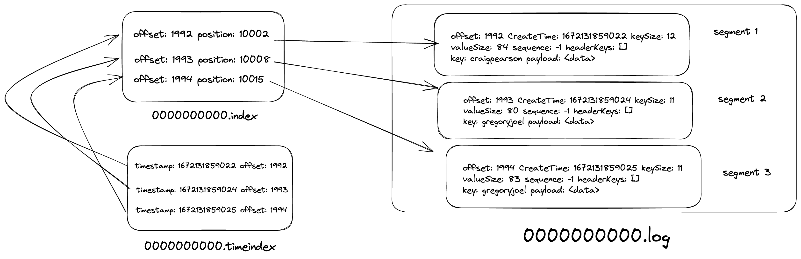
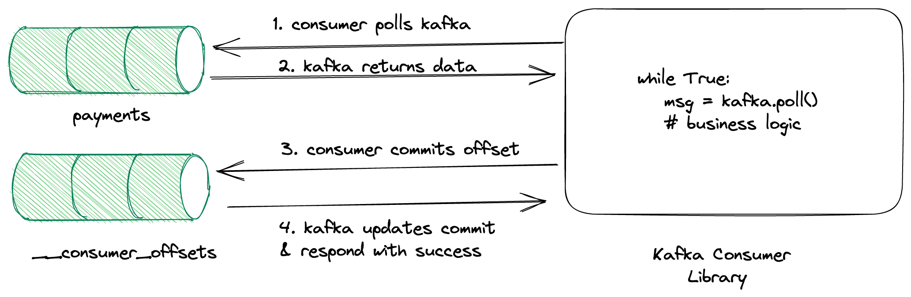
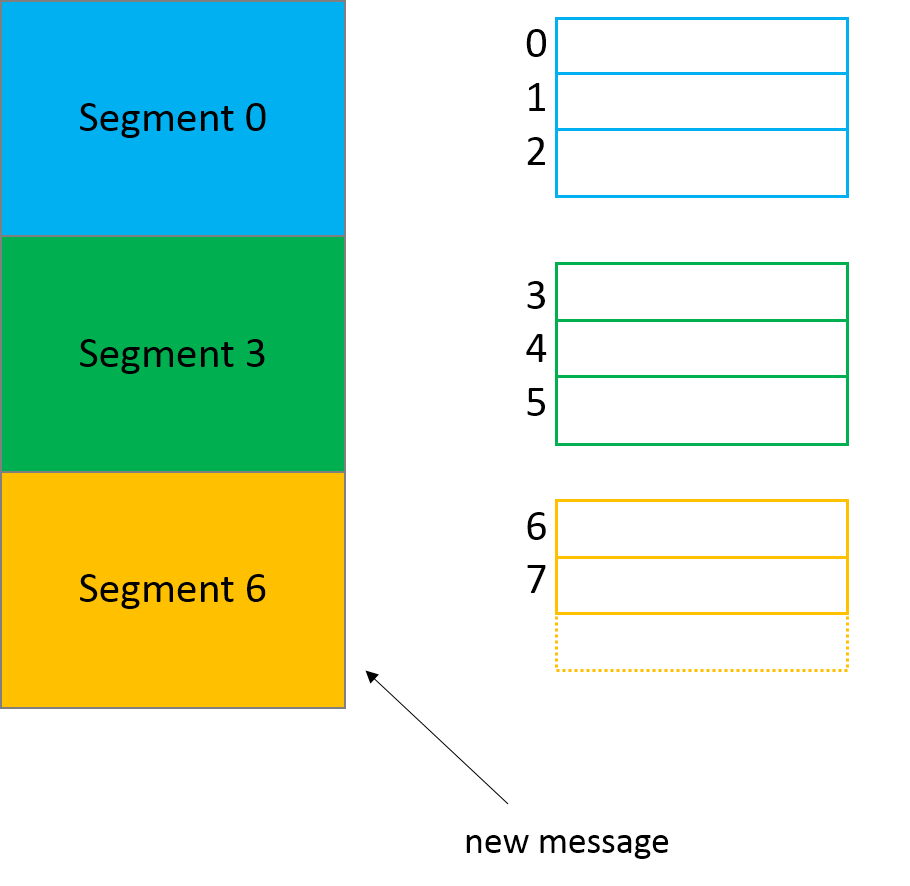
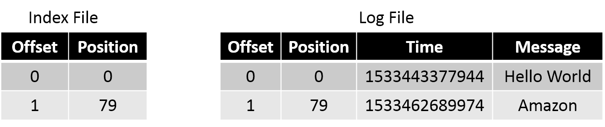
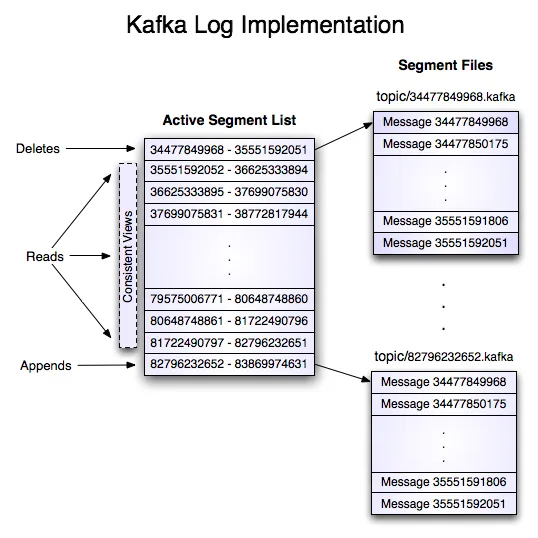
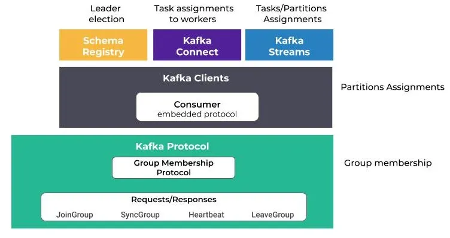

# FS2-Kafka-Examples
This project Zookeeper for distributed coordination and kakfa foe high-throughput distributed messaging and Kafka-ui for exposing a user-friendly web interface to manage Kafka topics
## Kafka-UI

You can inspect processed data in:
Kafka UI available at `http://localhost:8080`

### recovery-point-offset-checkpoint
This file is used internally by the kafka broker to track the number of logs that are flushed to the disk. The format of the file is like this.

`<version>
<total entries>
<topic name> <partition> offset`

### replication-offset-checkpoint
This file is used internally by the kafka broker to track the number of logs that are replicated to all the brokers in the cluster. The format of this file is the same as the `recovery-point-offset-checkpoint` file mentioned above.

### Partition Metadata
partition.metadata file contains a version and a topic_id. This topic id is the same for all the partitions( same topic)

### Log file
This is where the data written by the producers are stored in a binary format. One can view the contents of these files using command-line tools provided by kafka.

`bin/kafka-dump-log.sh --files data/kafka/payments-7/00000000000000000000.log,data/kafka/payments-7/00000000000000000000.index --print-data-log`

`Dumping data/kafka/payments-7/00000000000000000000.log`

`Starting offset: 0
baseOffset: 0 lastOffset: 0 count: 1 baseSequence: -1 lastSequence: -1 producerId: -1
producerEpoch: -1 partitionLeaderEpoch: 0 isTransactional: false isControl: false position: 0
CreateTime: 1672041637310 size: 73 magic: 2 compresscodec: none crc: 456919687 isvalid: true | offset: 0
CreateTime: 1672041637310 keySize: -1 valueSize: 5 sequence: -1 headerKeys: [] payload: world `

`payload` is the actual data that was pushed to kafka. `offset` tells how far the current message is from the zero indexes. `producerId` and `produerEpoch` are used in delivery guarantee semantics

### Index and Timeindex files
`bin/kafka-dump-log.sh --files data/kafka/payments-8/00000000000000000000.log,data/kafka/payments-8/00000000000000000000.index --print-data-log
Dumping data/kafka/payments-8/00000000000000000000.index`

`offset: 33 position: 4482`

`offset: 68 position: 9213`

`offset: 100 position: 13572`

`offset: 142 position: 18800`

`offset: 175 position: 23042`

`offset: 214 position: 27777`

`offset: 248 position: 32165`

`offset: 279 position: 36665`

`offset: 313 position: 40872`

`offset: 344 position: 45005`

`offset: 389 position: 49849`

`offset: 422 position: 54287`

`offset: 448 position: 58402`

`offset: 485 position: 62533`

As we see from the above output, the `index` file stores the offset and its position of it in the ``.log` file. Why is it needed? We know that consumers process messages sequentially. When a consumer asks for a message, kafka needs to fetch it from the log i.e. it needs to perform a disk I/O. Imagine, kafka reading each log file line by line to find an offset. It takes `O(n)` (where n is the number of lines in the file) time and latency of disk I/O. It will become a bottleneck when the log files are of gigabytes size. So, to optimize it, kafka stores the offset to position mapping in the `.index` file so that if a consumer asks for any arbitrary offset it simply does a binary search on the `.index` file in the `O(log n)` time and goes to the .log file and performs the binary search again.

Let’s take an example, say a consumer is reading 190th offset. Firstly, the kafka broker reads the index file (refer to the above log) and performs a binary search, and either finds the exact offset or the closest to it. In this case, it finds offset as 175 and its position as 23042. Then, it goes to the .log file and performs the binary search again given the fact that the `.log` the file is an append-only data structure stored in ascending order of offsets.

Let’s look at the `.timeindex` file
`bin/kafka-dump-log.sh --files data/kafka/payments-8/00000000000000000000.timeindex --print-data-log`

`Dumping data/kafka/payments-8/00000000000000000000.timeindex`

`timestamp: 1672131856604 offset: 33`

`timestamp: 1672131856661 offset: 68`

`timestamp: 1672131856701 offset: 100`

`timestamp: 1672131856738 offset: 142`

`timestamp: 1672131856772 offset: 175`

`timestamp: 1672131856816 offset: 213`

`timestamp: 1672131856862 offset: 247`

`timestamp: 1672131856901 offset: 279`

`timestamp: 1672131856930 offset: 312`

`timestamp: 1672131856981 offset: 344`

`timestamp: 1672131857029 offset: 388`

`timestamp: 1672131857076 offset: 419`

`timestamp: 1672131857102 offset: 448`

`timestamp: 1672131857147 offset: 484`

`timestamp: 1672131857185 offset: 517`

`timestamp: 1672131857239 offset: 547`

As we see from the above result, `.timeindex` the file stores the mapping between the epoch timestamp and the offset in the `.index` file. When the consumer wants to replay the event based on the timestamp, kafka first finds the offset by doing a binary search in the `.timeindex` file, find the offset, and finds the position by doing a binary search on the `.index` file.

Now, let’s take a look at the filesystem. We can observe that there will be new folders created with the name `__consumer_offsets-0`, `__consumer_offsets-1` … `__consumer_offsets-49`. Kafka stores the state of each consumer offset in a topic called `__consumer_offsets` with a default partition size of 50. If we look at what’s inside the folder, the same files will be present as in the payments topic we have seen above.

s we see from the above image, the consumer polls for the records and commits the offset whenever it’s done processing. Kafka is flexible such that we can configure how many records to fetch in a single poll, auto-committing interval, etc…

When a consumer is committing the offset, it sends the topic name, partition & offset information. Then, the broker uses it to construct the key as `<consumer_group_name>, <topic>, <partition>` and value as `<offset>,<partition_leader_epoch>,<metadata>,<timestamp>` and store it in the `__consumer_offsets` topic.

When the consumer is crashed or restarted, it sends the request to the kafka broker and the broker finds the partition in `__consumer_offsets` by doing hash `(<consumer_group_name>, <topic>, <partition> ) % 50` and fetches the latest offset and returns it to the consumer.

### Segments
Each partition is divided into segments.

A segment is simply a collection of messages of a partition. Instead of storing all the messages of a partition in a single file (think of the log file analogy again), Kafka splits them into chunks called segments. Doing this provides several advantages. Divide and Conquer FTW!

Most importantly, it makes purging data easy. As previously introduced partition is immutable from a consumer perspective. But Kafka can still remove the messages based on the “Retention policy” of the topic. Deleting segments is much simpler than deleting things from a single file, especially when a producer might be pushing data into it.

Each segment file has `segment.log`, `segment.index` and `segment.timeindex` files. Kafka always writes the messages into these segment files under a partition. There is always an active segment to which Kafka writes to. Once the segment’s size limit is reached, a new segment file is created and that becomes the active segment.

Each segment file is created with the offset of the first message as its file name. So, In the above picture, segment 0 has messages from offset 0 to offset 2, segment 3 has messages from offset 3 to 5 and so on. Segment 6 which is the last segment is the active segment.
Kafka makes the lowest offset in the segment as its name

One of the common operations in Kafka is to read the message at a particular offset. For this, if it has to go to the log file to find the offset, it becomes an expensive task especially because the log file can grow to huge sizes (Default — 1G). This is where the .index file becomes useful. Index file stores the offsets and physical position of the message in the log file.

If you need to read the message at offset 1, you first search for it in the index file and figure out that the message is in position 79. Then you directly go to position 79 in the log file and start reading. This makes it quite effective as you can use binary search to quickly get to the correct offset in the already sorted index file.

## Blogs
- [Kafka Internals](https://lokesh1729.com/posts/kafka-internals-learn-kafka-in-depth-part-2/)
- [Kafka Storage Internals](https://www.freblogg.com/kafka-storage-internals)

### Interfaces

Multiple interfaces = multiple addresses
A server with multiple interfaces can participate in multiple networks and in every network, it will have its own unique ip address
Anything that listens to networks is usually configured to listened to a certain networking interface, meaning it will only be able to accept connections from that network

If we deploy an application and bound it to 188.166.227.208, then all computers on this network won't have issues connecting to this app. Computers found on 10.130.54.5 will not be able to connect to this application since the application is listening on a different interface and hence these computers won't be able to establish a connection

0.0.0.0 meanins the app will listen to all network interface available on the machine
Each network interface must have its own unique IP address
The IP address that you give to a host is assigned to its network interface, sometimes referred to as the primary network interface. If you add a second network interface to a machine, it must have its own unique IP number. Adding a second network interface changes the function of a machine from a host to a router. If you add a second network interface to a host and disable routing, the host is then considered a multihomed host.
A router is a machine that forwards packets from one network to another. To do this, the router must have at least two network interfaces. A machine with only one network interface cannot forward packets; it is considered a host

It is possible for a machine to have more than one network interface but not function as a router. This type of machine is called a multihomed host. A multihomed host is directly connected to multiple networks through its network interfaces. However, it does not route packets from one network to another.

Connecting an interface to a network makes it a part of that network. Therefore, the IP address is a property of the connection, not the host.
Likewise, a host can have many network connections and accordingly, many IP addresses. Routers require multiple IP addresses for their interfaces.
Each network interface has a network address.
it binds to the address and the address tells it which interface to activate and start listening on

### Consumer

The session.timeout.ms property specifies the maximum amount of time in milliseconds a consumer within a consumer group can be out of contact with a broker before being considered inactive and a rebalancing is triggered between the active consumers in the group. When the group rebalances, the partitions are reassigned to the members of the group.

The heartbeat.interval.ms property specifies the interval in milliseconds between heartbeat checks to the consumer group coordinator to indicate that the consumer is active and connected. The heartbeat interval must be lower, usually by a third, than the session timeout interval

`Coordinator` — Manages group membership, offsets
` public class KafkaConsumer<K, V> implements Consumer<K, V> {
    private final ConsumerCoordinator coordinator;
}`

`final class Assignment {
        private List<TopicPartition> partitions;
        private ByteBuffer userData;
}`

`/**
 * This is used to describe per-partition state in the MetadataResponse.
 */
public class PartitionInfo {
    private final String topic;
    private final int partition;
    private final Node leader;
    private final Node[] replicas;
    private final Node[] inSyncReplicas;
    private final Node[] offlineReplicas;
}`
## Producer
`public final class TopicPartition implements Serializable {
    private final int partition;
    private final String topic;
    }`
A TopicPartition is made up of a topic name and partition number

`// This is used to describe per-partition state in the MetadataResponse
    public static class PartitionMetadata {
        public final TopicPartition topicPartition;
        public final Errors error;
        public final Optional<Integer> leaderId;
        public final Optional<Integer> leaderEpoch;
        public final List<Integer> replicaIds;
        public final List<Integer> inSyncReplicaIds;
        public final List<Integer> offlineReplicaIds;
    }`
we have this in the MetadataCache
` private final Map<TopicPartition, PartitionMetadata> metadataByPartition;`

` * Per topic info.
    private static class TopicInfo {
        public final ConcurrentMap<Integer /*partition*/, Deque<ProducerBatch>> batches = new CopyOnWriteMap<>();
        public final BuiltInPartitioner builtInPartitioner;
    }`

` public class RecordAccumulator {  
    private final ConcurrentMap<String /*topic*/, TopicInfo> topicInfoMap = new CopyOnWriteMap<>();
}`

RecordAccumulator Accumulates records and groups them by topic- partition into batches. A batch of unsent records is maintained in the buffer memory. This also helps in compression

`public class KafkaProducer<K, V> implements Producer<K, V> {
   private final ProducerMetadata metadata;
    private final RecordAccumulator accumulator; 
}`
The request Queue is important as it maintains the order of messages sent to kafka

## Consumer Group
A consumer group is a group of multiple consumers where each consumer present in a group reads data directly from the exclusive partitions. In case, the number of consumers is more than the number of partitions, some of the consumers will be in an inactive state.

Rebalance — Moving partition ownership from one consumer to another is called a rebalance.

`A consumer subscribes to one or more topics.`
`A consumer can be part of only one consumer group`

## Partition
Each partition stores log files replicated across nodes distributed into multiple brokers for fault tolerance. These log files are called segments. A segment is simply a collection of messages of a partition. Segment N contains the most recent records and Segment 1 contains the oldest retained records. The segment contains 1 GB of data (log.segment.bytes) or 1 week's worth of data (log.roll.ms or log.roll.hours) whichever is smaller. If this limit is reached, then the segment file is closed and a new segment file is created

A partition has only one consumer per consumer group.
At any time a single broker will the leader for a partition. That broker will be responsible for receiving and serving data of that partition.

`https://github.com/apache/kafka/blob/trunk/group-coordinator/src/main/java/org/apache/kafka/coordinator/group/GroupCoordinatorService.java`

`https://github.com/apache/kafka/blob/trunk/group-coordinator/src/main/java/org/apache/kafka/coordinator/group/consumer/ConsumerGroup.java`

[Minimum In-Sync Replicas](https://www.conduktor.io/kafka/kafka-topic-configuration-min-insync-replicas/)

[Kafka internals](https://medium.com/geekculture/kafka-internals-of-producer-and-consumers-5a1aebb2b3ce)
[kafka-topics-internals-segments-and-indexes](https://www.conduktor.io/kafka/kafka-topics-internals-segments-and-indexes/)
[Kafka internals-2](https://medium.com/geekculture/kafka-internals-part-2-7dad1977f7d1)
[distributed-event-streaming-kafka](https://medium.com/geekculture/distributed-event-streaming-kafka-dca9ca58ad69)
[kafka-consumers-internals](https://blog.developer.adobe.com/exploring-kafka-consumers-internals-b0b9becaa106)

### FS-Kafka
for Kafka, Chunk[A] => F[Chunk[B]] or Chunk[A] => F[Unit] are optimal 

the advantages of Chunk for this scenario are:
you can write the business logic without looking at the offsets
works well for batch operations, like batch writes on a db
lets you do concurrent operations like parTraverse on Chunk, without messing up the order of commits
lets you do filtering and deduplication on the Kafka messages, e.g. in some cases if you get two messages for the same key, you can consider only the latest
lets you group by key, so that you can then run logic on disjoint keys concurrently, and logic on the same key sequentially, which greatly increases the available concurrency compared to just doing one fiber per Kafka partition

[FS-Kafka](https://github.com/fd4s/fs2-kafka/pull/1281/)

After a consumer subscribes to some topics, it needs to request records to pass them off to the rest of the application. This process is called polling and is done using the poll function.

When calling poll, you must pass in a timeout duration to allow your application to move along if no records are available for retrieval.When no records are passed to a consumer within the timeout duration, it will progress with an empty collection of records.
Consumers use partition offsets to keep track of what records have been processed. As it polls records and computes whatever needs computing, it needs to note down the offsets of these records, so that the consumer knows what point to start polling records from in case of failure
The process of keeping track of a consumer’s offset is known as “committing”. In that it commits the current offset for a partition to storage.A consumer does not store its offsets locally. Instead, it sends them to the Kafka broker, who then persists them to disk.
kafka stores offset data in a topic called `__consumer_offset` . these topics use log compaction, which means they only save the most recent value per key.

assign()
1. finer control with topic-partition subscription
2. automatic or manual offsets management
3. supports multiple consumers per partition
Apache Flink and Spark use assign() for subscribing to the topics and manage the distribution of topic-partition pairs across workers.

##Consumer group
When a user uses subscribe() for consumption, consumers with the same group.id will form a consumer group and cooperate to consume topic(s) messages. Kafka cluster will elect one of the brokers as a Group Coordinator. The group coordinator is responsible for managing group list membership, receiving heartbeats, triggering rebalances on group membership changes etc. The coordinator will elect one consumer as a Group Leader and ask to do partitions assignments across consumers. Each partition will have only one consumer assigned.

###Consumer group rebalances
Changes in group membership will trigger consumer group rebalances. During rebalances, the group leader will recalculate partition assignments across current members. Rebalance is triggered when

1. consumer joins the group
2. consumer leaves the group
3. client-side failure detected via max.poll.interval.ms
4. server-side failure detected via session.timeout.ms

When we instantiate a consumer group, Kafka also creates the group coordinator. The group coordinator regularly receives requests from the consumers, known as heartbeats. If a consumer stops sending heartbeats, the coordinator assumes that the consumer has either left the group or crashed. That’s one possible trigger for a partition rebalance.
The first consumer who requests the group coordinator to join the group becomes the group leader. When a rebalance occurs for any reason, the group leader receives a list of the group members from the group coordinator. Then, the group leader reassigns the partitions among the consumers in that list using a customizable strategy set in the partition.assignment.strategy configuration.

##Bootstrapping
The “bootstrap-servers” configuration is a list of “hostname:port” pairs that address one or more (even all) of the brokers. The client uses this list by doing these steps:

pick the first broker from the list
send a request to the broker to fetch the cluster metadata containing information about topics, partitions, and the leader brokers for each partition (each broker can provide this metadata)
connect to the leader broker for the chosen partition of the topic
`sh kafka-topics.sh --bootstrap-server localhost:9092 --create --topic samples --partitions 1 --replication-factor 1`

[Java Consumer Seek and Assign](https://www.conduktor.io/kafka/java-consumer-seek-and-assign/)

In case you are looking to read specific messages from specific partitions, the `.seek()` and `.assign()` API may help you.

These APIs are also helpful to replay data from a specific offset.

To use these API, make the following changes:

Remove the group.id from the consumer properties (we don't use consumer groups anymore)

Remove the subscription to the topic
Use consumer `assign()` and `seek()` APIs

[kafka-docker-connection](https://www.baeldung.com/kafka-docker-connection)
[spring-boot-kafka-ssl](https://www.baeldung.com/spring-boot-kafka-ssl)

The ack mode determines when the broker updates the consumer’s offset.
here are three acknowledgment modes:

1. auto-commit: the consumer sends an acknowledgment to the broker as soon as it receives a message
2. after-processing: the consumer only sends an acknowledgment to the broker after it has successfully processed the message
3. manual: the consumer waits until it receives specific instructions before sending an acknowledgment to the broker

## Listeners
Listeners, advertised listeners, and listener protocols play a considerable role when connecting with Kafka brokers.

We manage listeners with the KAFKA_LISTENERS property, where we declare a comma-separated list of URIs, which specify the sockets that the broker should listen on for incoming TCP connections.

Each URI comprises a protocol name, followed by an interface address and a port:

`EXTERNAL_SAME_HOST://0.0.0.0:29092,INTERNAL://0.0.0.0:9092`

Here, we specified a 0.0.0.0 meta address to bind the socket to all interfaces. Further, EXTERNAL_SAME_HOST and INTERNAL are the custom listener names that we need to specify when defining listeners in the URI format.

## Bootstrapping

For initial connections, Kafka clients need a bootstrap server list where we specify the addresses of the brokers. The list should contain at least one valid address to a random broker in the cluster.

The client will use that address to connect to the broker. If the connection is successful, the broker will return the metadata about the cluster, including the advertised listener lists for all the brokers in the cluster. For subsequent connections, the clients will use that list to reach the brokers.

##Advertised Listeners
Just declaring listeners is not enough because it’s just a socket configuration for the broker. We need a way to tell the clients (consumers and producers) how to connect to Kafka.

This is where advertised listeners come into the picture with the help of the KAFKA_ADVERTISED_LISTENERS property. It has a similar format as the listener’s property:

`<listener protocol>://<advertised host name>:<advertised port>`

The clients use the addresses specified as advertised listeners after the initial bootstrapping process

###Consumer Lag
Kafka consumer group lag is a key performance indicator of any Kafka-based event-driven system.
Consumer lag is simply the delta between the consumer’s last committed offset and the producer’s end offset in the log. In other words, the consumer lag measures the delay between producing and consuming messages in any producer-consumer system.

[kafka-consumer-lag](https://www.baeldung.com/java-kafka-consumer-lag)

[message-delivery-semantics](https://www.baeldung.com/kafka-message-delivery-semantics)

ACKS=all means all in-sync replicas must store the request before returning to the client.
ACKS=1 means only a leader has to store the request before returning to the client.
ACKS=0 means the client considers the request successfully delivered immediately after the message is put onto the wire.

[tpc-buffers](https://redpanda.com/blog/tpc-buffers)

 ## Group Coordinator
Kafka designates a single broker as the "Group Coordinator" for each consumer group.
The Group Coordinator is responsible for managing the state of the group, handling rebalances, and coordinating the assignment of partitions to consumers

## Rebalance Protocol:
When a consumer joins or leaves a group, a rebalance is triggered.
Kafka uses a protocol to orchestrate the rebalance, and it involves communication between consumers and the Group Coordinator.
The consumers negotiate and agree on a new partition assignment during the rebalance.

## Consumer States:
Consumers within a group can be in one of the following states: Stable, AwaitingRebalance, PreparingRebalance, and Dead.
The state transitions occur during the rebalance process.

## Idempotent Consumers:
Kafka allows consumers to be configured as idempotent, ensuring that messages are processed exactly once.
Idempotent consumers require a unique client.id and ensure that a consumer will always have the same partition assignment after a rebalance.
- Kafka consumer groups are suitable for scenarios like event processing, log aggregation, metrics collection, and real-time analytics.

### Partition.assignment.strategy
When a new consumer group is created a consumer group coordinator is elected. The coordinator lives on a broker assigned by a hash() of the consumer group name. This coordinator is responsible for various tasks, including partition assignment, offset commits, and deciding when a consumer should be marked “failed”. Consumers in a consumer group share ownership of the partitions in the topics they subscribe to. When we add a new consumer to the group, it starts consuming messages from partitions previously consumed by another consumer. The same thing happens when a consumer shuts down or crashes; it leaves the group, and the partitions it used to consume will be consumed by one of the remaining consumers.

Reassignment of partitions to consumers also happens when the topics the consumer group is consuming are modified, e.g. new partitions are added to the topic
PartitionAssignor is the class that decides which partitions will be assigned to which consumer. When creating a new Kafka consumer, we can configure the strategy that will be used to assign the partitions amongst the consumers. We can set it using the configuration `partition.assignment.strategy`. 

All the Kafka consumers which belong to the same consumer group must have a single assignment strategy. If a consumer attempts to join a consumer group that has a different assignment strategy, it will end up getting an `InconsistentGroupProtocolException`

[partition-assignment-strategy](https://www.conduktor.io/blog/kafka-partition-assignment-strategy/)

[partition-assignment-strategies](https://medium.com/streamthoughts/understanding-kafka-partition-assignment-strategies-and-how-to-write-your-own-custom-assignor-ebeda1fc06f3)

What is important to understand is that a partition is actually the unit of parallelism for Kafka’s producers and consumers.
Kafka provides the guarantee that a topic-partition is assigned to only one consumer within a group.

The ability of consumers clients to cooperate within a dynamic group is made possible by the use of the so-called Kafka Rebalance Protocol.

[kafka-rebalance-protocol](https://medium.com/streamthoughts/apache-kafka-rebalance-protocol-or-the-magic-behind-your-streams-applications-e94baf68e4f2)

### JoinGroup
When a consumer starts, it sends a first FindCoordinator request to obtain the Kafka broker coordinator which is responsible for its group. Then, it initiates the rebalance protocol by sending a JoinGroup request.

[understanding-kafka-partition-assignment](https://medium.com/streamthoughts/understanding-kafka-partition-assignment-strategies-and-how-to-write-your-own-custom-assignor-ebeda1fc06f3)