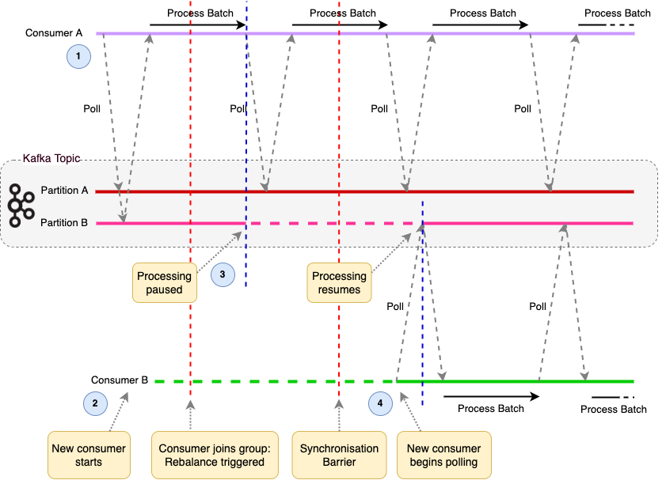
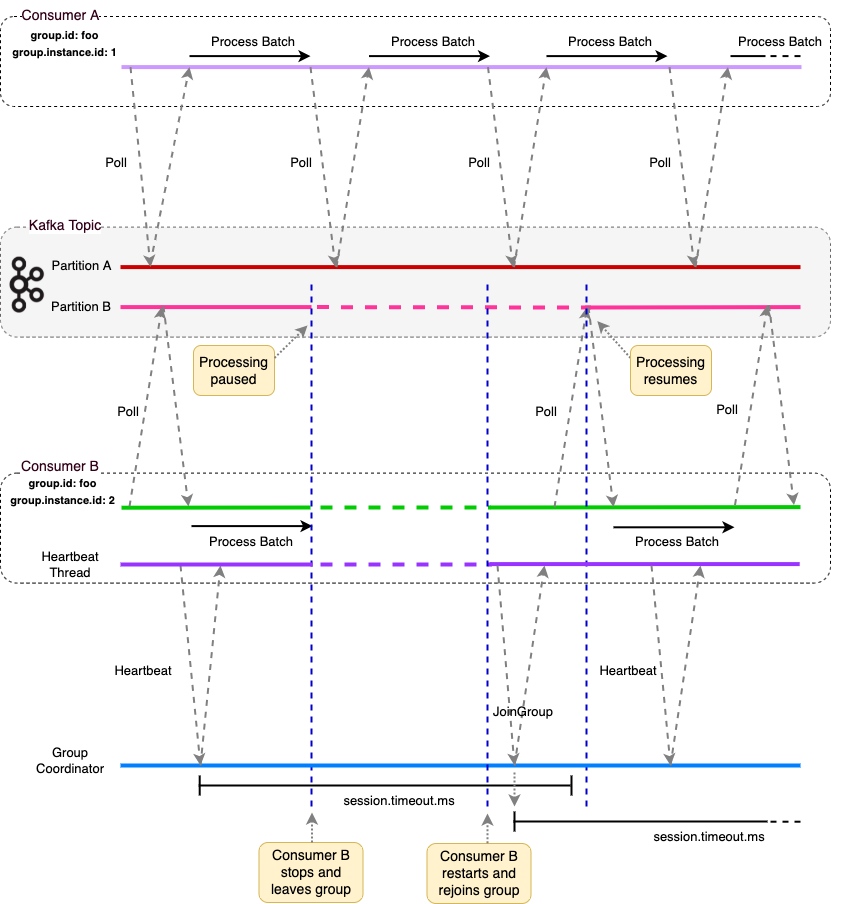
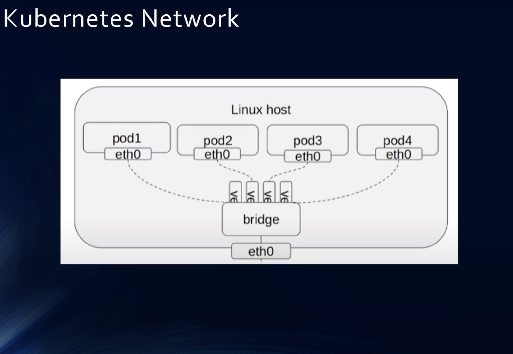
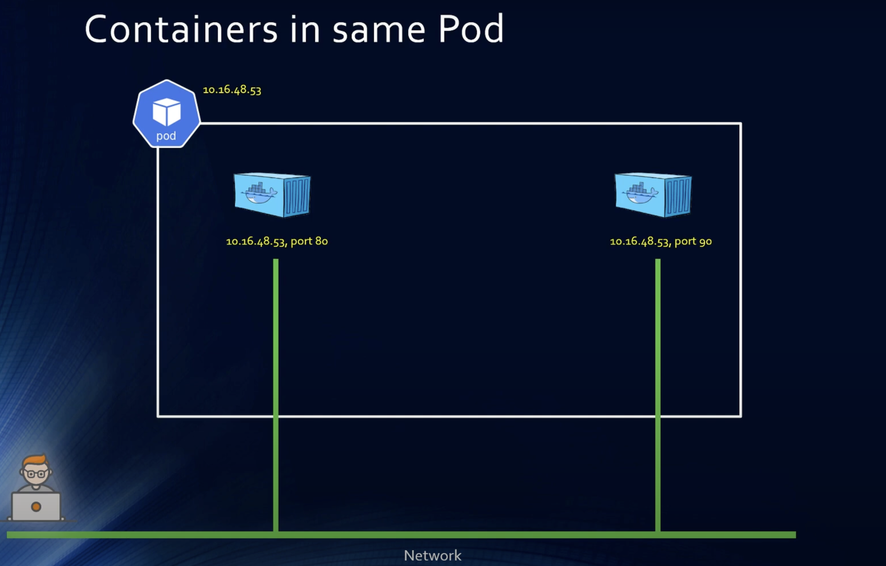
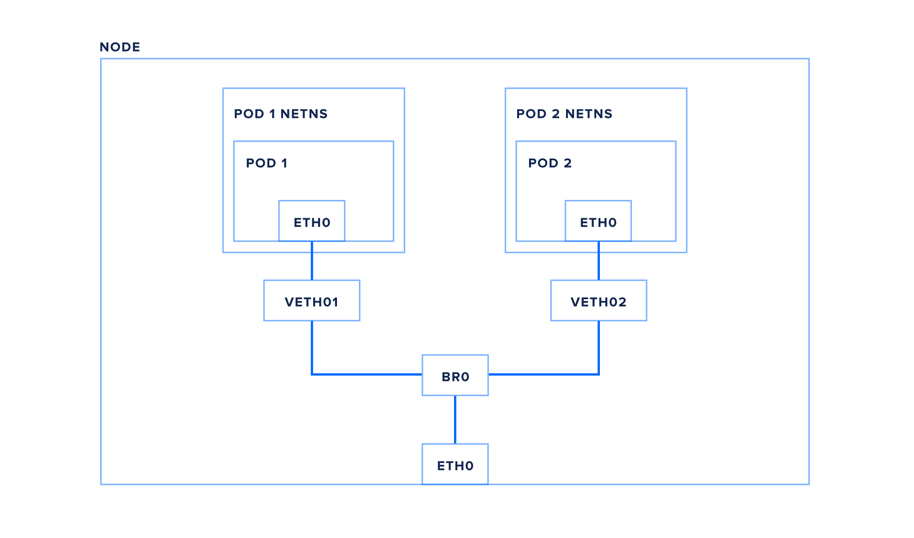
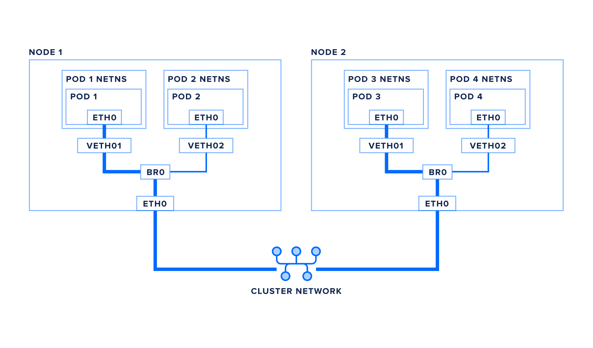

https://medium.com/@diegogabrielschurch/how-docker-network-works-bridge-driver-e4819459cc8a


Raft ensures that all servers in the cluster agree on the sequence of commands to be executed.
The replicated log maintained by Raft contains entries representing commands to be applied to the state machine.

Each server applies commands from the log to its local copy of the state machine in the same order they were logged, ensuring consistency across the cluster.

etcd is a distributed key-value store that uses Raft for consensus. It is widely used for service discovery, configuration management, and coordination.
The state machine in etcd is responsible for maintaining the key-value store and processing operations like "get(key)" and "put(key, value)".

CockroachDB is a distributed SQL database that offers horizontal scalability and fault tolerance.
It uses the Raft consensus algorithm for replication and consensus among nodes.
The state machine in CockroachDB manages the storage and retrieval of SQL data, ensuring consistency and durability across the cluster.


A port can be bound to a specific network interface

 `127.0.0.1:9092` and `192.168.1.1:9092` can both be used on the same host because they are bound to different network interfaces.

 it fails in kafka  with the below error
 `requirement failed: Each listener must have a different port, listeners: INTERNAL://localhost:9092,EXTERNAL://broker:9092`

 - Kafka listeners are unique combinations of protocol, IP address, and port.
- Kafka requires each listener to have a unique port, regardless of the IP address.


### new-consumer-group-protocol

Has these four pillars:

1. Logic: Client Side → Broker Side

no more group leader, assignment is done in the broker.

2. Rebalance Disruption: Stop the World → Incremental

it is much more incremental in a finer-grained sense.

when a new member joins, you don’t need to wait for all N members (that the group leader used to choose) to rebalance/revoke their partitions.

It can incrementally start getting partitions from the first (fastest) member to revoke.

When you think about it, a rebalance is simply a reassignment of some partitions from some consumers to others. 💡

Why does the whole group need to stop and know about this?

It doesn’t.

3. Protocol: Generic → Consumer

make it a consumer-optimized protocol.

4. Model: Pull-based → Push-Based

the broker now pushes the new partition assignments onto the consumers, instead of them pulling it from the broker (which used to pull it from the group leader).

### 🤔 How?
Elegantly.

All is streamlined within a new Heartbeat API.

The protocol maintains three types of epochs:

- Group Epoch - tracks when a new rebalance should happen

- Assignment Epoch - tracks the generation of the assignment

- Member Epoch - tracks each member’s last-synced epoch

💡 A new assignment is computed every time the group epoch changes.

All epochs should converge to be the same number.

The order is the following:
- the group-wide epoch is bumped.

- the target assignment epoch is bumped.

- consumers catch up to the member epoch via the heartbeat request, individually. (fine-grained)

In general, what you have is a simple state machine inside the Group Coordinator broker that’s running a constant reconciliation loop. 💥


### Consumer
```java
/**
 * After subscribing to a set of topics, the consumer will automatically join the group when {@link #poll(Duration)} is
 * invoked. The poll API is designed to ensure consumer liveness. As long as you continue to call poll, the consumer
 * will stay in the group and continue to receive messages from the partitions it was assigned. Underneath the covers,
 * the consumer sends periodic heartbeats to the server. If the consumer crashes or is unable to send heartbeats for
 * a duration of {@code session.timeout.ms}, then the consumer will be considered dead and its partitions will
 * be reassigned.
  * It is also possible that the consumer could encounter a "livelock" situation where it is continuing
 * to send heartbeats, but no progress is being made. To prevent the consumer from holding onto its partitions
 * indefinitely in this case, we provide a liveness detection mechanism using the {@code max.poll.interval.ms}
 * setting. Basically if you don't call poll at least as frequently as the configured max interval,
 * then the client will proactively leave the group so that another consumer can take over its partitions. When this happens,
 * you may see an offset commit failure (as indicated by a {@link CommitFailedException} thrown from a call to {@link #commitSync()}).
 * This is a safety mechanism which guarantees that only active members of the group are able to commit offsets.
 * So to stay in the group, you must continue to call poll.
 * <p>
 * The consumer provides two configuration settings to control the behavior of the poll loop:
 * <ol>
 *     <li><code>max.poll.interval.ms</code>: By increasing the interval between expected polls, you can give
 *     the consumer more time to handle a batch of records returned from {@link #poll(Duration)}. The drawback
 *     is that increasing this value may delay a group rebalance since the consumer will only join the rebalance
 *     inside the call to poll. You can use this setting to bound the time to finish a rebalance, but
 *     you risk slower progress if the consumer cannot actually call {@link #poll(Duration) poll} often enough.</li>
 *     <li><code>max.poll.records</code>: Use this setting to limit the total records returned from a single
 *     call to poll. This can make it easier to predict the maximum that must be handled within each poll
 *     interval. By tuning this value, you may be able to reduce the poll interval, which will reduce the
 *     impact of group rebalancing.</li>
 * </ol>
 * <p>
 * * The connection to the cluster is bootstrapped by specifying a list of one or more brokers to contact using the
 * configuration {@code bootstrap.servers}. This list is just used to discover the rest of the brokers in the
 * cluster and need not be an exhaustive list of servers in the cluster (though you may want to specify more than one in
 * case there are servers down when the client is connecting).
 * <p>
 * Setting {@code enable.auto.commit} means that offsets are committed automatically with a frequency controlled by
 * the config {@code auto.commit.interval.ms}.
 * <p>
 *  * <b>Note: The committed offset should always be the offset of the next message that your application will read.</b>
 * Thus, when calling {@link #commitSync(Map) commitSync(offsets)} you should add one to the offset of the last message processed.
 *
 * 
 *  * Once assigned, you can call {@link #poll(Duration) poll} in a loop, just as in the preceding examples to consume
 * records. The group that the consumer specifies is still used for committing offsets, but now the set of partitions
 * will only change with another call to {@link #assign(Collection) assign}. Manual partition assignment does
 * not use group coordination, so consumer failures will not cause assigned partitions to be rebalanced. Each consumer
 * acts independently even if it shares a groupId with another consumer. To avoid offset commit conflicts, you should
 * usually ensure that the groupId is unique for each consumer instance.
 * 
 * 
 * 
 * */
```


### Storing Offsets Outside Kafka

```java
/**
* <h4><a name="rebalancecallback">Storing Offsets Outside Kafka</h4>
 *
 * The consumer application need not use Kafka's built-in offset storage, it can store offsets in a store of its own
 * choosing. The primary use case for this is allowing the application to store both the offset and the results of the
 * consumption in the same system in a way that both the results and offsets are stored atomically. This is not always
 * possible, but when it is it will make the consumption fully atomic and give "exactly once" semantics that are
 * stronger than the default "at-least once" semantics you get with Kafka's offset commit functionality.
 * <p>
 * Here are a couple of examples of this type of usage:
 * <ul>
 * <li>If the results of the consumption are being stored in a relational database, storing the offset in the database
 * as well can allow committing both the results and offset in a single transaction. Thus either the transaction will
 * succeed and the offset will be updated based on what was consumed or the result will not be stored and the offset
 * won't be updated.
 * <li>If the results are being stored in a local store it may be possible to store the offset there as well. For
 * example a search index could be built by subscribing to a particular partition and storing both the offset and the
 * indexed data together. If this is done in a way that is atomic, it is often possible to have it be the case that even
 * if a crash occurs that causes unsync'd data to be lost, whatever is left has the corresponding offset stored as well.
 * This means that in this case the indexing process that comes back having lost recent updates just resumes indexing
 * from what it has ensuring that no updates are lost.
 * </ul>
 * <p>
 * Each record comes with its own offset, so to manage your own offset you just need to do the following:
 *
 * <ul>
 * <li>Configure <code>enable.auto.commit=false</code>
 * <li>Use the offset provided with each {@link ConsumerRecord} to save your position.
 * <li>On restart restore the position of the consumer using {@link #seek(TopicPartition, long)}.
 * </ul>
 *
 * <p>
 * This type of usage is simplest when the partition assignment is also done manually (this would be likely in the
 * search index use case described above). If the partition assignment is done automatically special care is
 * needed to handle the case where partition assignments change. This can be done by providing a
 * {@link ConsumerRebalanceListener} instance in the call to {@link #subscribe(Collection, ConsumerRebalanceListener)}
 * and {@link #subscribe(Pattern, ConsumerRebalanceListener)}.
 * For example, when partitions are taken from a consumer the consumer will want to commit its offset for those partitions by
 * implementing {@link ConsumerRebalanceListener#onPartitionsRevoked(Collection)}. When partitions are assigned to a
 * consumer, the consumer will want to look up the offset for those new partitions and correctly initialize the consumer
 * to that position by implementing {@link ConsumerRebalanceListener#onPartitionsAssigned(Collection)}.
 * <p>
 * Another common use for {@link ConsumerRebalanceListener} is to flush any caches the application maintains for
 * partitions that are moved elsewhere.
 * */


```

### Controlling The Consumer's Position
```java
/**
* <h4>Controlling The Consumer's Position</h4>
 *
 * In most use cases the consumer will simply consume records from beginning to end, periodically committing its
 * position (either automatically or manually). However Kafka allows the consumer to manually control its position,
 * moving forward or backwards in a partition at will. This means a consumer can re-consume older records, or skip to
 * the most recent records without actually consuming the intermediate records.
 * <p>
 * There are several instances where manually controlling the consumer's position can be useful.
 * <p>
 * One case is for time-sensitive record processing it may make sense for a consumer that falls far enough behind to not
 * attempt to catch up processing all records, but rather just skip to the most recent records.
 * <p>
 * Another use case is for a system that maintains local state as described in the previous section. In such a system
 * the consumer will want to initialize its position on start-up to whatever is contained in the local store. Likewise
 * if the local state is destroyed (say because the disk is lost) the state may be recreated on a new machine by
 * re-consuming all the data and recreating the state (assuming that Kafka is retaining sufficient history).
 * <p>
 * Kafka allows specifying the position using {@link #seek(TopicPartition, long)} to specify the new position. Special
 * methods for seeking to the earliest and latest offset the server maintains are also available (
 * {@link #seekToBeginning(Collection)} and {@link #seekToEnd(Collection)} respectively).
 **/
```

### Consumption Flow Control

```java

/**
 * <h4>Consumption Flow Control</h4>
 *
 * If a consumer is assigned multiple partitions to fetch data from, it will try to consume from all of them at the same time,
 * effectively giving these partitions the same priority for consumption. However in some cases consumers may want to
 * first focus on fetching from some subset of the assigned partitions at full speed, and only start fetching other partitions
 * when these partitions have few or no data to consume.
 *
 * <p>
 * One of such cases is stream processing, where processor fetches from two topics and performs the join on these two streams.
 * When one of the topics is long lagging behind the other, the processor would like to pause fetching from the ahead topic
 * in order to get the lagging stream to catch up. Another example is bootstrapping upon consumer starting up where there are
 * a lot of history data to catch up, the applications usually want to get the latest data on some of the topics before consider
 * fetching other topics.
 *
 * <p>
 * Kafka supports dynamic controlling of consumption flows by using {@link #pause(Collection)} and {@link #resume(Collection)}
 * to pause the consumption on the specified assigned partitions and resume the consumption
 * on the specified paused partitions respectively in the future {@link #poll(Duration)} calls.
 * 
 * 
 *  /**
     * Subscribe to the given list of topics to get dynamically
     * assigned partitions. <b>Topic subscriptions are not incremental. This list will replace the current
     * assignment (if there is one).</b> Note that it is not possible to combine topic subscription with group management
     * with manual partition assignment through {@link #assign(Collection)}.
     *
     * If the given list of topics is empty, it is treated the same as {@link #unsubscribe()}.
     *
     * <p>
     * As part of group management, the consumer will keep track of the list of consumers that belong to a particular
     * group and will trigger a rebalance operation if any one of the following events are triggered:
     * <ul>
     * <li>Number of partitions change for any of the subscribed topics
     * <li>A subscribed topic is created or deleted
     * <li>An existing member of the consumer group is shutdown or fails
     * <li>A new member is added to the consumer group
     * </ul>
     * <p>
     * When any of these events are triggered, the provided listener will be invoked first to indicate that
     * the consumer's assignment has been revoked, and then again when the new assignment has been received.
     * Note that rebalances will only occur during an active call to {@link #poll(Duration)}, so callbacks will
     * also only be invoked during that time.

 **/

```


```java
/**
     * Fetch data for the topics or partitions specified using one of the subscribe/assign APIs. It is an error to not have
     * subscribed to any topics or partitions before polling for data.
     * <p>
     * On each poll, consumer will try to use the last consumed offset as the starting offset and fetch sequentially. The last
     * consumed offset can be manually set through {@link #seek(TopicPartition, long)} or automatically set as the last committed
     * offset for the subscribed list of partitions

     **/
    public ConsumerRecords<K, V> poll(final Duration timeout) {
        return delegate.poll(timeout);
    }


    /**
     * Commit offsets returned on the last {@link #poll(Duration) poll()} for all the subscribed list of topics and
     * partitions.
     * <p>
     * This commits offsets only to Kafka. The offsets committed using this API will be used on the first fetch after
     * every rebalance and also on startup. As such, if you need to store offsets in anything other than Kafka, this API
     * should not be used.
     * <p>
     * This is a synchronous commit and will block until either the commit succeeds, an unrecoverable error is
     * encountered (in which case it is thrown to the caller), or the timeout specified by {@code default.api.timeout.ms} expires
     * (in which case a {@link org.apache.kafka.common.errors.TimeoutException} is thrown to the caller).
     * <p>
     * Note that asynchronous offset commits sent previously with the {@link #commitAsync(OffsetCommitCallback)}
     * (or similar) are guaranteed to have their callbacks invoked prior to completion of this method.
     *
     * @throws org.apache.kafka.clients.consumer.CommitFailedException if the commit failed and cannot be retried.
     *             This fatal error can only occur if you are using automatic group management with {@link #subscribe(Collection)},
     *             or if there is an active group with the same <code>group.id</code> which is using group management. In such cases,
     *             when you are trying to commit to partitions that are no longer assigned to this consumer because the
     *             consumer is for example no longer part of the group this exception would be thrown.
     * @throws org.apache.kafka.common.errors.RebalanceInProgressException if the consumer instance is in the middle of a rebalance
     *            so it is not yet determined which partitions would be assigned to the consumer. In such cases you can first
     *            complete the rebalance by calling {@link #poll(Duration)} and commit can be reconsidered afterwards.
     *            NOTE when you reconsider committing after the rebalance, the assigned partitions may have changed,
     *            and also for those partitions that are still assigned their fetch positions may have changed too
     *            if more records are returned from the {@link #poll(Duration)} call.
     * 
     * */
      @Override
    public void commitSync() {
        delegate.commitSync();
    }
```

## group management protocol

```java
/**
 *  * From a high level, Kafka's group management protocol consists of the following sequence of actions:
 *
 * <ol>
 *     <li>Group Registration: Group members register with the coordinator providing their own metadata
 *         (such as the set of topics they are interested in).</li>
 *     <li>Group/Leader Selection: The coordinator select the members of the group and chooses one member
 *         as the leader.</li>
 *     <li>State Assignment: The leader collects the metadata from all the members of the group and
 *         assigns state.</li>
 *     <li>Group Stabilization: Each member receives the state assigned by the leader and begins
 *         processing.</li>
 * </ol>
 *
 * 
 * */

  protected enum MemberState {
        UNJOINED,             // the client is not part of a group
        PREPARING_REBALANCE,  // the client has sent the join group request, but have not received response
        COMPLETING_REBALANCE, // the client has received join group response, but have not received assignment
        STABLE;               // the client has joined and is sending heartbeats

        public boolean hasNotJoinedGroup() {
            return equals(UNJOINED) || equals(PREPARING_REBALANCE);
        }
    }
```

It was intentionally designed with clear separation of concerns:

🟣 the broker knows about group membership & subscribed topics
🟣 the consumers know about partition assignment  


[new-consumer-group-protocol](https://2minutestreaming.beehiiv.com/p/kafka-kip-848-new-consumer-group-protocol)


the next generation of the consumer rebalance protocol for Apache Kafka (KIP-848) addresses the shortcomings of the current protocol. This new protocol has three major benefits:

(1) The stop-the-world rebalances are truly gone. We have designed an incremental rebalance protocol which drastically improves the stability of consumer groups. One misbehaving consumer can no longer take down the entire group.

(2) Unlike the current protocol which hardly scales to thousands of consumers within a single group, the new one is designed from the ground up to be scalable.

(3) The new rebalance protocol reduces the complexity of the consumers by bringing it back to the server side. This will simplify the implementation of the consumers (in all languages) and give operators all the visibility that they need to debug issues.


[The Next Generation of the Consumer Rebalance Protocol](https://cwiki.apache.org/confluence/display/KAFKA/KIP-848:+The+Next+Generation+of+the+Consumer+Rebalance+Protocol)


```java


/**
 * This interface is used to define custom partition assignment for use in
 * {@link org.apache.kafka.clients.consumer.KafkaConsumer}. Members of the consumer group subscribe
 * to the topics they are interested in and forward their subscriptions to a Kafka broker serving
 * as the group coordinator. The coordinator selects one member to perform the group assignment and
 * propagates the subscriptions of all members to it. Then {@link #assign(Cluster, GroupSubscription)} is called
 * to perform the assignment and the results are forwarded back to each respective members
 * <p>
 * In some cases, it is useful to forward additional metadata to the assignor in order to make
 * assignment decisions. For this, you can override {@link #subscriptionUserData(Set)} and provide custom
 * userData in the returned Subscription. For example, to have a rack-aware assignor, an implementation
 * can use this user data to forward the rackId belonging to each member.
 * <p>
 * The implementation can extend {@link Configurable} to get configs from consumer.
 */
public interface ConsumerPartitionAssignor {

    /**
     * Return serialized data that will be included in the {@link Subscription} sent to the leader
     * and can be leveraged in {@link #assign(Cluster, GroupSubscription)} ((e.g. local host/rack information)
     *
     * @param topics Topics subscribed to through {@link org.apache.kafka.clients.consumer.KafkaConsumer#subscribe(java.util.Collection)}
     *               and variants
     * @return nullable subscription user data
     */
    default ByteBuffer subscriptionUserData(Set<String> topics) {
        return null;
    }

    /**
     * Perform the group assignment given the member subscriptions and current cluster metadata.
     * @param metadata Current topic/broker metadata known by consumer
     * @param groupSubscription Subscriptions from all members including metadata provided through {@link #subscriptionUserData(Set)}
     * @return A map from the members to their respective assignments. This should have one entry
     *         for each member in the input subscription map.
     */
    GroupAssignment assign(Cluster metadata, GroupSubscription groupSubscription);

    /**
     * Callback which is invoked when a group member receives its assignment from the leader.
     * @param assignment The local member's assignment as provided by the leader in {@link #assign(Cluster, GroupSubscription)}
     * @param metadata Additional metadata on the consumer (optional)
     */
    default void onAssignment(Assignment assignment, ConsumerGroupMetadata metadata) {
    }

    /**
     * Indicate which rebalance protocol this assignor works with;
     * By default it should always work with {@link RebalanceProtocol#EAGER}.
     */
    default List<RebalanceProtocol> supportedProtocols() {
        return Collections.singletonList(RebalanceProtocol.EAGER);
    }

    /**
     * Return the version of the assignor which indicates how the user metadata encodings
     * and the assignment algorithm gets evolved.
     */
    default short version() {
        return (short) 0;
    }

    /**
     * Unique name for this assignor (e.g. "range" or "roundrobin" or "sticky"). Note, this is not required
     * to be the same as the class name specified in {@link ConsumerConfig#PARTITION_ASSIGNMENT_STRATEGY_CONFIG}
     * @return non-null unique name
     */
    String name();

    final class Subscription {
        private final List<String> topics;
        private final ByteBuffer userData;
        private final List<TopicPartition> ownedPartitions;
        private final Optional<String> rackId;
        private Optional<String> groupInstanceId;
        private final Optional<Integer> generationId;

        public Subscription(List<String> topics, ByteBuffer userData, List<TopicPartition> ownedPartitions, int generationId, Optional<String> rackId) {
            this.topics = topics;
            this.userData = userData;
            this.ownedPartitions = ownedPartitions;
            this.groupInstanceId = Optional.empty();
            this.generationId = generationId < 0 ? Optional.empty() : Optional.of(generationId);
            this.rackId = rackId;
        }

        public Subscription(List<String> topics, ByteBuffer userData, List<TopicPartition> ownedPartitions) {
            this(topics, userData, ownedPartitions, DEFAULT_GENERATION, Optional.empty());
        }

        public Subscription(List<String> topics, ByteBuffer userData) {
            this(topics, userData, Collections.emptyList(), DEFAULT_GENERATION, Optional.empty());
        }

        public Subscription(List<String> topics) {
            this(topics, null, Collections.emptyList(), DEFAULT_GENERATION, Optional.empty());
        }

        public List<String> topics() {
            return topics;
        }

        public ByteBuffer userData() {
            return userData;
        }

        public List<TopicPartition> ownedPartitions() {
            return ownedPartitions;
        }

        public Optional<String> rackId() {
            return rackId;
        }

        public void setGroupInstanceId(Optional<String> groupInstanceId) {
            this.groupInstanceId = groupInstanceId;
        }

        public Optional<String> groupInstanceId() {
            return groupInstanceId;
        }

        public Optional<Integer> generationId() {
            return generationId;
        }

        @Override
        public String toString() {
            return "Subscription(" +
                "topics=" + topics +
                (userData == null ? "" : ", userDataSize=" + userData.remaining()) +
                ", ownedPartitions=" + ownedPartitions +
                ", groupInstanceId=" + groupInstanceId.map(String::toString).orElse("null") +
                ", generationId=" + generationId.orElse(-1) +
                ", rackId=" + (rackId.orElse("null")) +
                ")";
        }
    }

    final class Assignment {
        private final List<TopicPartition> partitions;
        private final ByteBuffer userData;

        public Assignment(List<TopicPartition> partitions, ByteBuffer userData) {
            this.partitions = partitions;
            this.userData = userData;
        }

        public Assignment(List<TopicPartition> partitions) {
            this(partitions, null);
        }

        public List<TopicPartition> partitions() {
            return partitions;
        }

        public ByteBuffer userData() {
            return userData;
        }

        @Override
        public String toString() {
            return "Assignment(" +
                "partitions=" + partitions +
                (userData == null ? "" : ", userDataSize=" + userData.remaining()) +
                ')';
        }
    }

    final class GroupSubscription {
        private final Map<String, Subscription> subscriptions;

        public GroupSubscription(Map<String, Subscription> subscriptions) {
            this.subscriptions = subscriptions;
        }

        public Map<String, Subscription> groupSubscription() {
            return subscriptions;
        }

        @Override
        public String toString() {
            return "GroupSubscription(" +
                "subscriptions=" + subscriptions +
                ")";
        }
    }

    final class GroupAssignment {
        private final Map<String, Assignment> assignments;

        public GroupAssignment(Map<String, Assignment> assignments) {
            this.assignments = assignments;
        }

        public Map<String, Assignment> groupAssignment() {
            return assignments;
        }

        @Override
        public String toString() {
            return "GroupAssignment(" +
                "assignments=" + assignments +
                ")";
        }
    }

    /**
     * The rebalance protocol defines partition assignment and revocation semantics. The purpose is to establish a
     * consistent set of rules that all consumers in a group follow in order to transfer ownership of a partition.
     * {@link ConsumerPartitionAssignor} implementors can claim supporting one or more rebalance protocols via the
     * {@link ConsumerPartitionAssignor#supportedProtocols()}, and it is their responsibility to respect the rules
     * of those protocols in their {@link ConsumerPartitionAssignor#assign(Cluster, GroupSubscription)} implementations.
     * Failures to follow the rules of the supported protocols would lead to runtime error or undefined behavior.
     *
     * The {@link RebalanceProtocol#EAGER} rebalance protocol requires a consumer to always revoke all its owned
     * partitions before participating in a rebalance event. It therefore allows a complete reshuffling of the assignment.
     *
     * {@link RebalanceProtocol#COOPERATIVE} rebalance protocol allows a consumer to retain its currently owned
     * partitions before participating in a rebalance event. The assignor should not reassign any owned partitions
     * immediately, but instead may indicate consumers the need for partition revocation so that the revoked
     * partitions can be reassigned to other consumers in the next rebalance event. This is designed for sticky assignment
     * logic which attempts to minimize partition reassignment with cooperative adjustments.
     */
    enum RebalanceProtocol {
        EAGER((byte) 0), COOPERATIVE((byte) 1);

        private final byte id;

        RebalanceProtocol(byte id) {
            this.id = id;
        }

        public byte id() {
            return id;
        }

        public static RebalanceProtocol forId(byte id) {
            switch (id) {
                case 0:
                    return EAGER;
                case 1:
                    return COOPERATIVE;
                default:
                    throw new IllegalArgumentException("Unknown rebalance protocol id: " + id);
            }
        }
    }

    /**
     * Get a list of configured instances of {@link org.apache.kafka.clients.consumer.ConsumerPartitionAssignor}
     * based on the class names/types specified by {@link org.apache.kafka.clients.consumer.ConsumerConfig#PARTITION_ASSIGNMENT_STRATEGY_CONFIG}
     */
    static List<ConsumerPartitionAssignor> getAssignorInstances(List<String> assignorClasses, Map<String, Object> configs) {
        List<ConsumerPartitionAssignor> assignors = new ArrayList<>();
        // a map to store assignor name -> assignor class name
        Map<String, String> assignorNameMap = new HashMap<>();

        if (assignorClasses == null)
            return assignors;

        for (Object klass : assignorClasses) {
            // first try to get the class if passed in as a string
            if (klass instanceof String) {
                try {
                    klass = Class.forName((String) klass, true, Utils.getContextOrKafkaClassLoader());
                } catch (ClassNotFoundException classNotFound) {
                    throw new KafkaException(klass + " ClassNotFoundException exception occurred", classNotFound);
                }
            }

            if (klass instanceof Class<?>) {
                Object assignor = Utils.newInstance((Class<?>) klass);
                if (assignor instanceof Configurable)
                    ((Configurable) assignor).configure(configs);

                if (assignor instanceof ConsumerPartitionAssignor) {
                    String assignorName = ((ConsumerPartitionAssignor) assignor).name();
                    if (assignorNameMap.containsKey(assignorName)) {
                        throw new KafkaException("The assignor name: '" + assignorName + "' is used in more than one assignor: " +
                            assignorNameMap.get(assignorName) + ", " + assignor.getClass().getName());
                    }
                    assignorNameMap.put(assignorName, assignor.getClass().getName());
                    assignors.add((ConsumerPartitionAssignor) assignor);
                } else {
                    throw new KafkaException(klass + " is not an instance of " + ConsumerPartitionAssignor.class.getName());
                }
            } else {
                throw new KafkaException("List contains element of type " + klass.getClass().getName() + ", expected String or Class");
            }
        }
        return assignors;
    }

}


```


```java
/**
 * AbstractCoordinator implements group management for a single group member by interacting with
 * a designated Kafka broker (the coordinator). Group semantics are provided by extending this class.
 * See {@link ConsumerCoordinator} for example usage.
 *
 * From a high level, Kafka's group management protocol consists of the following sequence of actions:
 *
 * <ol>
 *     <li>Group Registration: Group members register with the coordinator providing their own metadata
 *         (such as the set of topics they are interested in).</li>
 *     <li>Group/Leader Selection: The coordinator select the members of the group and chooses one member
 *         as the leader.</li>
 *     <li>State Assignment: The leader collects the metadata from all the members of the group and
 *         assigns state.</li>
 *     <li>Group Stabilization: Each member receives the state assigned by the leader and begins
 *         processing.</li>
 * </ol>
 *
 * To leverage this protocol, an implementation must define the format of metadata provided by each
 * member for group registration in {@link #metadata()} and the format of the state assignment provided
 * by the leader in {@link #onLeaderElected(String, String, List, boolean)} and becomes available to members in
 * {@link #onJoinComplete(int, String, String, ByteBuffer)}.
 *
 * Note on locking: this class shares state between the caller and a background thread which is
 * used for sending heartbeats after the client has joined the group. All mutable state as well as
 * state transitions are protected with the class's monitor. Generally this means acquiring the lock
 * before reading or writing the state of the group (e.g. generation, memberId) and holding the lock
 * when sending a request that affects the state of the group (e.g. JoinGroup, LeaveGroup).
 */
public abstract class AbstractCoordinator implements Closeable {
        /**
     * Invoked prior to each group join or rejoin. This is typically used to perform any
     * cleanup from the previous generation (such as committing offsets for the consumer)
     * @param timer Timer bounding how long this method can block
     * @param generation The previous generation or -1 if there was none
     * @param memberId The identifier of this member in the previous group or "" if there was none
     * @return true If onJoinPrepare async commit succeeded, false otherwise
     */
    protected abstract boolean onJoinPrepare(Timer timer, int generation, String memberId);

 /**
     * Invoked when the leader is elected. This is used by the leader to perform the assignment
     * if necessary and to push state to all the members of the group (e.g. to push partition
     * assignments in the case of the new consumer)
     * @param leaderId The id of the leader (which is this member)
     * @param protocol The protocol selected by the coordinator
     * @param allMemberMetadata Metadata from all members of the group
     * @param skipAssignment True if leader must skip running the assignor
     * @return A map from each member to their state assignment
     */
    protected abstract Map<String, ByteBuffer> onLeaderElected(String leaderId,
                                                               String protocol,
                                                               List<JoinGroupResponseData.JoinGroupResponseMember> allMemberMetadata,
                                                               boolean skipAssignment);

}


```

if your consumer doesn’t join the group at all in session_timeout_ms, the group will complete the rebalance without them.

When it does catch up and join - a new rebalance will start.

if your consumer starts the rebalance dance but doesn’t complete it in session_timeout_ms - the group will abort the rebalance, kick them out of the group, and begin a new rebalance.

And when it restarts back up and joins - a new rebalance will start again.


#### Incremental Rebalance
The larger a consumer group is, the longer it can take for a rebalance to take place. If the impact of eager consumer group rebalances stopping message processing while they are occurring is considered too great, then an Incremental Rebalance strategy could be adopted. (This is also known as Cooperative Rebalance). This time existing consumers that have been notified by the Group Coordinator that a rebalance is underway do not stop processing. Instead rebalancing occurs over two phases. As the consumers receive notification from the Group Coordinator that a rebalance has begun, the following now occurs:


1. The existing consumers send a JoinGroup request to the Group Coordinator, but continue processing messages from their assigned topic partitions.
2. The JoinGroup request contains their topic subscription information and the information on their current assignments.
3. Once the Group Coordinator receives JoinGroup Requests from all existing consumers (or they have timed out), it then sends JoinResponses to the consumers, and assigns a new group leader.
4. The new group leader responds with a SyncGroup request with the intended consumer to partition assignments.
5. The Group Coordinator notifies the consumers that must release partitions in a SyncResponse.
6. Only those consumers that need to revoke partitions actually stop processing in order for those partitions to be reassigned to another consumer.
7. New JoinGroup requests are sent from all the consumers to the Group Coordinator in a second round of the rebalance protocol with information on the partitions they still own and those they have revoked.
8. At this point the group has stabilised and the rebalance has reached the 'Synchronisation Barrier'. Partition assignment can now be completed.
Only those partitions that need to be reassigned are revoked. The other partitions are constantly owned by their consumers with no interruption to consumption of their messages.




#### Static Group Membership
With the default rebalance protocol when a consumer starts it is assigned a new `member.id` (which is an internal Id in the Group Coordinator) irrespective of whether it is an existing consumer that has just restarted. Any consumer starting triggers a rebalance, and is assigned a new member.id. With this protocol the consumer cannot be re-identified as the same.

The Static Group Membership protocol introduces the ability to configure a unique `group.instance.id` on the consumer, marking it as a static member. The Group Coordinator maps this `group.instance.id` to the internal `member.id`. If a consumer dies and restarts it will send a JoinGroup request with this id to the Group Coordinator. In the scenario where the consumer shuts down it is not removed from the consumer group until its session times out based on the `session.timeout.ms`. When the consumer is restarted and rejoins the group, the Group Coordinator checks and finds the `group.instance.id` matches that of a static member it has registered in the consumer group. It therefore knows it is the same consumer instance and a rebalance is not triggered. The partitions that were assigned to that consumer are reassigned to it and processing of messages from those partitions now resumes. Meanwhile there was no interruption to the processing of messages on partitions assigned to other consumers.



The diagram demonstrates static group membership. Two consumers belong to the same consumer group and have distinct `group.instance.id` values assigned. They are polling a partition each from the same topic. Consumer B stops and leaves the group, however a rebalance is not immediately triggered. The consumer rejoins the group before the `session.timeout.ms` times out and is reassigned its partition, ensuring no rebalance is required.


Note that the generation is incremented on successful completion of the first phase (Joining). Before this phase completes, the old generation has an opportunity to do any necessary cleanup work (such as commit offsets in the case of the new consumer). Upon transition to the AwaitSync state, the coordinator begins a timer for each member according to their respective session timeouts. If the timeout expires for any member, then the coordinator must trigger a rebalance.


`Subcription`: Used by consumers to specify the topics they intend to consume from. This info is used during consumer group coordination and partition assignment

`Assignment`: After rebalancing, kafka assigns partitions to consumers

```java
// Creating a GroupSubscription instance
Map<String, Subscription> consumerSubscriptions = new HashMap<>();
consumerSubscriptions.put("consumer1", new Subscription(Arrays.asList("topic1", "topic2")));
consumerSubscriptions.put("consumer2", new Subscription(Arrays.asList("topic3")));

GroupSubscription groupSubscription = new GroupSubscription(consumerSubscriptions);

// Accessing subscriptions for consumers
Subscription consumer1Subscription = groupSubscription.getSubscriptions().get("consumer1");
List<String> consumer1Topics = consumer1Subscription.topics();
System.out.println("Consumer 1 subscribed topics: " + consumer1Topics);


```

### Container Runtime Interface 
- Has nothing to do with Ip address,it just - Brings the container up


### Container Network Interface

- Interface between container runtime interface and network
- Configures the network routes


Each pod has a unique IP address in Kubernetes
Within the Pod, we have a container runtime interface.It creates the containers and then calls the CNI to include the container in the network

CNI takes few commands like ADD. DELETE,CHECK etc
Containers within a pod share network namespaces

- Containers in same pod have the same IP address as the pod but are exposed on different ports
- These containers can talk to each other via localhost
- All pods can communicate wuth all other pods without NAT
- Each pod receives a single unique IP address and all containers within the pod share that address and communicate with each other over the `lo` loopback interface using localhost hostname.This is achieved by assigning all of the pod's containers to the same network stack




Most Kubernetes clusters will need to deploy multiple pods per node. Pod to pod communication may happen between two pods on the same node or between two different nodes

Pod to pod communication on one node


network namespaces isolate network devices such as interfaces and bridges. Each pod on a node is assigned its own isolated network namespace.

Pod namespaces are connected back to the `root` namespace with a virtual ethernet pair, essentially a pipe between the two namespaces with an interface on each end (here we’re using `veth1` in the root namespace, and `eth0` within the pod).

Finally, the pods are connected to each other and to the node’s `eth0` interface via a bridge, `br0` (your node may use something like `cbr0` or `docker0`). A bridge essentially works like a physical ethernet switch, using either ARP (address resolution protocol) or IP-based routing to look up other local interfaces to direct traffic to.


### Let’s trace a packet from pod1 to pod2 now:

- pod1 creates a packet with pod2’s IP as its destination
- The packet travels over the virtual ethernet pair to the root network namespace
- The packet continues to the bridge br0
- Because the destination pod is on the same node, the bridge sends the packet to pod2’s virtual ethernet pair
- the packet travels through the virtual ethernet pair, into pod2’s network namespace and the pod’s eth0 network interface

### Pod to Pod Communication Between Two Nodes



- pod1 creates a packet with pod3’s IP as its destination
- The packet travels over the virtual ethernet pair to the root network namespace
- The packet continues to the bridge br0
- The bridge finds no local interface to route to, so the packet is sent out the default route toward eth0
Optional: if your cluster requires a network overlay to properly route packets to nodes, the packet may be encapsulated in a VXLAN packet (or other network virtualization technique) before heading to the network. - - - Alternately, the network itself may be set up with the proper static routes, in which case the packet travels to eth0 and out the the network unaltered.
- The packet enters the cluster network and is routed to the correct node.
- The packet enters the destination node on eth0
Optional: if your packet was encapsulated, it will be de-encapsulated at this point
- The packet continues to the bridge br0
- The bridge routes the packet to the destination pod’s virtual ethernet pair
- The packet passes through the virtual ethernet pair to the pod’s eth0 interface