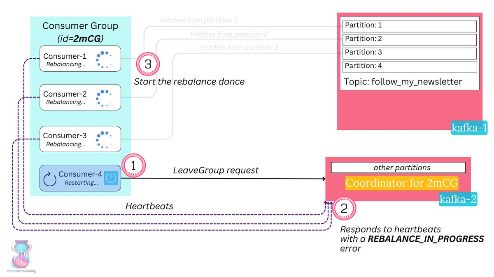
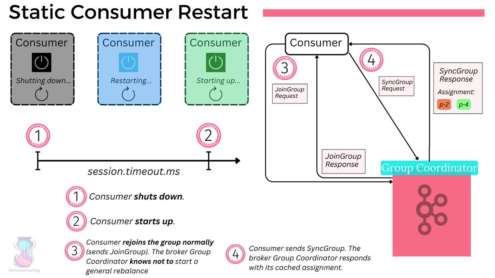
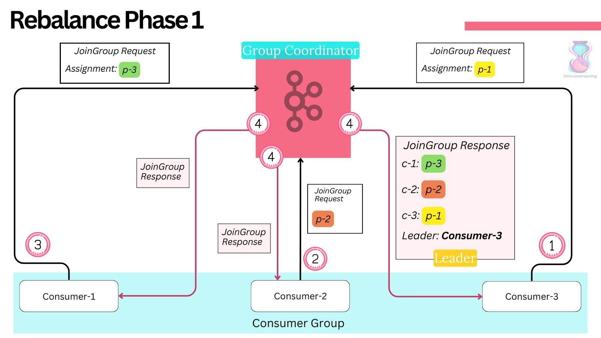
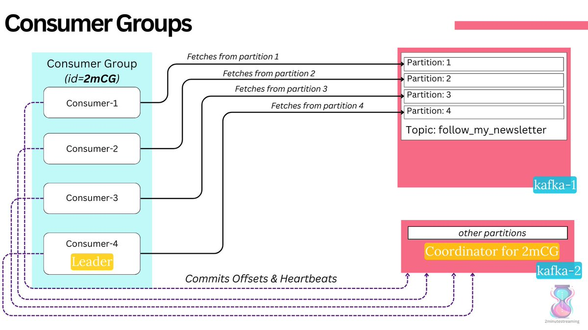
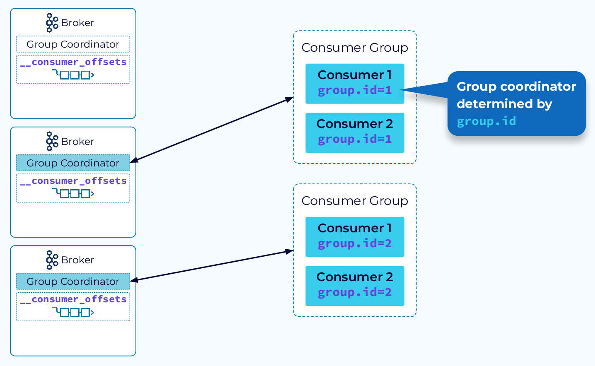

# FS2-Kafka-Examples
This project Zookeeper for distributed coordination and kakfa foe high-throughput distributed messaging and Kafka-ui for exposing a user-friendly web interface to manage Kafka topics
## Kafka-UI

You can inspect processed data in:
Kafka UI available at `http://localhost:8080`


### recovery-point-offset-checkpoint
This file is used internally by the kafka broker to track the number of logs that are flushed to the disk. The format of the file is like this.

`<version>
<total entries>
<topic name> <partition> offset`

### replication-offset-checkpoint
This file is used internally by the kafka broker to track the number of logs that are replicated to all the brokers in the cluster. The format of this file is the same as the `recovery-point-offset-checkpoint` file mentioned above.

### Partition Metadata
partition.metadata file contains a version and a topic_id. This topic id is the same for all the partitions( same topic)

### Log file
This is where the data written by the producers are stored in a binary format. One can view the contents of these files using command-line tools provided by kafka.

```bash
bin/kafka-dump-log.sh --files data/kafka/payments-7/00000000000000000000.log,data/kafka/payments-7/00000000000000000000.index --print-data-log
Dumping data/kafka/payments-7/00000000000000000000.log
Starting offset: 0
baseOffset: 0 lastOffset: 0 count: 1 baseSequence: -1 lastSequence: -1 producerId: -1
producerEpoch: -1 partitionLeaderEpoch: 0 isTransactional: false isControl: false position: 0
CreateTime: 1672041637310 size: 73 magic: 2 compresscodec: none crc: 456919687 isvalid: true | offset: 0
CreateTime: 1672041637310 keySize: -1 valueSize: 5 sequence: -1 headerKeys: [] payload: world 
```

`payload` is the actual data that was pushed to kafka. `offset` tells how far the current message is from the zero indexes. `producerId` and `produerEpoch` are used in delivery guarantee semantics

### Index and Timeindex files
```bash
bin/kafka-dump-log.sh --files data/kafka/payments-8/00000000000000000000.log,data/kafka/payments-8/00000000000000000000.index --print-data-log
Dumping data/kafka/payments-8/00000000000000000000.index
```

```bash
offset: 33 position: 4482
offset: 68 position: 9213
offset: 100 position: 13572
offset: 142 position: 18800
offset: 175 position: 23042
offset: 214 position: 27777
offset: 248 position: 32165
offset: 279 position: 36665
offset: 313 position: 40872
offset: 344 position: 45005
offset: 389 position: 49849
offset: 422 position: 54287
offset: 448 position: 58402
offset: 485 position: 62533
 ```

As we see from the above output, the `index` file stores the offset and its position of it in the ``.log` file. Why is it needed? We know that consumers process messages sequentially. When a consumer asks for a message, kafka needs to fetch it from the log i.e. it needs to perform a disk I/O. Imagine, kafka reading each log file line by line to find an offset. It takes `O(n)` (where n is the number of lines in the file) time and latency of disk I/O. It will become a bottleneck when the log files are of gigabytes size. So, to optimize it, kafka stores the offset to position mapping in the `.index` file so that if a consumer asks for any arbitrary offset it simply does a binary search on the `.index` file in the `O(log n)` time and goes to the .log file and performs the binary search again.

Let’s take an example, say a consumer is reading 190th offset. Firstly, the kafka broker reads the index file (refer to the above log) and performs a binary search, and either finds the exact offset or the closest to it. In this case, it finds offset as 175 and its position as 23042. Then, it goes to the .log file and performs the binary search again given the fact that the `.log` the file is an append-only data structure stored in ascending order of offsets.

Let’s look at the `.timeindex` file
```bash
bin/kafka-dump-log.sh --files data/kafka/payments-8/00000000000000000000.timeindex --print-data-log

Dumping data/kafka/payments-8/00000000000000000000.timeindex

timestamp: 1672131856604 offset: 33
timestamp: 1672131856661 offset: 68
timestamp: 1672131856701 offset: 100
timestamp: 1672131856738 offset: 142
timestamp: 1672131856772 offset: 175
timestamp: 1672131856816 offset: 213
timestamp: 1672131856862 offset: 247
timestamp: 1672131856901 offset: 279
timestamp: 1672131856930 offset: 312
timestamp: 1672131856981 offset: 344
timestamp: 1672131857029 offset: 388
timestamp: 1672131857076 offset: 419
timestamp: 1672131857102 offset: 448
timestamp: 1672131857147 offset: 484
timestamp: 1672131857185 offset: 517
timestamp: 1672131857239 offset: 547
```

As we see from the above result, `.timeindex` the file stores the mapping between the epoch timestamp and the offset in the `.index` file. When the consumer wants to replay the event based on the timestamp, kafka first finds the offset by doing a binary search in the `.timeindex` file, find the offset, and finds the position by doing a binary search on the `.index` file.


Now, let’s take a look at the filesystem. We can observe that there will be new folders created with the name `__consumer_offsets-0`, `__consumer_offsets-1` … `__consumer_offsets-49`. Kafka stores the state of each consumer offset in a topic called `__consumer_offsets` with a default partition size of 50. If we look at what’s inside the folder, the same files will be present as in the payments topic we have seen above.


s we see from the above image, the consumer polls for the records and commits the offset whenever it’s done processing. Kafka is flexible such that we can configure how many records to fetch in a single poll, auto-committing interval, etc…

When a consumer is committing the offset, it sends the topic name, partition & offset information. Then, the broker uses it to construct the key as `<consumer_group_name>, <topic>, <partition>` and value as `<offset>,<partition_leader_epoch>,<metadata>,<timestamp>` and store it in the `__consumer_offsets` topic.


When the consumer is crashed or restarted, it sends the request to the kafka broker and the broker finds the partition in `__consumer_offsets` by doing hash `(<consumer_group_name>, <topic>, <partition> ) % 50` and fetches the latest offset and returns it to the consumer.


### Segments
Each partition is divided into segments.

A segment is simply a collection of messages of a partition. Instead of storing all the messages of a partition in a single file (think of the log file analogy again), Kafka splits them into chunks called segments. Doing this provides several advantages. Divide and Conquer FTW!

Most importantly, it makes purging data easy. As previously introduced partition is immutable from a consumer perspective. But Kafka can still remove the messages based on the “Retention policy” of the topic. Deleting segments is much simpler than deleting things from a single file, especially when a producer might be pushing data into it.

Each segment file has `segment.log`, `segment.index` and `segment.timeindex` files. Kafka always writes the messages into these segment files under a partition. There is always an active segment to which Kafka writes to. Once the segment’s size limit is reached, a new segment file is created and that becomes the active segment.


Each segment file is created with the offset of the first message as its file name. So, In the above picture, segment 0 has messages from offset 0 to offset 2, segment 3 has messages from offset 3 to 5 and so on. Segment 6 which is the last segment is the active segment.
Kafka makes the lowest offset in the segment as its name

One of the common operations in Kafka is to read the message at a particular offset. For this, if it has to go to the log file to find the offset, it becomes an expensive task especially because the log file can grow to huge sizes (Default — 1G). This is where the .index file becomes useful. Index file stores the offsets and physical position of the message in the log file.


If you need to read the message at offset 1, you first search for it in the index file and figure out that the message is in position 79. Then you directly go to position 79 in the log file and start reading. This makes it quite effective as you can use binary search to quickly get to the correct offset in the already sorted index file.


## Blogs
- [Kafka Internals](https://lokesh1729.com/posts/kafka-internals-learn-kafka-in-depth-part-2/)
- [Kafka Storage Internals](https://www.freblogg.com/kafka-storage-internals)


### Interfaces

Multiple interfaces = multiple addresses
A server with multiple interfaces can participate in multiple networks and in every network, it will have its own unique ip address
Anything that listens to networks is usually configured to listened to a certain networking interface, meaning it will only be able to accept connections from that network

If we deploy an application and bound it to 188.166.227.208, then all computers on this network won't have issues connecting to this app. Computers found on 10.130.54.5 will not be able to connect to this application since the application is listening on a different interface and hence these computers won't be able to establish a connection

0.0.0.0 meanins the app will listen to all network interface available on the machine
Each network interface must have its own unique IP address
The IP address that you give to a host is assigned to its network interface, sometimes referred to as the primary network interface. If you add a second network interface to a machine, it must have its own unique IP number. Adding a second network interface changes the function of a machine from a host to a router. If you add a second network interface to a host and disable routing, the host is then considered a multihomed host.
A router is a machine that forwards packets from one network to another. To do this, the router must have at least two network interfaces. A machine with only one network interface cannot forward packets; it is considered a host

It is possible for a machine to have more than one network interface but not function as a router. This type of machine is called a multihomed host. A multihomed host is directly connected to multiple networks through its network interfaces. However, it does not route packets from one network to another.

Connecting an interface to a network makes it a part of that network. Therefore, the IP address is a property of the connection, not the host.
Likewise, a host can have many network connections and accordingly, many IP addresses. Routers require multiple IP addresses for their interfaces.
Each network interface has a network address.
it binds to the address and the address tells it which interface to activate and start listening on


### Consumer

The session.timeout.ms property specifies the maximum amount of time in milliseconds a consumer within a consumer group can be out of contact with a broker before being considered inactive and a rebalancing is triggered between the active consumers in the group. When the group rebalances, the partitions are reassigned to the members of the group.


The heartbeat.interval.ms property specifies the interval in milliseconds between heartbeat checks to the consumer group coordinator to indicate that the consumer is active and connected. The heartbeat interval must be lower, usually by a third, than the session timeout interval

`Coordinator` — Manages group membership, offsets
```java 
public class KafkaConsumer<K, V> implements Consumer<K, V> {
    private final ConsumerCoordinator coordinator;
}

final class Assignment {
        private List<TopicPartition> partitions;
        private ByteBuffer userData;
}


/**
 * This is used to describe per-partition state in the MetadataResponse.
 */
public class PartitionInfo {
    private final String topic;
    private final int partition;
    private final Node leader;
    private final Node[] replicas;
    private final Node[] inSyncReplicas;
    private final Node[] offlineReplicas;
}
## Producer
public final class TopicPartition implements Serializable {
    private final int partition;
    private final String topic;
    }
```
A TopicPartition is made up of a topic name and partition number

```java
// This is used to describe per-partition state in the MetadataResponse
    public static class PartitionMetadata {
        public final TopicPartition topicPartition;
        public final Errors error;
        public final Optional<Integer> leaderId;
        public final Optional<Integer> leaderEpoch;
        public final List<Integer> replicaIds;
        public final List<Integer> inSyncReplicaIds;
        public final List<Integer> offlineReplicaIds;
    }
```
we have this in the MetadataCache
` private final Map<TopicPartition, PartitionMetadata> metadataByPartition;`


```java
* Per topic info.
    private static class TopicInfo {
        public final ConcurrentMap<Integer /*partition*/, Deque<ProducerBatch>> batches = new CopyOnWriteMap<>();
        public final BuiltInPartitioner builtInPartitioner;
    }

public class RecordAccumulator {  
    private final ConcurrentMap<String /*topic*/, TopicInfo> topicInfoMap = new CopyOnWriteMap<>();
}
```

RecordAccumulator Accumulates records and groups them by topic- partition into batches. A batch of unsent records is maintained in the buffer memory. This also helps in compression

```java
public class KafkaProducer<K, V> implements Producer<K, V> {
   private final ProducerMetadata metadata;
    private final RecordAccumulator accumulator; 
}
```
The request Queue is important as it maintains the order of messages sent to kafka

## Consumer Group
A consumer group is a group of multiple consumers where each consumer present in a group reads data directly from the exclusive partitions. In case, the number of consumers is more than the number of partitions, some of the consumers will be in an inactive state.

Rebalance — Moving partition ownership from one consumer to another is called a rebalance.

`A consumer subscribes to one or more topics.`
`A consumer can be part of only one consumer group`


## Partition
Each partition stores log files replicated across nodes distributed into multiple brokers for fault tolerance. These log files are called segments. A segment is simply a collection of messages of a partition. Segment N contains the most recent records and Segment 1 contains the oldest retained records. The segment contains 1 GB of data (log.segment.bytes) or 1 week's worth of data (log.roll.ms or log.roll.hours) whichever is smaller. If this limit is reached, then the segment file is closed and a new segment file is created


A partition has only one consumer per consumer group.
At any time a single broker will the leader for a partition. That broker will be responsible for receiving and serving data of that partition.

`https://github.com/apache/kafka/blob/trunk/group-coordinator/src/main/java/org/apache/kafka/coordinator/group/GroupCoordinatorService.java`

`https://github.com/apache/kafka/blob/trunk/group-coordinator/src/main/java/org/apache/kafka/coordinator/group/consumer/ConsumerGroup.java`

[Minimum In-Sync Replicas](https://www.conduktor.io/kafka/kafka-topic-configuration-min-insync-replicas/)

[Kafka internals](https://medium.com/geekculture/kafka-internals-of-producer-and-consumers-5a1aebb2b3ce)
[kafka-topics-internals-segments-and-indexes](https://www.conduktor.io/kafka/kafka-topics-internals-segments-and-indexes/)
[Kafka internals-2](https://medium.com/geekculture/kafka-internals-part-2-7dad1977f7d1)
[distributed-event-streaming-kafka](https://medium.com/geekculture/distributed-event-streaming-kafka-dca9ca58ad69)
[kafka-consumers-internals](https://blog.developer.adobe.com/exploring-kafka-consumers-internals-b0b9becaa106)


### FS-Kafka
for `Kafka, Chunk[A] => F[Chunk[B]] or Chunk[A] => F[Unit]` are optimal 

the advantages of Chunk for this scenario are:
you can write the business logic without looking at the offsets
works well for batch operations, like batch writes on a db
lets you do concurrent operations like parTraverse on Chunk, without messing up the order of commits
lets you do filtering and deduplication on the Kafka messages, e.g. in some cases if you get two messages for the same key, you can consider only the latest
lets you group by key, so that you can then run logic on disjoint keys concurrently, and logic on the same key sequentially, which greatly increases the available concurrency compared to just doing one fiber per Kafka partition

[FS-Kafka](https://github.com/fd4s/fs2-kafka/pull/1281/)

After a consumer subscribes to some topics, it needs to request records to pass them off to the rest of the application. This process is called polling and is done using the poll function.

When calling poll, you must pass in a timeout duration to allow your application to move along if no records are available for retrieval.When no records are passed to a consumer within the timeout duration, it will progress with an empty collection of records.
Consumers use partition offsets to keep track of what records have been processed. As it polls records and computes whatever needs computing, it needs to note down the offsets of these records, so that the consumer knows what point to start polling records from in case of failure
The process of keeping track of a consumer’s offset is known as “committing”. In that it commits the current offset for a partition to storage.A consumer does not store its offsets locally. Instead, it sends them to the Kafka broker, who then persists them to disk.
kafka stores offset data in a topic called `__consumer_offset` . these topics use log compaction, which means they only save the most recent value per key.

assign()
1. finer control with topic-partition subscription
2. automatic or manual offsets management
3. supports multiple consumers per partition
Apache Flink and Spark use assign() for subscribing to the topics and manage the distribution of topic-partition pairs across workers.

##Consumer group
When a user uses subscribe() for consumption, consumers with the same group.id will form a consumer group and cooperate to consume topic(s) messages. Kafka cluster will elect one of the brokers as a Group Coordinator. The group coordinator is responsible for managing group list membership, receiving heartbeats, triggering rebalances on group membership changes etc. The coordinator will elect one consumer as a Group Leader and ask to do partitions assignments across consumers. Each partition will have only one consumer assigned.


###Consumer group rebalances
Changes in group membership will trigger consumer group rebalances. During rebalances, the group leader will recalculate partition assignments across current members. Rebalance is triggered when

1. consumer joins the group
2. consumer leaves the group
3. client-side failure detected via max.poll.interval.ms
4. server-side failure detected via session.timeout.ms


When we instantiate a consumer group, Kafka also creates the group coordinator. The group coordinator regularly receives requests from the consumers, known as heartbeats. If a consumer stops sending heartbeats, the coordinator assumes that the consumer has either left the group or crashed. That’s one possible trigger for a partition rebalance.
The first consumer who requests the group coordinator to join the group becomes the group leader. When a rebalance occurs for any reason, the group leader receives a list of the group members from the group coordinator. Then, the group leader reassigns the partitions among the consumers in that list using a customizable strategy set in the partition.assignment.strategy configuration.


##Bootstrapping
The “bootstrap-servers” configuration is a list of “hostname:port” pairs that address one or more (even all) of the brokers. The client uses this list by doing these steps:

pick the first broker from the list
send a request to the broker to fetch the cluster metadata containing information about topics, partitions, and the leader brokers for each partition (each broker can provide this metadata)
connect to the leader broker for the chosen partition of the topic
`sh kafka-topics.sh --bootstrap-server localhost:9092 --create --topic samples --partitions 1 --replication-factor 1`

[Java Consumer Seek and Assign](https://www.conduktor.io/kafka/java-consumer-seek-and-assign/)


In case you are looking to read specific messages from specific partitions, the `.seek()` and `.assign()` API may help you.

These APIs are also helpful to replay data from a specific offset.

To use these API, make the following changes:

Remove the group.id from the consumer properties (we don't use consumer groups anymore)

Remove the subscription to the topic
Use consumer `assign()` and `seek()` APIs

[kafka-docker-connection](https://www.baeldung.com/kafka-docker-connection)
[spring-boot-kafka-ssl](https://www.baeldung.com/spring-boot-kafka-ssl)

The ack mode determines when the broker updates the consumer’s offset.
here are three acknowledgment modes:

1. auto-commit: the consumer sends an acknowledgment to the broker as soon as it receives a message
2. after-processing: the consumer only sends an acknowledgment to the broker after it has successfully processed the message
3. manual: the consumer waits until it receives specific instructions before sending an acknowledgment to the broker


## Listeners
Listeners, advertised listeners, and listener protocols play a considerable role when connecting with Kafka brokers.

We manage listeners with the KAFKA_LISTENERS property, where we declare a comma-separated list of URIs, which specify the sockets that the broker should listen on for incoming TCP connections.

Each URI comprises a protocol name, followed by an interface address and a port:

`EXTERNAL_SAME_HOST://0.0.0.0:29092,INTERNAL://0.0.0.0:9092`

Here, we specified a 0.0.0.0 meta address to bind the socket to all interfaces. Further, EXTERNAL_SAME_HOST and INTERNAL are the custom listener names that we need to specify when defining listeners in the URI format.

## Bootstrapping

For initial connections, Kafka clients need a bootstrap server list where we specify the addresses of the brokers. The list should contain at least one valid address to a random broker in the cluster.

The client will use that address to connect to the broker. If the connection is successful, the broker will return the metadata about the cluster, including the advertised listener lists for all the brokers in the cluster. For subsequent connections, the clients will use that list to reach the brokers.

##Advertised Listeners
Just declaring listeners is not enough because it’s just a socket configuration for the broker. We need a way to tell the clients (consumers and producers) how to connect to Kafka.

This is where advertised listeners come into the picture with the help of the KAFKA_ADVERTISED_LISTENERS property. It has a similar format as the listener’s property:

`<listener protocol>://<advertised host name>:<advertised port>`

The clients use the addresses specified as advertised listeners after the initial bootstrapping process

###Consumer Lag
Kafka consumer group lag is a key performance indicator of any Kafka-based event-driven system.
Consumer lag is simply the delta between the consumer’s last committed offset and the producer’s end offset in the log. In other words, the consumer lag measures the delay between producing and consuming messages in any producer-consumer system.

[kafka-consumer-lag](https://www.baeldung.com/java-kafka-consumer-lag)

[message-delivery-semantics](https://www.baeldung.com/kafka-message-delivery-semantics)


ACKS=all means all in-sync replicas must store the request before returning to the client.
ACKS=1 means only a leader has to store the request before returning to the client.
ACKS=0 means the client considers the request successfully delivered immediately after the message is put onto the wire.


[tpc-buffers](https://redpanda.com/blog/tpc-buffers)
[](https://redpanda.com/blog/redpanda-faster-safer-than-kafka)


 ## Group Coordinator
Kafka designates a single broker as the "Group Coordinator" for each consumer group.
The Group Coordinator is responsible for managing the state of the group, handling rebalances, and coordinating the assignment of partitions to consumers

## Rebalance Protocol:
When a consumer joins or leaves a group, a rebalance is triggered.
Kafka uses a protocol to orchestrate the rebalance, and it involves communication between consumers and the Group Coordinator.
The consumers negotiate and agree on a new partition assignment during the rebalance.

## Consumer States:
Consumers within a group can be in one of the following states: Stable, AwaitingRebalance, PreparingRebalance, and Dead.
The state transitions occur during the rebalance process.

## Idempotent Consumers:
Kafka allows consumers to be configured as idempotent, ensuring that messages are processed exactly once.
Idempotent consumers require a unique client.id and ensure that a consumer will always have the same partition assignment after a rebalance.
- Kafka consumer groups are suitable for scenarios like event processing, log aggregation, metrics collection, and real-time analytics.

### Partition.assignment.strategy
When a new consumer group is created a consumer group coordinator is elected. The coordinator lives on a broker assigned by a hash() of the consumer group name. This coordinator is responsible for various tasks, including partition assignment, offset commits, and deciding when a consumer should be marked “failed”. Consumers in a consumer group share ownership of the partitions in the topics they subscribe to. When we add a new consumer to the group, it starts consuming messages from partitions previously consumed by another consumer. The same thing happens when a consumer shuts down or crashes; it leaves the group, and the partitions it used to consume will be consumed by one of the remaining consumers.

Reassignment of partitions to consumers also happens when the topics the consumer group is consuming are modified, e.g. new partitions are added to the topic
PartitionAssignor is the class that decides which partitions will be assigned to which consumer. When creating a new Kafka consumer, we can configure the strategy that will be used to assign the partitions amongst the consumers. We can set it using the configuration `partition.assignment.strategy`. 


All the Kafka consumers which belong to the same consumer group must have a single assignment strategy. If a consumer attempts to join a consumer group that has a different assignment strategy, it will end up getting an `InconsistentGroupProtocolException`


[partition-assignment-strategy](https://www.conduktor.io/blog/kafka-partition-assignment-strategy/)

[partition-assignment-strategies](https://medium.com/streamthoughts/understanding-kafka-partition-assignment-strategies-and-how-to-write-your-own-custom-assignor-ebeda1fc06f3)

What is important to understand is that a partition is actually the unit of parallelism for Kafka’s producers and consumers.
Kafka provides the guarantee that a topic-partition is assigned to only one consumer within a group.

The ability of consumers clients to cooperate within a dynamic group is made possible by the use of the so-called Kafka Rebalance Protocol.

[kafka-rebalance-protocol](https://medium.com/streamthoughts/apache-kafka-rebalance-protocol-or-the-magic-behind-your-streams-applications-e94baf68e4f2)


### JoinGroup
When a consumer starts, it sends a first FindCoordinator request to obtain the Kafka broker coordinator which is responsible for its group. Then, it initiates the rebalance protocol by sending a JoinGroup request.


[understanding-kafka-partition-assignment](https://medium.com/streamthoughts/understanding-kafka-partition-assignment-strategies-and-how-to-write-your-own-custom-assignor-ebeda1fc06f3)

### Subscribing to topics
Kafka Consumer offers two ways for subscribing to the topics: via subscribe() and assign() methods. Each has a different set of supported features.

[kafka-consumers-internals](https://blog.developer.adobe.com/exploring-kafka-consumers-internals-b0b9becaa106)


##  KRaft
In the new architecture, the controller nodes are a Raft quorum that manages the log of metadata events. This log contains information about each change to the cluster metadata. Everything that is currently stored in ZooKeeper, such as topics, partitions, ISRs, configurations, and so on, will be stored in this log.

Using the Raft algorithm, the controller nodes will elect a leader from among themselves, without relying on any external system. The leader of the metadata log is called the active controller. The active controller handles all RPCs made from the brokers. The follower controllers replicate the data that is written to the active controller and serve as hot standbys if the active controller should fail. Because the controllers will now all track the latest state, controller failover will not require a lengthy reloading period in which we transfer all the state to the new controller.
Instead of the controller pushing out updates to the other brokers, those brokers will fetch updates from the active controller via a new MetadataFetch API. Similar to a fetch request, brokers will track the offset of the latest metadata change they fetched and will only request newer updates from the controller. Brokers will persist the metadata to disk, which will allow them to start up quickly, even with millions of partitions.

Brokers will register with the controller quorum and will remain registered until unregistered by an admin, so once a broker shuts down, it is offline but still registered. Brokers that are online but are not up-to-date with the latest metadata will be fenced and will not be able to serve client requests. The new fenced state will prevent cases where a client produces events to a broker that is no longer a leader but is too out-of-date to be aware that it isn’t a leader.

Replication is critical because it is the way Kafka guarantees availability and durability when individual nodes inevitably fail.

#### max.poll.interval.ms

The maximum delay between invocations of poll() when using consumer group management. This places an upper bound on the amount of time that the consumer can be idle before fetching more records. If poll() is not called before expiration of this timeout, then the consumer is considered failed and the group will rebalance in order to reassign the partitions to another member.In other words, if our consumer doesn't call poll at least once every max.poll.interval.ms, to Kafka, it's as good as dead. When this happens, Kafka follows up with a rebalance process to distribute the current work of the dead consumer to the rest of its consumer group. This introduces more overhead and delay into an already slow processing rate.

# Producer


# Consumer Group Rebalance

## group_instance_id
1. every consumer group rebalance stops the world - consumers stop reading from partitions until the rebalance completes.
🤕 2. every consumer restart triggers a rebalance.

This can become pretty disruptive when you have a group consisting of hundreds of consumers

How do you restart any given app for maintenance purposes without triggering a rebalance? 🤔

I’ll tell you how:

👉 Static Consumer Group Membership

Long-winded way of saying something simple - slap a unique ID on each of your consumers! ✨

Normally, every consumer in a group is assigned a fresh ID that’s generated by the broker when it joins the group. When it leaves, the broker completely forgets about that ID. (there's no use for it)


When a consumer leaves the group gracefully (e.g restarts), it sends a LeaveGroupRequest to the coordinator broker.

The broker then immediately triggers a rebalance to reassign the partitions that were previously-consumed by the now-left member.




If the consumer joins later again, the broker will give it a new ID (it won’t even know it’s the same consumer) and rebalance again to spread the load.

But this seems inefficient. These two rebalances can take a long time! 🐌

Each rebalance is bounded by the session_timeout_ms, which is 45 seconds by default.

2x the timeout - that's a minute and a half (90 seconds) of unavailability per consumer restart. 🤦🏻‍♂️


Now. Imagine you have 100 consumer apps that you want to perform a rolling restart on - that’s 2.5 hours of unavailability simply due to rebalances! 💀

If we know it's the same consumer coming back and we do not want to do this partition assignment shuffle in between its restart - shouldn't we be able to avoid it?
To risk sounding like a president - Yes, We Can. 🇺🇸

You can tell Kafka to not do that. If you set the group_instance_id config on your consumer app to something unique, a rebalance will not be triggered when the member shuts down.

Internally - the LeaveGroupRequest is simply not sent. 😁

The Coordinator will patiently wait for the member to rejoin. The member will eventually re-join and send its usual dance of SyncGroup/JoinGroup. 💃

The difference this time is that the Coordinator will NOT trigger a rebalance for the rest of the group -- instead, it will just respond with the member’s old partition assignment directly (the coordinator keeps it cached). 👌




That's the happy path.

😵What if the member never comes back?

Well, the usual heartbeat timeout (session_timeout_ms) is still tracked - so if the Coordinator does NOT receive a heartbeat from that exact static consumer within the configured timeout, it will treat it as dead and trigger a rebalance. Business as usual.

Note that during the consumer's restart period, no consumer from the group is consuming from the partitions that were assigned to the now-offline static member.

When configuring the heartbeat timeout (session_timeout_ms), keep two things in mind:

☝️configure it high enough to not timeout during regular restarts
✌️ configure it low enough to not have excessively long periods of nobody processing that subset of partitions during cases of actual consumer failures


### Kafka Consumer Group Rebalance Visualized
Its a dance consisting of two requests: 💃

1. JoinGroup
2. SyncGroup


And once established, consumers regularly heartbeat to the group coordinator to signal they’re alive.

The whole group goes through the two steps sequentially.
❤️ Phase 0 - Heartbeats / Steady State

Let’s assume our group is already formed.

In the steady state, every consumer is consuming peacefully and periodically sending heartbeats to the group coordinator in order to signal that it is alive and well.

There are 6 reasons why a group can be forced to rebalance:

• a consumer joins the group (sends a JoinGroup request). 👋

• a consumer shuts down gracefully - it leaves the group via a LeaveGroup request. ✌️

• max_poll_interval_ms passing between the poll calls. ⏱

• a consumer dies - its heartbeat requests time out after the configured session_timeout_ms. 💀

• the enforceRebalance API is called. 🏌️

• a new partition is added to a topic that the group is subscribed to. ✨

Let’s imagine our group needs to rebalance because a new member is joining. 👋

When the group is in a rebalance state, the coordinator begins to respond to the heartbeats with an error indicating that a rebalance is in progress.

It’s through this response that it communicates the need for a rebalance to each consumer.

When the consumer realizes it’s time to rebalance, it begins the dance. 💃

💃 Phase 1 - JoinGroup

Every consumer first sends a JoinGroup to signal their intention of joining the group. This is done even they're already in the group - in that case, they simply reaffirm their membership and signal their intent to participate in the rebalance.

The very first JoinGroup request the Coordinator receives is special:
⏱ - after it, the max poll interval timeout starts ticking...
👑 - the consumer that sent this first request is crowned the Group Leader! It will later be responsible for assigning partitions.

The JoinGroup request sent by each consumer contains the protocol type and the extendable protocol-specific metadata. This is an embedded protocol within the rebalance protocol.

For regular Kafka consumers - that’s most importantly the partition assignment that the consumer is currently assigned (if already in the group).

The Group Coordinator broker responds to these JoinGroup requests when either:

🟣 - all known members have sent a request.
🟣 - max_poll_interval_ms passes.

Once either of these is fulfilled, the Coordinator responds to all the JoinGroup requests it has received.

The JoinGroup response sent to the Group Leader client is special - it contains all of the other JoinGroup request information sent by the other members. 🧳

In our example - the partition assignment of every consumer. 👍

The Group Leader then uses this information to craft a partition assignment for every consumer. 

💃 Phase 2 - SyncGroup

After a consumer processes the JoinGroup response, it immediately follows up with a SyncGroup request.

The Group Coordinator will respond to these requests with the computed assignment for each consumer respectively.

But. It has to wait and hold the requests in purgatory until it receives the assignment information.

It is the Group Leader’s SyncGroup request that contains all the data (the computed partition assignment) that should be propagated to each member. 👑

When the broker receives the Group Leader’s SyncGroup request, it immediately persists this new group state to disk by appending a new record to the log of the `__consumer_offsets` partition it leads. 💿

Recall that each group is assigned a specific consumer offsets partition, and the leader of that partition is the Group Coordinator for that particular consumer group. Group. I thought I’d say that word again. 😁

Then, the Coordinator starts responding to the requests - propagating the particular consumer's assignment in its specific SyncGroup response.

From a consumer’s point of view - the rebalance is finished once it receives a SyncGroup response. That frees it to resume consumption from the partitions it is assigned.

The End🎬

Note that this post explained the eager rebalance protocol, which is the default in the consumer.

The incremental cooperative rebalance protocol is a bit more interesting - and we will cover it with a video shortly too. ✌️

[Video](https://twitter.com/i/status/1678057402946539523)

### Consumer Groups v2!
If you’ve ever used consumer groups in production at any non-trivial scale, you probably know all the problems with it:

- ⛔️ Group-wide synchronization barrier acts as a cap on scalability

A single misbehaving consumer can disturb the whole group.

Even if you have cooperative rebalancing and static membership enabled, you will still have rebalances happen. 🤷‍♂️
It’s a fact of life I've heard - death, taxes & consumer group rebalances.

And the problem is that even with cooperative rebalancing (which helped a lot!), you’re bound on waiting for the slowest member of the group to complete the rebalance(s). 🐌

The problem is that no consumer can commit offsets while a rebalance is in progress. ❌

Another subtle thing is that with cooperative rebalancing, a rebalance will take longer than usual.

Why?

Because consumers are allowed to process partitions during rebalances.
They will call the poll() method more infrequently -- they're busy processing records after all.
Thus, the overall rebalance time will increase.

This makes it pretty hard to scale to 1000s of members.

- 🤯 Complexity

There’s a reason you’re reading this!

The current protocol is pretty complex and hard to understand. It's used for a bunch of stuff, including metadata propagation in Kafka Streams.

This compexity results in more:

- 🐛 bugs

The harder to reason about and the more moving parts 
you have - the greater chance for bugs.
There have been quite a few in the protocol.

And due to the fact that a lot of the protocol’s logic lives on the clients, that results in:

- 🐌 slow fixes

Bugs require client-side fixes, which are slow to be adopted.

If you run a Kafka ops team, you know how hard it is to get all of your clients' teams to upgrade!

If you're using a cloud service, you need to wait for a new Kafka release to go out.

Can't have the cloud provider handle it for you behind the scenes!

- 🔍 hard to debug

Debugging is harder because you need client logs. In the cloud, that's hard to do again.

On-prem, it requires reading through a lot of logs and collecting a lot of files.

- ⚙️ very extendable

There’s a reusable embedded protocol within the rebalance protocol, where clients are free to attach raw bytes that only they can then parse themselves. 

It's challenging to build compatible software for this cross-client protocol, as well as near-impossible to inspect from the broker side.

- 😢 inconsistent metadata

Clients are responsible for triggering rebalances based on the metadata, but different clients can have different views of the metadata.

- 😵‍💫 interoperability

Different implementations of the clients (i.e. anything besides the Java client) may have bugs.
The complex logic needs to be re-implemented quite a few times.

This usually means more bugs and slower time to ship features in your favorite client. A combination nobody likes.

...

So what should an open source community do?

Move the logic to the broker!
Then?
Simplify it.

The new protocol is very elegant - it streamlines all of the regular Kafka consumer logic inside a new heartbeat API.

It has the broker decide what partition assignments the consumers should have, and totally omits the notion of a Group Leader client.

Another major change is that the notion of a group-wide rebalance is removed now.

The rebalance is more fine-grained now. 👌

When you think about it, a rebalance is simply a reassignment of some partitions from some consumers to others. 💡

Why does the whole group need to stop and know about this?

It had to before because the logic was on the client.

It doesn’t now. 🎂

The new protocol is fine-grained in its assignments.

It maintains per-member epochs, as well as separate epochs for the general group membership and the global assignment.

The goal is simple - get all of those epoch numbers to be the same.

The order is the following:
1. the group-wide epoch is bumped.
2. the target assignment epoch is bumped.
3. individual consumers catch up to the epoch via the heartbeat request, individually. (fine-grained)

In general, what you have is a simple state machine inside the Group Coordinator broker that’s running a constant reconciliation loop. 💥

Because every member converges to the target state independently, the coordinator is free to simplify that convergence member by member. 👍

It has the logic to resolve dependencies between members - the act of:
1. revoking one member’s partition.
2. confirming the success of that.
3. bumping that member's epoch before assigning that partition to another consumer.

Here is an example visual of what happens when two members join a consumer group one by one:


[video](https://twitter.com/i/status/1679187632679419908)


## Rebalance
The protocol is very intricate. It was intentionally designed with clear separation of concerns:

🟣 the broker knows about group membership & subscribed topics
🟣 the consumers know about partition assignment

Notably, the clients themselves choose how to distribute the load among themselves - they pass this information through an embedded protocol within the general rebalance. Design-wise, this makes sense because every application is different and it knows best how to split its work appropriately. 🍱

✌️ The rebalance consists of two steps:
1. Collect or reaffirm group membership information.
2. Compute and propagate partition assignment.

For the pictured example, imagine the following 3/3/3 scenario:
We have 3 consumers consuming from a topic with 3 partitions, and 3 new partitions were created in the same topic. 3️⃣

🎬 Phase 0 - Initiate the Rebalance?

How do the clients know that a rebalance is taking place?

There can be different triggers for a rebalance - here it is a notification of new partitions, but it can be new consumer clients coming online or leaving the group, etc.

In any case - the same path is used.

📸 Not pictured here: every consumer sends lightweight heartbeat requests to the Group Coordinator broker.

When the broker realizes that a rebalance should happen, it starts responding to the heartbeats with a special response that informs the clients.

The consumers then start the rebalance dance.

🎬 Phase 1 - JoinGroup

A JoinGroup request is sent to the Group Coordinator by every consumer. This informs the Group Coordinator broker of what consumer clients are part of the group.

The very first JoinGroup request the Coordinator receives is special:

⏱ - after it, the max poll interval timeout starts ticking...
👑 - the consumer that sent this first request is crowned the Group Leader!

The JoinGroup request sent by each consumer contains the protocol type and the protocol-specific metadata. This is the embedded protocol.

For regular Kafka consumers - that’s usually the partition assignment that the consumer is assigned, among other things like rack id, consumer instance member id, and other things specific to the configured partition assignor.

For Kafka Connect - there's other information like the URL and offset of the worker.

The broker is agnostic to this information - it doesn’t parse it, it simply acts as a simple proxy and re-sends the same bytes.

The Group Coordinator broker responds when either:

🟣 - all known members have sent a request
🟣 - max.poll.interval\.ms passes

Once this is fulfilled, the Coordinator starts responding to all the JoinGroup requests it received so far.

Note that this acts as a sort of synchronization barrier for the protocol. At this point of response, we know that no member of the group is consuming from any partition:
🟣 - if the member sent a request, it willfully stopped consumption. (note there is a different type of rebalance - the incremental cooperative one - that changes details here. we will cover this later ✌️)
🟣 - if the timeout passed, the member isn't part of the consumer group anymore.

The JoinGroup response sent to the Group Leader client is special - it has all of the other JoinGroup request information sent by the other members. ⭐️🧳

The GroupLeader then uses this information to craft a partition assignment for every consumer, and the 2nd phase starts:

🎬 Phase 2 - SyncGroup

A SyncGroup request is sent by each consumer immediately after they process the JoinGroup response.

The Group Leader’s SyncGroup request sends all the data (the computed partition assignment) that should be sent to each member.

💿 When the broker receives that request, it immediately persists this new group state to disk by appending a new record to the `__consumer_offsets` partition it leads.

Then, the Coordinator starts responding to the requests - propagating the particular consumer's assignment in its specific SyncGroup response.

🏁 The rebalance is then over



## Consumer Group

The core reason to have consumer groups in Kafka is so that you can scale your message consumption (& processing) for each app leveraging those messages.

Usually, you want a message to be processed once - so the Kafka protocol enforces you to have each partition be assigned a specific consumer, most notably ensuring no two consumers consume from the same partition for a prolonged period of time. (forget about exactly once for a second)

This happens through Consumer Group Rebalances - a process whose main purpose is to reassign the partition<->consumer mapping.

This is done when:

🙋‍♂️ a new consumer comes online to join the group
👋 when one leaves the group
😵 when an old one goes offline

To maintain this mapping, you need to inform each consumer what partitions they're going to consume from.

This happens through the confusingly-named Group Coordinator and Group Leader.

👨🏾‍🎤 Group Coordinator - a broker that is the point of contact for the given consumer group.

The coordinator’s responsibility is to… well… coordinate the group.

It maintains the membership of the group (what consumers are part of it, their heartbeats) and coordinates them together during consumer group rebalances. We will dive into those in a separate post. 🔜

The Coordinator also accepts the special OffsetCommit requests which are sent by the consumers to save their progress in the log. ⛳️

This data is stored in an internal topic named `__consumer_offsets`. This topic also contains metadata about the group, so that the coordinator can fail over appropriately if it dies.

Most brokers are group coordinators for at least one consumer group.

The way the broker is chosen is very simple - each consumer group is assigned a `__consumer_offsets` partition that they save their commits in.

The leader for the group's assigned partition is the group coordinator for that consumer group. 👨🏾‍🎤

And how do we choose which partition is for which group?

Very simply - we take the Java String hash code of the group id and modulo it with the number of consumer offsets partitions (defaults to 50).

👩🏻‍🎤 Group Leader - a single consumer client that is the leader of the group

Any consumer can be the group leader. Its responsibility is to assign partitions for each consumer. This is done during the consumer group rebalance step as we will cover later.



[telematics-tracking-part2](https://chollinger.com/blog/2022/09/tiny-telematics-tracking-my-trucks-location-offline-with-a-raspberry-pi-redis-kafka-and-flink-part-2/)
[telematics-tracking-part1](https://chollinger.com/blog/2022/08/tiny-telematics-tracking-my-trucks-location-offline-with-a-raspberry-pi-redis-kafka-and-flink-part-1/)

[fs2,cats effect, refined, fs-kafka](https://chollinger.com/blog/2022/06/functional-programming-concepts-i-actually-like-a-bit-of-praise-for-scala-for-once/)

[0.0.0.0](https://www.youtube.com/watch?v=my2vBYZ1RFw)

[fs2-kafka-in-real-world-part-1](https://ayushm4489.medium.com/fs2-kafka-in-real-world-part-1-a7dfc65b995b)

[fs2-kafka-in-real-world-part-2](https://ayushm4489.medium.com/fs2-kafka-in-real-world-part-2-831891ee6907)

[scala3-fs2](https://github.com/PendaRed/scala3-fs2/tree/main/src/main/scala/com/jgibbons/fs2/c)

[parallel-backpressured-kafka-consumer](https://tuleism.github.io/blog/2021/parallel-backpressured-kafka-consumer/)

[kafka-rebalance-protocol](https://medium.com/streamthoughts/apache-kafka-rebalance-protocol-or-the-magic-behind-your-streams-applications-e94baf68e4f2)


Kafka uses ZooKeeper for several purposes, such as:


- Maintaining the cluster membership and broker metadata, such as broker IDs, hostnames, ports, rack information, etc.
- Storing the topic and partition metadata, such as topic names, partition IDs, leaders, followers, replicas, etc.
- Managing the consumer group membership and offsets, such as group IDs, consumer IDs, assigned partitions, committed offsets, etc.
- Handling the controller election and quorum, such as electing a single broker as the controller that is responsible for managing the cluster state and coordinating leader and follower changes.


### What is Kraft and How Does It Work?
Kraft is a new mode of operation for Kafka that eliminates the dependency on ZooKeeper and uses a self-managed metadata quorum instead. Kraft is based on the Raft consensus protocol, which is a widely adopted algorithm for achieving distributed consensus among a set of servers. Raft ensures that the servers agree on a consistent and durable log of commands, which in Kafka’s case, represent the metadata changes.

Kraft works as follows:


A Kafka cluster consists of a set of brokers that can play one or more of the following roles: broker, controller, or voter.
A broker is a server that stores and serves data for topics and partitions. A broker can also be a controller or a voter, but it does not have to be.
A controller is a broker that is responsible for managing the cluster state and coordinating metadata changes. There can be only one controller at a time, which is elected by the Raft protocol among the voters.
A voter is a broker that participates in the Raft quorum and stores a copy of the metadata log. There can be any odd number of voters, typically 3 or 5, depending on the desired fault tolerance.
The metadata log is a sequence of records that represent the metadata changes in the cluster, such as creating, deleting, or altering topics, changing partition leaders or replicas, etc. The metadata log is replicated among the voters using the Raft protocol, and is also stored on disk for durability.
The metadata cache is a local in-memory representation of the metadata state for each broker. The controller maintains the authoritative metadata cache, which is updated by applying the records from the metadata log. The other brokers maintain a follower metadata cache, which is updated by fetching the records from the controller.
The metadata requests are the requests that involve metadata operations, such as creating, deleting, or altering topics, fetching metadata, committing offsets, etc. The metadata requests are handled by the controller, which validates and executes them, and appends the corresponding records to the metadata log. The other brokers forward the metadata requests to the controller, and wait for the controller to respond.

`kafka-storage.sh random-uuid` is used to generate an ID for the Kafka cluster,which is required in KRaft mode.


### Listeners
Listeners are used to connect to Kafka brokers. Each Kafka broker can be configured to use multiple listeners. Each listener requires a different configuration so it can listen on a different port or network interface

`<listenerName>://<hostname>:<port>`

If <hostname> is empty, Kafka uses the java.net.InetAddress.getCanonicalHostName() class as the hostname
When a Kafka client wants to connect to a Kafka cluster, it first connects to the bootstrap server, which is one of the cluster nodes. The bootstrap server provides the client with a list of all the brokers in the cluster, and the client connects to each one individually. The list of brokers is based on the configured listeners

### Advertised listeners

Optionally, you can use the advertised.listeners property to provide the client with a different set of listener addresses than those given in the listeners property. This is useful if additional network infrastructure, such as a proxy, is between the client and the broker, or an external DNS name is being used instead of an IP address.

```sh
listeners=internal-1://:9092,internal-2://:9093
advertised.listeners=internal-1://my-broker-1.my-domain.com:1234,internal-2://my-broker-1.my-domain.com:1235
```


#### Inter-broker listeners

Inter-broker listeners are used for communication between Kafka brokers. Inter-broker communication is required for:

- Coordinating workloads between different brokers
- Replicating messages between partitions stored on different brokers
- Handling administrative tasks from the controller, such as partition leadership changes
The inter-broker listener can be assigned to a port of your choice. When multiple listeners are configured, you can define the name of the inter-broker listener in the `inter.broker.listener.name` property


### Commit logs
Apache Kafka stores all records it receives from producers in commit logs. The commit logs contain the actual data, in the form of records, that Kafka needs to deliver. These are not the application log files which record what the broker is doing.

##### Log directories

You can configure log directories using the log.dirs property file to store commit logs in one or multiple log directories. It should be set to `/var/lib/kafka` directory created during installation:


### Consumer Group Protocol
Kafka separates storage from compute. Storage is handled by the brokers and compute is mainly handled by consumers or frameworks built on top of consumers (Kafka Streams, ksqlDB). Consumer groups play a key role in the effectiveness and scalability of Kafka consumers


To define a consumer group we just need to set the group.id in the consumer config. Once that is set, every new instance of that consumer will be added to the group. Then, when the consumer group subscribes to one or more topics, their partitions will be evenly distributed between the instances in the group. This allows for parallel processing of the data in those topics.

The unit of parallelism is the partition. For a given consumer group, consumers can process more than one partition but a partition can only be processed by one consumer. If our group is subscribed to two topics and each one has two partitions then we can effectively use up to four consumers in the group. We could add a fifth but it would sit idle since partitions cannot be shared


The assignment of partitions to consumer group instances is dynamic. As consumers are added to the group, or when consumers fail or are removed from the group for some other reason, the workload will be rebalanced automatically.


#### Group Coordinator



The magic behind consumer groups is provided by the group coordinator. The group coordinator helps to distribute the data in the subscribed topics to the consumer group instances evenly and it keeps things balanced when group membership changes occur. The coordinator uses an internal Kafka topic to keep track of group metadata.


#### Group Startup


When a consumer instance starts up it sends a FindCoordinator request that includes its group.id to any broker in the cluster. The broker will create a hash of the group.id and modulo that against the number of partitions in the internal __consumer_offsets topic. That determines the partition that all metadata events for this group will be written to. The broker that hosts the leader replica for that partition will take on the role of group coordinator for the new consumer group. The broker that received the FindCoordinator request will respond with the endpoint of the group coordinator.


 #### Members Join

 

 Next, the consumers and the group coordinator begin a little logistical dance, starting with the consumers sending a JoinGroup request and passing their topic subscription information. The coordinator will choose one consumer, usually the first one to send the JoinGroup request, as the group leader. The coordinator will return a memberId to each consumer, but it will also return a list of all members and the subscription info to the group leader. The reason for this is so that the group leader can do the actual partition assignment using a configurable partition assignment strategy.


 #### Partitions Assigned

 


 After the group leader receives the complete member list and subscription information, it will use its configured partitioner to assign the partitions in the subscription to the group members. With that done, the leader will send a SyncGroupRequest to the coordinator, passing in its memberId and the group assignments provided by its partitioner. The other consumers will make a similar request but will only pass their memberId. The coordinator will use the assignment information given to it by the group leader to return the actual assignments to each consumer. Now the consumers can begin their real work of consuming and processing data.


 [consumer-group-protocol](https://developer.confluent.io/courses/architecture/consumer-group-protocol/)

 [architecture/broker](https://developer.confluent.io/courses/architecture/broker/)


 [kafka-networking-via-wireshark](https://vkontech.com/kafka-networking-via-wireshark/)


