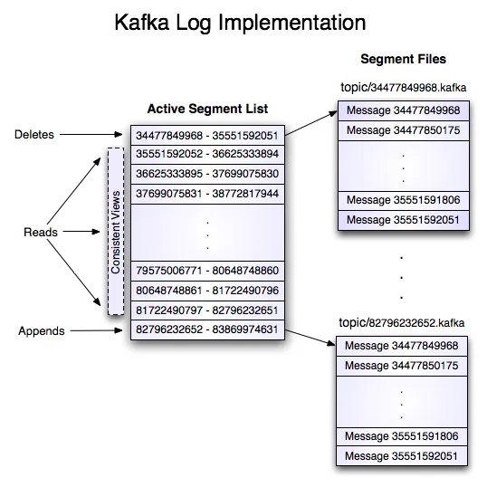
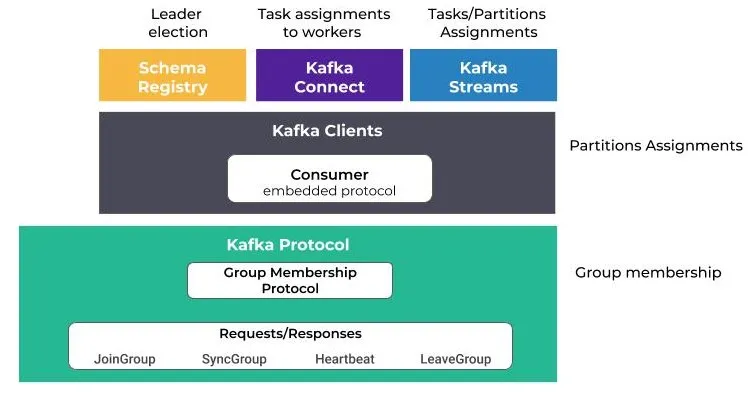
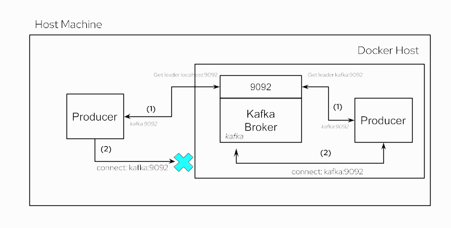

# FS2-Kafka-Examples
This project Zookeeper for distributed coordination and kakfa foe high-throughput distributed messaging and Kafka-ui for exposing a user-friendly web interface to manage Kafka topics
## Kafka-UI

You can inspect processed data in:
Kafka UI available at `http://localhost:8080`


### recovery-point-offset-checkpoint
This file is used internally by the kafka broker to track the number of logs that are flushed to the disk. The format of the file is like this.

`<version>
<total entries>
<topic name> <partition> offset`

### replication-offset-checkpoint
This file is used internally by the kafka broker to track the number of logs that are replicated to all the brokers in the cluster. The format of this file is the same as the `recovery-point-offset-checkpoint` file mentioned above.

### Partition Metadata
partition.metadata file contains a version and a topic_id. This topic id is the same for all the partitions( same topic)

### Log file
This is where the data written by the producers are stored in a binary format. One can view the contents of these files using command-line tools provided by kafka.

```bash
bin/kafka-dump-log.sh --files data/kafka/payments-7/00000000000000000000.log,data/kafka/payments-7/00000000000000000000.index --print-data-log
Dumping data/kafka/payments-7/00000000000000000000.log
Starting offset: 0
baseOffset: 0 lastOffset: 0 count: 1 baseSequence: -1 lastSequence: -1 producerId: -1
producerEpoch: -1 partitionLeaderEpoch: 0 isTransactional: false isControl: false position: 0
CreateTime: 1672041637310 size: 73 magic: 2 compresscodec: none crc: 456919687 isvalid: true | offset: 0
CreateTime: 1672041637310 keySize: -1 valueSize: 5 sequence: -1 headerKeys: [] payload: world 
```

`payload` is the actual data that was pushed to kafka. `offset` tells how far the current message is from the zero indexes. `producerId` and `produerEpoch` are used in delivery guarantee semantics

### Index and Timeindex files
```bash
bin/kafka-dump-log.sh --files data/kafka/payments-8/00000000000000000000.log,data/kafka/payments-8/00000000000000000000.index --print-data-log
Dumping data/kafka/payments-8/00000000000000000000.index
```

```bash
offset: 33 position: 4482
offset: 68 position: 9213
offset: 100 position: 13572
offset: 142 position: 18800
offset: 175 position: 23042
offset: 214 position: 27777
offset: 248 position: 32165
offset: 279 position: 36665
offset: 313 position: 40872
offset: 344 position: 45005
offset: 389 position: 49849
offset: 422 position: 54287
offset: 448 position: 58402
offset: 485 position: 62533
 ```

As we see from the above output, the `index` file stores the offset and its position of it in the ``.log` file. Why is it needed? We know that consumers process messages sequentially. When a consumer asks for a message, kafka needs to fetch it from the log i.e. it needs to perform a disk I/O. Imagine, kafka reading each log file line by line to find an offset. It takes `O(n)` (where n is the number of lines in the file) time and latency of disk I/O. It will become a bottleneck when the log files are of gigabytes size. So, to optimize it, kafka stores the offset to position mapping in the `.index` file so that if a consumer asks for any arbitrary offset it simply does a binary search on the `.index` file in the `O(log n)` time and goes to the .log file and performs the binary search again.

Let’s take an example, say a consumer is reading 190th offset. Firstly, the kafka broker reads the index file (refer to the above log) and performs a binary search, and either finds the exact offset or the closest to it. In this case, it finds offset as 175 and its position as 23042. Then, it goes to the .log file and performs the binary search again given the fact that the `.log` the file is an append-only data structure stored in ascending order of offsets.

Let’s look at the `.timeindex` file
```bash
bin/kafka-dump-log.sh --files data/kafka/payments-8/00000000000000000000.timeindex --print-data-log

Dumping data/kafka/payments-8/00000000000000000000.timeindex

timestamp: 1672131856604 offset: 33
timestamp: 1672131856661 offset: 68
timestamp: 1672131856701 offset: 100
timestamp: 1672131856738 offset: 142
timestamp: 1672131856772 offset: 175
timestamp: 1672131856816 offset: 213
timestamp: 1672131856862 offset: 247
timestamp: 1672131856901 offset: 279
timestamp: 1672131856930 offset: 312
timestamp: 1672131856981 offset: 344
timestamp: 1672131857029 offset: 388
timestamp: 1672131857076 offset: 419
timestamp: 1672131857102 offset: 448
timestamp: 1672131857147 offset: 484
timestamp: 1672131857185 offset: 517
timestamp: 1672131857239 offset: 547
```

As we see from the above result, `.timeindex` the file stores the mapping between the epoch timestamp and the offset in the `.index` file. When the consumer wants to replay the event based on the timestamp, kafka first finds the offset by doing a binary search in the `.timeindex` file, find the offset, and finds the position by doing a binary search on the `.index` file.


Now, let’s take a look at the filesystem. We can observe that there will be new folders created with the name `__consumer_offsets-0`, `__consumer_offsets-1` … `__consumer_offsets-49`. Kafka stores the state of each consumer offset in a topic called `__consumer_offsets` with a default partition size of 50. If we look at what’s inside the folder, the same files will be present as in the payments topic we have seen above.


s we see from the above image, the consumer polls for the records and commits the offset whenever it’s done processing. Kafka is flexible such that we can configure how many records to fetch in a single poll, auto-committing interval, etc…

When a consumer is committing the offset, it sends the topic name, partition & offset information. Then, the broker uses it to construct the key as `<consumer_group_name>, <topic>, <partition>` and value as `<offset>,<partition_leader_epoch>,<metadata>,<timestamp>` and store it in the `__consumer_offsets` topic.


When the consumer is crashed or restarted, it sends the request to the kafka broker and the broker finds the partition in `__consumer_offsets` by doing hash `(<consumer_group_name>, <topic>, <partition> ) % 50` and fetches the latest offset and returns it to the consumer.


### Segments
Each partition is divided into segments.

A segment is simply a collection of messages of a partition. Instead of storing all the messages of a partition in a single file (think of the log file analogy again), Kafka splits them into chunks called segments. Doing this provides several advantages. Divide and Conquer FTW!

Most importantly, it makes purging data easy. As previously introduced partition is immutable from a consumer perspective. But Kafka can still remove the messages based on the “Retention policy” of the topic. Deleting segments is much simpler than deleting things from a single file, especially when a producer might be pushing data into it.

Each segment file has `segment.log`, `segment.index` and `segment.timeindex` files. Kafka always writes the messages into these segment files under a partition. There is always an active segment to which Kafka writes to. Once the segment’s size limit is reached, a new segment file is created and that becomes the active segment.


Each segment file is created with the offset of the first message as its file name. So, In the above picture, segment 0 has messages from offset 0 to offset 2, segment 3 has messages from offset 3 to 5 and so on. Segment 6 which is the last segment is the active segment.
Kafka makes the lowest offset in the segment as its name

One of the common operations in Kafka is to read the message at a particular offset. For this, if it has to go to the log file to find the offset, it becomes an expensive task especially because the log file can grow to huge sizes (Default — 1G). This is where the .index file becomes useful. Index file stores the offsets and physical position of the message in the log file.


If you need to read the message at offset 1, you first search for it in the index file and figure out that the message is in position 79. Then you directly go to position 79 in the log file and start reading. This makes it quite effective as you can use binary search to quickly get to the correct offset in the already sorted index file.


## Blogs
- [Kafka Internals](https://lokesh1729.com/posts/kafka-internals-learn-kafka-in-depth-part-2/)
- [Kafka Storage Internals](https://www.freblogg.com/kafka-storage-internals)


### Interfaces

Multiple interfaces = multiple addresses
A server with multiple interfaces can participate in multiple networks and in every network, it will have its own unique ip address
Anything that listens to networks is usually configured to listened to a certain networking interface, meaning it will only be able to accept connections from that network

If we deploy an application and bound it to 188.166.227.208, then all computers on this network won't have issues connecting to this app. Computers found on 10.130.54.5 will not be able to connect to this application since the application is listening on a different interface and hence these computers won't be able to establish a connection

0.0.0.0 meanins the app will listen to all network interface available on the machine
Each network interface must have its own unique IP address
The IP address that you give to a host is assigned to its network interface, sometimes referred to as the primary network interface. If you add a second network interface to a machine, it must have its own unique IP number. Adding a second network interface changes the function of a machine from a host to a router. If you add a second network interface to a host and disable routing, the host is then considered a multihomed host.
A router is a machine that forwards packets from one network to another. To do this, the router must have at least two network interfaces. A machine with only one network interface cannot forward packets; it is considered a host

It is possible for a machine to have more than one network interface but not function as a router. This type of machine is called a multihomed host. A multihomed host is directly connected to multiple networks through its network interfaces. However, it does not route packets from one network to another.

Connecting an interface to a network makes it a part of that network. Therefore, the IP address is a property of the connection, not the host.
Likewise, a host can have many network connections and accordingly, many IP addresses. Routers require multiple IP addresses for their interfaces.
Each network interface has a network address.
it binds to the address and the address tells it which interface to activate and start listening on


### Consumer

The session.timeout.ms property specifies the maximum amount of time in milliseconds a consumer within a consumer group can be out of contact with a broker before being considered inactive and a rebalancing is triggered between the active consumers in the group. When the group rebalances, the partitions are reassigned to the members of the group.


The heartbeat.interval.ms property specifies the interval in milliseconds between heartbeat checks to the consumer group coordinator to indicate that the consumer is active and connected. The heartbeat interval must be lower, usually by a third, than the session timeout interval

`Coordinator` — Manages group membership, offsets
```java 
public class KafkaConsumer<K, V> implements Consumer<K, V> {
    private final ConsumerCoordinator coordinator;
}

final class Assignment {
        private List<TopicPartition> partitions;
        private ByteBuffer userData;
}


/**
 * This is used to describe per-partition state in the MetadataResponse.
 */
public class PartitionInfo {
    private final String topic;
    private final int partition;
    private final Node leader;
    private final Node[] replicas;
    private final Node[] inSyncReplicas;
    private final Node[] offlineReplicas;
}
## Producer
public final class TopicPartition implements Serializable {
    private final int partition;
    private final String topic;
    }
```
A TopicPartition is made up of a topic name and partition number

```java
// This is used to describe per-partition state in the MetadataResponse
    public static class PartitionMetadata {
        public final TopicPartition topicPartition;
        public final Errors error;
        public final Optional<Integer> leaderId;
        public final Optional<Integer> leaderEpoch;
        public final List<Integer> replicaIds;
        public final List<Integer> inSyncReplicaIds;
        public final List<Integer> offlineReplicaIds;
    }
```
we have this in the MetadataCache
` private final Map<TopicPartition, PartitionMetadata> metadataByPartition;`


```java
* Per topic info.
    private static class TopicInfo {
        public final ConcurrentMap<Integer /*partition*/, Deque<ProducerBatch>> batches = new CopyOnWriteMap<>();
        public final BuiltInPartitioner builtInPartitioner;
    }

public class RecordAccumulator {  
    private final ConcurrentMap<String /*topic*/, TopicInfo> topicInfoMap = new CopyOnWriteMap<>();
}
```

RecordAccumulator Accumulates records and groups them by topic- partition into batches. A batch of unsent records is maintained in the buffer memory. This also helps in compression

```java
public class KafkaProducer<K, V> implements Producer<K, V> {
   private final ProducerMetadata metadata;
    private final RecordAccumulator accumulator; 
}
```
The request Queue is important as it maintains the order of messages sent to kafka

## Consumer Group
A consumer group is a group of multiple consumers where each consumer present in a group reads data directly from the exclusive partitions. In case, the number of consumers is more than the number of partitions, some of the consumers will be in an inactive state.

Rebalance — Moving partition ownership from one consumer to another is called a rebalance.

`A consumer subscribes to one or more topics.`
`A consumer can be part of only one consumer group`


## Partition
Each partition stores log files replicated across nodes distributed into multiple brokers for fault tolerance. These log files are called segments. A segment is simply a collection of messages of a partition. Segment N contains the most recent records and Segment 1 contains the oldest retained records. The segment contains 1 GB of data (log.segment.bytes) or 1 week's worth of data (log.roll.ms or log.roll.hours) whichever is smaller. If this limit is reached, then the segment file is closed and a new segment file is created




A partition has only one consumer per consumer group.
At any time a single broker will the leader for a partition. That broker will be responsible for receiving and serving data of that partition.

`https://github.com/apache/kafka/blob/trunk/group-coordinator/src/main/java/org/apache/kafka/coordinator/group/GroupCoordinatorService.java`

`https://github.com/apache/kafka/blob/trunk/group-coordinator/src/main/java/org/apache/kafka/coordinator/group/consumer/ConsumerGroup.java`

[Minimum In-Sync Replicas](https://www.conduktor.io/kafka/kafka-topic-configuration-min-insync-replicas/)

[Kafka internals](https://medium.com/geekculture/kafka-internals-of-producer-and-consumers-5a1aebb2b3ce)
[kafka-topics-internals-segments-and-indexes](https://www.conduktor.io/kafka/kafka-topics-internals-segments-and-indexes/)
[Kafka internals-2](https://medium.com/geekculture/kafka-internals-part-2-7dad1977f7d1)
[distributed-event-streaming-kafka](https://medium.com/geekculture/distributed-event-streaming-kafka-dca9ca58ad69)
[kafka-consumers-internals](https://blog.developer.adobe.com/exploring-kafka-consumers-internals-b0b9becaa106)


### FS-Kafka
for `Kafka, Chunk[A] => F[Chunk[B]] or Chunk[A] => F[Unit]` are optimal 

the advantages of Chunk for this scenario are:
you can write the business logic without looking at the offsets
works well for batch operations, like batch writes on a db
lets you do concurrent operations like parTraverse on Chunk, without messing up the order of commits
lets you do filtering and deduplication on the Kafka messages, e.g. in some cases if you get two messages for the same key, you can consider only the latest
lets you group by key, so that you can then run logic on disjoint keys concurrently, and logic on the same key sequentially, which greatly increases the available concurrency compared to just doing one fiber per Kafka partition

[FS-Kafka](https://github.com/fd4s/fs2-kafka/pull/1281/)

After a consumer subscribes to some topics, it needs to request records to pass them off to the rest of the application. This process is called polling and is done using the poll function.

When calling poll, you must pass in a timeout duration to allow your application to move along if no records are available for retrieval.When no records are passed to a consumer within the timeout duration, it will progress with an empty collection of records.
Consumers use partition offsets to keep track of what records have been processed. As it polls records and computes whatever needs computing, it needs to note down the offsets of these records, so that the consumer knows what point to start polling records from in case of failure
The process of keeping track of a consumer’s offset is known as “committing”. In that it commits the current offset for a partition to storage.A consumer does not store its offsets locally. Instead, it sends them to the Kafka broker, who then persists them to disk.
kafka stores offset data in a topic called `__consumer_offset` . these topics use log compaction, which means they only save the most recent value per key.

assign()
1. finer control with topic-partition subscription
2. automatic or manual offsets management
3. supports multiple consumers per partition
Apache Flink and Spark use assign() for subscribing to the topics and manage the distribution of topic-partition pairs across workers.

##Consumer group
When a user uses subscribe() for consumption, consumers with the same group.id will form a consumer group and cooperate to consume topic(s) messages. Kafka cluster will elect one of the brokers as a Group Coordinator. The group coordinator is responsible for managing group list membership, receiving heartbeats, triggering rebalances on group membership changes etc. The coordinator will elect one consumer as a Group Leader and ask to do partitions assignments across consumers. Each partition will have only one consumer assigned.


###Consumer group rebalances
Changes in group membership will trigger consumer group rebalances. During rebalances, the group leader will recalculate partition assignments across current members. Rebalance is triggered when

1. consumer joins the group
2. consumer leaves the group
3. client-side failure detected via max.poll.interval.ms
4. server-side failure detected via session.timeout.ms


When we instantiate a consumer group, Kafka also creates the group coordinator. The group coordinator regularly receives requests from the consumers, known as heartbeats. If a consumer stops sending heartbeats, the coordinator assumes that the consumer has either left the group or crashed. That’s one possible trigger for a partition rebalance.
The first consumer who requests the group coordinator to join the group becomes the group leader. When a rebalance occurs for any reason, the group leader receives a list of the group members from the group coordinator. Then, the group leader reassigns the partitions among the consumers in that list using a customizable strategy set in the partition.assignment.strategy configuration.


##Bootstrapping
The “bootstrap-servers” configuration is a list of “hostname:port” pairs that address one or more (even all) of the brokers. The client uses this list by doing these steps:

pick the first broker from the list
send a request to the broker to fetch the cluster metadata containing information about topics, partitions, and the leader brokers for each partition (each broker can provide this metadata)
connect to the leader broker for the chosen partition of the topic
`sh kafka-topics.sh --bootstrap-server localhost:9092 --create --topic samples --partitions 1 --replication-factor 1`

[Java Consumer Seek and Assign](https://www.conduktor.io/kafka/java-consumer-seek-and-assign/)


In case you are looking to read specific messages from specific partitions, the `.seek()` and `.assign()` API may help you.

These APIs are also helpful to replay data from a specific offset.

To use these API, make the following changes:

Remove the group.id from the consumer properties (we don't use consumer groups anymore)

Remove the subscription to the topic
Use consumer `assign()` and `seek()` APIs

[kafka-docker-connection](https://www.baeldung.com/kafka-docker-connection)
[spring-boot-kafka-ssl](https://www.baeldung.com/spring-boot-kafka-ssl)

The ack mode determines when the broker updates the consumer’s offset.
here are three acknowledgment modes:

1. auto-commit: the consumer sends an acknowledgment to the broker as soon as it receives a message
2. after-processing: the consumer only sends an acknowledgment to the broker after it has successfully processed the message
3. manual: the consumer waits until it receives specific instructions before sending an acknowledgment to the broker


## Listeners
Listeners, advertised listeners, and listener protocols play a considerable role when connecting with Kafka brokers.

We manage listeners with the KAFKA_LISTENERS property, where we declare a comma-separated list of URIs, which specify the sockets that the broker should listen on for incoming TCP connections.

Each URI comprises a protocol name, followed by an interface address and a port:

`EXTERNAL_SAME_HOST://0.0.0.0:29092,INTERNAL://0.0.0.0:9092`

Here, we specified a 0.0.0.0 meta address to bind the socket to all interfaces. Further, EXTERNAL_SAME_HOST and INTERNAL are the custom listener names that we need to specify when defining listeners in the URI format.

## Bootstrapping

For initial connections, Kafka clients need a bootstrap server list where we specify the addresses of the brokers. The list should contain at least one valid address to a random broker in the cluster.

The client will use that address to connect to the broker. If the connection is successful, the broker will return the metadata about the cluster, including the advertised listener lists for all the brokers in the cluster. For subsequent connections, the clients will use that list to reach the brokers.

##Advertised Listeners
Just declaring listeners is not enough because it’s just a socket configuration for the broker. We need a way to tell the clients (consumers and producers) how to connect to Kafka.

This is where advertised listeners come into the picture with the help of the KAFKA_ADVERTISED_LISTENERS property. It has a similar format as the listener’s property:

`<listener protocol>://<advertised host name>:<advertised port>`

The clients use the addresses specified as advertised listeners after the initial bootstrapping process

###Consumer Lag
Kafka consumer group lag is a key performance indicator of any Kafka-based event-driven system.
Consumer lag is simply the delta between the consumer’s last committed offset and the producer’s end offset in the log. In other words, the consumer lag measures the delay between producing and consuming messages in any producer-consumer system.

[kafka-consumer-lag](https://www.baeldung.com/java-kafka-consumer-lag)

[message-delivery-semantics](https://www.baeldung.com/kafka-message-delivery-semantics)


ACKS=all means all in-sync replicas must store the request before returning to the client.
ACKS=1 means only a leader has to store the request before returning to the client.
ACKS=0 means the client considers the request successfully delivered immediately after the message is put onto the wire.


[tpc-buffers](https://redpanda.com/blog/tpc-buffers)
[](https://redpanda.com/blog/redpanda-faster-safer-than-kafka)


 ## Group Coordinator
Kafka designates a single broker as the "Group Coordinator" for each consumer group.
The Group Coordinator is responsible for managing the state of the group, handling rebalances, and coordinating the assignment of partitions to consumers

## Rebalance Protocol:
When a consumer joins or leaves a group, a rebalance is triggered.
Kafka uses a protocol to orchestrate the rebalance, and it involves communication between consumers and the Group Coordinator.
The consumers negotiate and agree on a new partition assignment during the rebalance.

## Consumer States:
Consumers within a group can be in one of the following states: Stable, AwaitingRebalance, PreparingRebalance, and Dead.
The state transitions occur during the rebalance process.

## Idempotent Consumers:
Kafka allows consumers to be configured as idempotent, ensuring that messages are processed exactly once.
Idempotent consumers require a unique client.id and ensure that a consumer will always have the same partition assignment after a rebalance.
- Kafka consumer groups are suitable for scenarios like event processing, log aggregation, metrics collection, and real-time analytics.

### Partition.assignment.strategy
When a new consumer group is created a consumer group coordinator is elected. The coordinator lives on a broker assigned by a hash() of the consumer group name. This coordinator is responsible for various tasks, including partition assignment, offset commits, and deciding when a consumer should be marked “failed”. Consumers in a consumer group share ownership of the partitions in the topics they subscribe to. When we add a new consumer to the group, it starts consuming messages from partitions previously consumed by another consumer. The same thing happens when a consumer shuts down or crashes; it leaves the group, and the partitions it used to consume will be consumed by one of the remaining consumers.

Reassignment of partitions to consumers also happens when the topics the consumer group is consuming are modified, e.g. new partitions are added to the topic
PartitionAssignor is the class that decides which partitions will be assigned to which consumer. When creating a new Kafka consumer, we can configure the strategy that will be used to assign the partitions amongst the consumers. We can set it using the configuration `partition.assignment.strategy`. 


All the Kafka consumers which belong to the same consumer group must have a single assignment strategy. If a consumer attempts to join a consumer group that has a different assignment strategy, it will end up getting an `InconsistentGroupProtocolException`


[partition-assignment-strategy](https://www.conduktor.io/blog/kafka-partition-assignment-strategy/)

[partition-assignment-strategies](https://medium.com/streamthoughts/understanding-kafka-partition-assignment-strategies-and-how-to-write-your-own-custom-assignor-ebeda1fc06f3)

What is important to understand is that a partition is actually the unit of parallelism for Kafka’s producers and consumers.
Kafka provides the guarantee that a topic-partition is assigned to only one consumer within a group.

The ability of consumers clients to cooperate within a dynamic group is made possible by the use of the so-called Kafka Rebalance Protocol.

[kafka-rebalance-protocol](https://medium.com/streamthoughts/apache-kafka-rebalance-protocol-or-the-magic-behind-your-streams-applications-e94baf68e4f2)



### JoinGroup
When a consumer starts, it sends a first FindCoordinator request to obtain the Kafka broker coordinator which is responsible for its group. Then, it initiates the rebalance protocol by sending a JoinGroup request.


[understanding-kafka-partition-assignment](https://medium.com/streamthoughts/understanding-kafka-partition-assignment-strategies-and-how-to-write-your-own-custom-assignor-ebeda1fc06f3)

### Subscribing to topics
Kafka Consumer offers two ways for subscribing to the topics: via subscribe() and assign() methods. Each has a different set of supported features.

[kafka-consumers-internals](https://blog.developer.adobe.com/exploring-kafka-consumers-internals-b0b9becaa106)


##  KRaft
In the new architecture, the controller nodes are a Raft quorum that manages the log of metadata events. This log contains information about each change to the cluster metadata. Everything that is currently stored in ZooKeeper, such as topics, partitions, ISRs, configurations, and so on, will be stored in this log.

Using the Raft algorithm, the controller nodes will elect a leader from among themselves, without relying on any external system. The leader of the metadata log is called the active controller. The active controller handles all RPCs made from the brokers. The follower controllers replicate the data that is written to the active controller and serve as hot standbys if the active controller should fail. Because the controllers will now all track the latest state, controller failover will not require a lengthy reloading period in which we transfer all the state to the new controller.
Instead of the controller pushing out updates to the other brokers, those brokers will fetch updates from the active controller via a new MetadataFetch API. Similar to a fetch request, brokers will track the offset of the latest metadata change they fetched and will only request newer updates from the controller. Brokers will persist the metadata to disk, which will allow them to start up quickly, even with millions of partitions.

Brokers will register with the controller quorum and will remain registered until unregistered by an admin, so once a broker shuts down, it is offline but still registered. Brokers that are online but are not up-to-date with the latest metadata will be fenced and will not be able to serve client requests. The new fenced state will prevent cases where a client produces events to a broker that is no longer a leader but is too out-of-date to be aware that it isn’t a leader.

Replication is critical because it is the way Kafka guarantees availability and durability when individual nodes inevitably fail.

#### max.poll.interval.ms

The maximum delay between invocations of poll() when using consumer group management. This places an upper bound on the amount of time that the consumer can be idle before fetching more records. If poll() is not called before expiration of this timeout, then the consumer is considered failed and the group will rebalance in order to reassign the partitions to another member.In other words, if our consumer doesn't call poll at least once every max.poll.interval.ms, to Kafka, it's as good as dead. When this happens, Kafka follows up with a rebalance process to distribute the current work of the dead consumer to the rest of its consumer group. This introduces more overhead and delay into an already slow processing rate.

# Producer


# Consumer Group Rebalance

## group_instance_id
1. every consumer group rebalance stops the world - consumers stop reading from partitions until the rebalance completes.
🤕 2. every consumer restart triggers a rebalance.

This can become pretty disruptive when you have a group consisting of hundreds of consumers

How do you restart any given app for maintenance purposes without triggering a rebalance? 🤔

I’ll tell you how:

👉 Static Consumer Group Membership

Long-winded way of saying something simple - slap a unique ID on each of your consumers! ✨

Normally, every consumer in a group is assigned a fresh ID that’s generated by the broker when it joins the group. When it leaves, the broker completely forgets about that ID. (there's no use for it)


When a consumer leaves the group gracefully (e.g restarts), it sends a LeaveGroupRequest to the coordinator broker.

The broker then immediately triggers a rebalance to reassign the partitions that were previously-consumed by the now-left member.


If the consumer joins later again, the broker will give it a new ID (it won’t even know it’s the same consumer) and rebalance again to spread the load.

But this seems inefficient. These two rebalances can take a long time! 🐌

Each rebalance is bounded by the session_timeout_ms, which is 45 seconds by default.

2x the timeout - that's a minute and a half (90 seconds) of unavailability per consumer restart. 🤦🏻‍♂️


Now. Imagine you have 100 consumer apps that you want to perform a rolling restart on - that’s 2.5 hours of unavailability simply due to rebalances! 💀

If we know it's the same consumer coming back and we do not want to do this partition assignment shuffle in between its restart - shouldn't we be able to avoid it?
To risk sounding like a president - Yes, We Can. 🇺🇸

You can tell Kafka to not do that. If you set the group_instance_id config on your consumer app to something unique, a rebalance will not be triggered when the member shuts down.

Internally - the LeaveGroupRequest is simply not sent. 😁

The Coordinator will patiently wait for the member to rejoin. The member will eventually re-join and send its usual dance of SyncGroup/JoinGroup. 💃

The difference this time is that the Coordinator will NOT trigger a rebalance for the rest of the group -- instead, it will just respond with the member’s old partition assignment directly (the coordinator keeps it cached). 👌


That's the happy path.

😵What if the member never comes back?

Well, the usual heartbeat timeout (session_timeout_ms) is still tracked - so if the Coordinator does NOT receive a heartbeat from that exact static consumer within the configured timeout, it will treat it as dead and trigger a rebalance. Business as usual.

Note that during the consumer's restart period, no consumer from the group is consuming from the partitions that were assigned to the now-offline static member.

When configuring the heartbeat timeout (session_timeout_ms), keep two things in mind:

☝️configure it high enough to not timeout during regular restarts
✌️ configure it low enough to not have excessively long periods of nobody processing that subset of partitions during cases of actual consumer failures


### Kafka Consumer Group Rebalance Visualized
Its a dance consisting of two requests: 💃

1. JoinGroup
2. SyncGroup


And once established, consumers regularly heartbeat to the group coordinator to signal they’re alive.

The whole group goes through the two steps sequentially.
❤️ Phase 0 - Heartbeats / Steady State

Let’s assume our group is already formed.

In the steady state, every consumer is consuming peacefully and periodically sending heartbeats to the group coordinator in order to signal that it is alive and well.

There are 6 reasons why a group can be forced to rebalance:

• a consumer joins the group (sends a JoinGroup request). 👋

• a consumer shuts down gracefully - it leaves the group via a LeaveGroup request. ✌️

• max_poll_interval_ms passing between the poll calls. ⏱

• a consumer dies - its heartbeat requests time out after the configured session_timeout_ms. 💀

• the enforceRebalance API is called. 🏌️

• a new partition is added to a topic that the group is subscribed to. ✨

Let’s imagine our group needs to rebalance because a new member is joining. 👋

When the group is in a rebalance state, the coordinator begins to respond to the heartbeats with an error indicating that a rebalance is in progress.

It’s through this response that it communicates the need for a rebalance to each consumer.

When the consumer realizes it’s time to rebalance, it begins the dance. 💃

💃 Phase 1 - JoinGroup

Every consumer first sends a JoinGroup to signal their intention of joining the group. This is done even they're already in the group - in that case, they simply reaffirm their membership and signal their intent to participate in the rebalance.

The very first JoinGroup request the Coordinator receives is special:
⏱ - after it, the max poll interval timeout starts ticking...
👑 - the consumer that sent this first request is crowned the Group Leader! It will later be responsible for assigning partitions.

The JoinGroup request sent by each consumer contains the protocol type and the extendable protocol-specific metadata. This is an embedded protocol within the rebalance protocol.

For regular Kafka consumers - that’s most importantly the partition assignment that the consumer is currently assigned (if already in the group).

The Group Coordinator broker responds to these JoinGroup requests when either:

🟣 - all known members have sent a request.
🟣 - max_poll_interval_ms passes.

Once either of these is fulfilled, the Coordinator responds to all the JoinGroup requests it has received.

The JoinGroup response sent to the Group Leader client is special - it contains all of the other JoinGroup request information sent by the other members. 🧳

In our example - the partition assignment of every consumer. 👍

The Group Leader then uses this information to craft a partition assignment for every consumer. 

💃 Phase 2 - SyncGroup

After a consumer processes the JoinGroup response, it immediately follows up with a SyncGroup request.

The Group Coordinator will respond to these requests with the computed assignment for each consumer respectively.

But. It has to wait and hold the requests in purgatory until it receives the assignment information.

It is the Group Leader’s SyncGroup request that contains all the data (the computed partition assignment) that should be propagated to each member. 👑

When the broker receives the Group Leader’s SyncGroup request, it immediately persists this new group state to disk by appending a new record to the log of the `__consumer_offsets` partition it leads. 💿

Recall that each group is assigned a specific consumer offsets partition, and the leader of that partition is the Group Coordinator for that particular consumer group. Group. I thought I’d say that word again. 😁

Then, the Coordinator starts responding to the requests - propagating the particular consumer's assignment in its specific SyncGroup response.

From a consumer’s point of view - the rebalance is finished once it receives a SyncGroup response. That frees it to resume consumption from the partitions it is assigned.

The End🎬

Note that this post explained the eager rebalance protocol, which is the default in the consumer.

The incremental cooperative rebalance protocol is a bit more interesting - and we will cover it with a video shortly too. ✌️

[Video](https://twitter.com/i/status/1678057402946539523)

### Consumer Groups v2!
If you’ve ever used consumer groups in production at any non-trivial scale, you probably know all the problems with it:

- ⛔️ Group-wide synchronization barrier acts as a cap on scalability

A single misbehaving consumer can disturb the whole group.

Even if you have cooperative rebalancing and static membership enabled, you will still have rebalances happen. 🤷‍♂️
It’s a fact of life I've heard - death, taxes & consumer group rebalances.

And the problem is that even with cooperative rebalancing (which helped a lot!), you’re bound on waiting for the slowest member of the group to complete the rebalance(s). 🐌

The problem is that no consumer can commit offsets while a rebalance is in progress. ❌

Another subtle thing is that with cooperative rebalancing, a rebalance will take longer than usual.

Why?

Because consumers are allowed to process partitions during rebalances.
They will call the poll() method more infrequently -- they're busy processing records after all.
Thus, the overall rebalance time will increase.

This makes it pretty hard to scale to 1000s of members.

- 🤯 Complexity

There’s a reason you’re reading this!

The current protocol is pretty complex and hard to understand. It's used for a bunch of stuff, including metadata propagation in Kafka Streams.

This compexity results in more:

- 🐛 bugs

The harder to reason about and the more moving parts 
you have - the greater chance for bugs.
There have been quite a few in the protocol.

And due to the fact that a lot of the protocol’s logic lives on the clients, that results in:

- 🐌 slow fixes

Bugs require client-side fixes, which are slow to be adopted.

If you run a Kafka ops team, you know how hard it is to get all of your clients' teams to upgrade!

If you're using a cloud service, you need to wait for a new Kafka release to go out.

Can't have the cloud provider handle it for you behind the scenes!

- 🔍 hard to debug

Debugging is harder because you need client logs. In the cloud, that's hard to do again.

On-prem, it requires reading through a lot of logs and collecting a lot of files.

- ⚙️ very extendable

There’s a reusable embedded protocol within the rebalance protocol, where clients are free to attach raw bytes that only they can then parse themselves. 

It's challenging to build compatible software for this cross-client protocol, as well as near-impossible to inspect from the broker side.

- 😢 inconsistent metadata

Clients are responsible for triggering rebalances based on the metadata, but different clients can have different views of the metadata.

- 😵‍💫 interoperability

Different implementations of the clients (i.e. anything besides the Java client) may have bugs.
The complex logic needs to be re-implemented quite a few times.

This usually means more bugs and slower time to ship features in your favorite client. A combination nobody likes.

...

So what should an open source community do?

Move the logic to the broker!
Then?
Simplify it.

The new protocol is very elegant - it streamlines all of the regular Kafka consumer logic inside a new heartbeat API.

It has the broker decide what partition assignments the consumers should have, and totally omits the notion of a Group Leader client.

Another major change is that the notion of a group-wide rebalance is removed now.

The rebalance is more fine-grained now. 👌

When you think about it, a rebalance is simply a reassignment of some partitions from some consumers to others. 💡

Why does the whole group need to stop and know about this?

It had to before because the logic was on the client.

It doesn’t now. 🎂

The new protocol is fine-grained in its assignments.

It maintains per-member epochs, as well as separate epochs for the general group membership and the global assignment.

The goal is simple - get all of those epoch numbers to be the same.

The order is the following:
1. the group-wide epoch is bumped.
2. the target assignment epoch is bumped.
3. individual consumers catch up to the epoch via the heartbeat request, individually. (fine-grained)

In general, what you have is a simple state machine inside the Group Coordinator broker that’s running a constant reconciliation loop. 💥

Because every member converges to the target state independently, the coordinator is free to simplify that convergence member by member. 👍

It has the logic to resolve dependencies between members - the act of:
1. revoking one member’s partition.
2. confirming the success of that.
3. bumping that member's epoch before assigning that partition to another consumer.

Here is an example visual of what happens when two members join a consumer group one by one:


[video](https://twitter.com/i/status/1679187632679419908)


## Rebalance
The protocol is very intricate. It was intentionally designed with clear separation of concerns:

🟣 the broker knows about group membership & subscribed topics
🟣 the consumers know about partition assignment

Notably, the clients themselves choose how to distribute the load among themselves - they pass this information through an embedded protocol within the general rebalance. Design-wise, this makes sense because every application is different and it knows best how to split its work appropriately. 🍱

✌️ The rebalance consists of two steps:
1. Collect or reaffirm group membership information.
2. Compute and propagate partition assignment.

For the pictured example, imagine the following 3/3/3 scenario:
We have 3 consumers consuming from a topic with 3 partitions, and 3 new partitions were created in the same topic. 3️⃣

🎬 Phase 0 - Initiate the Rebalance?

How do the clients know that a rebalance is taking place?

There can be different triggers for a rebalance - here it is a notification of new partitions, but it can be new consumer clients coming online or leaving the group, etc.

In any case - the same path is used.

📸 Not pictured here: every consumer sends lightweight heartbeat requests to the Group Coordinator broker.

When the broker realizes that a rebalance should happen, it starts responding to the heartbeats with a special response that informs the clients.

The consumers then start the rebalance dance.

🎬 Phase 1 - JoinGroup

A JoinGroup request is sent to the Group Coordinator by every consumer. This informs the Group Coordinator broker of what consumer clients are part of the group.

The very first JoinGroup request the Coordinator receives is special:

⏱ - after it, the max poll interval timeout starts ticking...
👑 - the consumer that sent this first request is crowned the Group Leader!

The JoinGroup request sent by each consumer contains the protocol type and the protocol-specific metadata. This is the embedded protocol.

For regular Kafka consumers - that’s usually the partition assignment that the consumer is assigned, among other things like rack id, consumer instance member id, and other things specific to the configured partition assignor.

For Kafka Connect - there's other information like the URL and offset of the worker.

The broker is agnostic to this information - it doesn’t parse it, it simply acts as a simple proxy and re-sends the same bytes.

The Group Coordinator broker responds when either:

🟣 - all known members have sent a request
🟣 - max.poll.interval\.ms passes

Once this is fulfilled, the Coordinator starts responding to all the JoinGroup requests it received so far.

Note that this acts as a sort of synchronization barrier for the protocol. At this point of response, we know that no member of the group is consuming from any partition:
🟣 - if the member sent a request, it willfully stopped consumption. (note there is a different type of rebalance - the incremental cooperative one - that changes details here. we will cover this later ✌️)
🟣 - if the timeout passed, the member isn't part of the consumer group anymore.

The JoinGroup response sent to the Group Leader client is special - it has all of the other JoinGroup request information sent by the other members. ⭐️🧳

The GroupLeader then uses this information to craft a partition assignment for every consumer, and the 2nd phase starts:

🎬 Phase 2 - SyncGroup

A SyncGroup request is sent by each consumer immediately after they process the JoinGroup response.

The Group Leader’s SyncGroup request sends all the data (the computed partition assignment) that should be sent to each member.

💿 When the broker receives that request, it immediately persists this new group state to disk by appending a new record to the `__consumer_offsets` partition it leads.

Then, the Coordinator starts responding to the requests - propagating the particular consumer's assignment in its specific SyncGroup response.

🏁 The rebalance is then over


## Consumer Group

The core reason to have consumer groups in Kafka is so that you can scale your message consumption (& processing) for each app leveraging those messages.

Usually, you want a message to be processed once - so the Kafka protocol enforces you to have each partition be assigned a specific consumer, most notably ensuring no two consumers consume from the same partition for a prolonged period of time. (forget about exactly once for a second)

This happens through Consumer Group Rebalances - a process whose main purpose is to reassign the partition<->consumer mapping.

This is done when:

🙋‍♂️ a new consumer comes online to join the group
👋 when one leaves the group
😵 when an old one goes offline

To maintain this mapping, you need to inform each consumer what partitions they're going to consume from.

This happens through the confusingly-named Group Coordinator and Group Leader.

👨🏾‍🎤 Group Coordinator - a broker that is the point of contact for the given consumer group.

The coordinator’s responsibility is to… well… coordinate the group.

It maintains the membership of the group (what consumers are part of it, their heartbeats) and coordinates them together during consumer group rebalances. We will dive into those in a separate post. 🔜

The Coordinator also accepts the special OffsetCommit requests which are sent by the consumers to save their progress in the log. ⛳️

This data is stored in an internal topic named `__consumer_offsets`. This topic also contains metadata about the group, so that the coordinator can fail over appropriately if it dies.

Most brokers are group coordinators for at least one consumer group.

The way the broker is chosen is very simple - each consumer group is assigned a `__consumer_offsets` partition that they save their commits in.

The leader for the group's assigned partition is the group coordinator for that consumer group. 👨🏾‍🎤

And how do we choose which partition is for which group?

Very simply - we take the Java String hash code of the group id and modulo it with the number of consumer offsets partitions (defaults to 50).

👩🏻‍🎤 Group Leader - a single consumer client that is the leader of the group

Any consumer can be the group leader. Its responsibility is to assign partitions for each consumer. This is done during the consumer group rebalance step as we will cover later.


[telematics-tracking-part2](https://chollinger.com/blog/2022/09/tiny-telematics-tracking-my-trucks-location-offline-with-a-raspberry-pi-redis-kafka-and-flink-part-2/)
[telematics-tracking-part1](https://chollinger.com/blog/2022/08/tiny-telematics-tracking-my-trucks-location-offline-with-a-raspberry-pi-redis-kafka-and-flink-part-1/)

[fs2,cats effect, refined, fs-kafka](https://chollinger.com/blog/2022/06/functional-programming-concepts-i-actually-like-a-bit-of-praise-for-scala-for-once/)

[0.0.0.0](https://www.youtube.com/watch?v=my2vBYZ1RFw)

[fs2-kafka-in-real-world-part-1](https://ayushm4489.medium.com/fs2-kafka-in-real-world-part-1-a7dfc65b995b)

[fs2-kafka-in-real-world-part-2](https://ayushm4489.medium.com/fs2-kafka-in-real-world-part-2-831891ee6907)

[scala3-fs2](https://github.com/PendaRed/scala3-fs2/tree/main/src/main/scala/com/jgibbons/fs2/c)

[parallel-backpressured-kafka-consumer](https://tuleism.github.io/blog/2021/parallel-backpressured-kafka-consumer/)

[kafka-rebalance-protocol](https://medium.com/streamthoughts/apache-kafka-rebalance-protocol-or-the-magic-behind-your-streams-applications-e94baf68e4f2)


Kafka uses ZooKeeper for several purposes, such as:


- Maintaining the cluster membership and broker metadata, such as broker IDs, hostnames, ports, rack information, etc.
- Storing the topic and partition metadata, such as topic names, partition IDs, leaders, followers, replicas, etc.
- Managing the consumer group membership and offsets, such as group IDs, consumer IDs, assigned partitions, committed offsets, etc.
- Handling the controller election and quorum, such as electing a single broker as the controller that is responsible for managing the cluster state and coordinating leader and follower changes.


### What is Kraft and How Does It Work?
Kraft is a new mode of operation for Kafka that eliminates the dependency on ZooKeeper and uses a self-managed metadata quorum instead. Kraft is based on the Raft consensus protocol, which is a widely adopted algorithm for achieving distributed consensus among a set of servers. Raft ensures that the servers agree on a consistent and durable log of commands, which in Kafka’s case, represent the metadata changes.

Kraft works as follows:


A Kafka cluster consists of a set of brokers that can play one or more of the following roles: broker, controller, or voter.
A broker is a server that stores and serves data for topics and partitions. A broker can also be a controller or a voter, but it does not have to be.
A controller is a broker that is responsible for managing the cluster state and coordinating metadata changes. There can be only one controller at a time, which is elected by the Raft protocol among the voters.
A voter is a broker that participates in the Raft quorum and stores a copy of the metadata log. There can be any odd number of voters, typically 3 or 5, depending on the desired fault tolerance.
The metadata log is a sequence of records that represent the metadata changes in the cluster, such as creating, deleting, or altering topics, changing partition leaders or replicas, etc. The metadata log is replicated among the voters using the Raft protocol, and is also stored on disk for durability.
The metadata cache is a local in-memory representation of the metadata state for each broker. The controller maintains the authoritative metadata cache, which is updated by applying the records from the metadata log. The other brokers maintain a follower metadata cache, which is updated by fetching the records from the controller.
The metadata requests are the requests that involve metadata operations, such as creating, deleting, or altering topics, fetching metadata, committing offsets, etc. The metadata requests are handled by the controller, which validates and executes them, and appends the corresponding records to the metadata log. The other brokers forward the metadata requests to the controller, and wait for the controller to respond.

`kafka-storage.sh random-uuid` is used to generate an ID for the Kafka cluster,which is required in KRaft mode.


### Listeners
Listeners are used to connect to Kafka brokers. Each Kafka broker can be configured to use multiple listeners. Each listener requires a different configuration so it can listen on a different port or network interface

`<listenerName>://<hostname>:<port>`

If <hostname> is empty, Kafka uses the java.net.InetAddress.getCanonicalHostName() class as the hostname
When a Kafka client wants to connect to a Kafka cluster, it first connects to the bootstrap server, which is one of the cluster nodes. The bootstrap server provides the client with a list of all the brokers in the cluster, and the client connects to each one individually. The list of brokers is based on the configured listeners

### Advertised listeners

Optionally, you can use the advertised.listeners property to provide the client with a different set of listener addresses than those given in the listeners property. This is useful if additional network infrastructure, such as a proxy, is between the client and the broker, or an external DNS name is being used instead of an IP address.

```sh
listeners=internal-1://:9092,internal-2://:9093
advertised.listeners=internal-1://my-broker-1.my-domain.com:1234,internal-2://my-broker-1.my-domain.com:1235
```


#### Inter-broker listeners

Inter-broker listeners are used for communication between Kafka brokers. Inter-broker communication is required for:

- Coordinating workloads between different brokers
- Replicating messages between partitions stored on different brokers
- Handling administrative tasks from the controller, such as partition leadership changes
The inter-broker listener can be assigned to a port of your choice. When multiple listeners are configured, you can define the name of the inter-broker listener in the `inter.broker.listener.name` property


### Commit logs
Apache Kafka stores all records it receives from producers in commit logs. The commit logs contain the actual data, in the form of records, that Kafka needs to deliver. These are not the application log files which record what the broker is doing.

##### Log directories

You can configure log directories using the log.dirs property file to store commit logs in one or multiple log directories. It should be set to `/var/lib/kafka` directory created during installation:


### Consumer Group Protocol
Kafka separates storage from compute. Storage is handled by the brokers and compute is mainly handled by consumers or frameworks built on top of consumers (Kafka Streams, ksqlDB). Consumer groups play a key role in the effectiveness and scalability of Kafka consumers


To define a consumer group we just need to set the group.id in the consumer config. Once that is set, every new instance of that consumer will be added to the group. Then, when the consumer group subscribes to one or more topics, their partitions will be evenly distributed between the instances in the group. This allows for parallel processing of the data in those topics.

The unit of parallelism is the partition. For a given consumer group, consumers can process more than one partition but a partition can only be processed by one consumer. If our group is subscribed to two topics and each one has two partitions then we can effectively use up to four consumers in the group. We could add a fifth but it would sit idle since partitions cannot be shared


The assignment of partitions to consumer group instances is dynamic. As consumers are added to the group, or when consumers fail or are removed from the group for some other reason, the workload will be rebalanced automatically.


#### Group Coordinator


The magic behind consumer groups is provided by the group coordinator. The group coordinator helps to distribute the data in the subscribed topics to the consumer group instances evenly and it keeps things balanced when group membership changes occur. The coordinator uses an internal Kafka topic to keep track of group metadata.


#### Group Startup


When a consumer instance starts up it sends a FindCoordinator request that includes its group.id to any broker in the cluster. The broker will create a hash of the group.id and modulo that against the number of partitions in the internal __consumer_offsets topic. That determines the partition that all metadata events for this group will be written to. The broker that hosts the leader replica for that partition will take on the role of group coordinator for the new consumer group. The broker that received the FindCoordinator request will respond with the endpoint of the group coordinator.


 #### Members Join

 

 Next, the consumers and the group coordinator begin a little logistical dance, starting with the consumers sending a JoinGroup request and passing their topic subscription information. The coordinator will choose one consumer, usually the first one to send the JoinGroup request, as the group leader. The coordinator will return a memberId to each consumer, but it will also return a list of all members and the subscription info to the group leader. The reason for this is so that the group leader can do the actual partition assignment using a configurable partition assignment strategy.


 #### Partitions Assigned

 


 After the group leader receives the complete member list and subscription information, it will use its configured partitioner to assign the partitions in the subscription to the group members. With that done, the leader will send a SyncGroupRequest to the coordinator, passing in its memberId and the group assignments provided by its partitioner. The other consumers will make a similar request but will only pass their memberId. The coordinator will use the assignment information given to it by the group leader to return the actual assignments to each consumer. Now the consumers can begin their real work of consuming and processing data.


Specify hostname as 0.0.0.0 to bind to all interfaces
Leave hostname empty to bind to default interface
```java
   public static final String LISTENERS_DEFAULT = "PLAINTEXT://:9092";
```
CONTROL_PLANE_LISTENER_NAME:
Name of listener used for communication between controller and brokers.


`listeners` tells the Kafka process what physical network interface it should open a listening socket to.
A physical network adapter should have 1 or more ip addresses assigned to it.
So `listeners` just tells the Kafka process which network adapter and port number to use to initialize a listening socket.

A socket is bound to a port number so that the TCP layer can identify the application that data is destined to be sent to.

An endpoint is a combination of an IP address and a port number. Every TCP connection can be uniquely identified by its two endpoints. That way you can have multiple connections between your host and the server.

Each IP-based socket on a system is unique, and is identified by a combination of IP address, the protocol that the socket is using (TCP or UDP), and a numeric port number, which is mapped to the application that is using the socket by the operating system

When two network devices communicate, they do so by sending packets to each other. Each packet received by a receiver device contains a port number that uniquely identifies the process where the packet needs to be sent

A socket consists of the IP address of a system and the port number of a program within the system


Each listener needs a port number and network interface to bind to. The network interface is determined by an ip address

Because we have two listeners, one which is intended for use for internal inter-broker communication, and one which is intdended for use for external traffic, we must set the `inter.broker.listener.name` parameter.

`inter.broker.listener.name=INTERNAL`

brokers do communicate with each other( replicas are reading the messages from the leaders, controller is informing other brokers about changes)
The address on which you reach a broker depends on the network used. If you’re connecting to the broker from an internal network it’s going to be a different host/IP than when connecting externally. There are basically three scenarios that arise:


Kafka brokers can be configured to use multiple listeners. Each listener can be used to listen on a different port or network interface and can have different configuration. Listeners are configured in the listeners property in the configuration file. The `listeners` property contains a list of listeners with each listener configured as `<listenerName>://<hostname>:_<port>_`. When the hostname value is empty, Kafka will use `java.net.InetAddress.getCanonicalHostName()` as hostname


The names of the listeners have to match the names of the listeners from the listeners property.
[kafka-primer-for-docker-how-to-setup](https://levelup.gitconnected.com/kafka-primer-for-docker-how-to-setup-kafka-start-messaging-and-monitor-broker-metrics-in-docker-b4e018e205d1)
[kafka-listeners-and-advertised-listeners-](https://medium.com/@fintechdevlondon/kafka-listeners-and-advertised-listeners-what-are-they-and-what-do-they-do-9b004e2eb93d)
 [consumer-group-protocol](https://developer.confluent.io/courses/architecture/consumer-group-protocol/)

 [architecture/broker](https://developer.confluent.io/courses/architecture/broker/)


 [kafka-networking-via-wireshark](https://vkontech.com/kafka-networking-via-wireshark/)


```scala
type ProducerRecords[K, V] = Chunk[ProducerRecord[K, V]]


  type ProducerResult[K, V] = Chunk[(ProducerRecord[K, V], RecordMetadata)]

    
abstract class KafkaProducer[F[_], K, V] {

  /**
    * Produces the specified [[ProducerRecords]] in two steps: the first effect puts the records in
    * the buffer of the producer, and the second effect waits for the records to send.<br><br>
    *
    * It's possible to `flatten` the result from this function to have an effect which both sends
    * the records and waits for them to finish sending.<br><br>
    *
    * Waiting for individual records to send can substantially limit performance. In some cases,
    * this is necessary, and so we might want to consider the following alternatives.<br><br>
    *
    *   - Wait for the produced records in batches, improving the rate at which records are
    *     produced, but loosing the guarantee where `produce >> otherAction` means `otherAction`
    *     executes after the record has been sent.<br>
    *   - Run several `produce.flatten >> otherAction` concurrently, improving the rate at which
    *     records are produced, and still have `otherAction` execute after records have been sent,
    *     but losing the order of produced records.
    */
  def produce(
    records: ProducerRecords[K, V]
  ): F[F[ProducerResult[K, V]]]

}
```

You need to tell Kafka how the brokers can reach each other but also make sure that external clients (producers/consumers) can reach the broker they need to reach.

```bash
 KAFKA_ADVERTISED_LISTENERS: INTERNAL://broker-1:29092,EXTERNAL://localhost:9092

```
Using the above setting, the below does not work because `docker exec` runs the command within the container and inside, `localhost` is the container and not the docker host
`docker exec` tells Docker that we want to 
Execute a command in a running container

```bash
docker exec broker-2 kafka-topics --create --topic my-topic --bootstrap-server localhost:9092 --partitions 3 --replication-factor 3
```
However, any of the below works
```bash
# only for this container
docker exec broker-2 kafka-topics --create --topic my-topic --bootstrap-server localhost:29092 --partitions 3 --replication-factor 3

# for all containers
docker exec broker-2 kafka-topics --create --topic my-topic --bootstrap-server containername:29092 --partitions 3 --replication-factor 3

docker exec broker-2 kafka-topics --create --topic mytopic --bootstrap-server broker-1:29092,broker-3:29093,broker-4:29094,broker-5:29094 --partitions 3 --replication-factor 3

```

```bash
docker exec -it broker-1 bash
# then ping any broker
ping -c 4 broker-4

######  Result
--- broker-4 ping statistics ---
4 packets transmitted, 4 received, 0% packet loss, time 3028ms
rtt min/avg/max/mdev = 0.067/0.477/1.170/0.423 ms


### Can also ping ip address
ping -c 4 192.168.32.4


####
--- 192.168.32.4 ping statistics ---
4 packets transmitted, 4 received, 0% packet loss, time 3077ms
rtt min/avg/max/mdev = 0.099/0.948/3.007/1.197 ms
```
the below works as localhost is the docker host
```bash
kcat -b localhost:9092 -G mygroup mytopic my-topic

kcat -L -b localhost:9092
```
 information about the bridge network is listed, including the IP address of the gateway between the Docker host and the bridge network (172.17.0.1)

 The `max.partition.fetch.bytes` in Kafka determines the largest amount of data that a consumer can fetch from a single partition in a single request.


 A listener is a combination of:

- Host/IP
- Port
- Protocol

KAFKA_LISTENERS:This might be an IP address associated with a given network interface on a machine. The default is 0.0.0.0, which means listening on all interfaces.

KAFKA_ADVERTISED_LISTENERS is a comma-separated list of listeners with their host/IP and port. This is the metadata that’s passed back to clients.

Kafka brokers communicate between themselves, usually on the internal network (e.g., Docker network, AWS VPC, etc.). To define which listener to use, specify KAFKA_INTER_BROKER_LISTENER_NAME(inter.broker.listener.name). The host/IP used must be accessible from the broker machine to others

`inter.broker.listener.name` must be a listener name defined in advertised.listeners

the below won't work as different interfaces opened (127.0.0.1 and broker-1) 


```bash
##Controller 4's connection to broker broker-2:29092 (id: 2 rack: null) was unsuccessful 
##Controller 4's connection to broker broker-4:29092 (id: 4 rack: null) was unsuccessful
## Controller 4's connection to broker broker-1:29092 (id: 1 rack: null) was unsuccessful
## Controller 4's connection to broker broker-5:29092 (id: 5 rack: null) was unsuccessful
##
KAFKA_LISTENERS: INTERNAL://127.0.0.1:29092,EXTERNAL://0.0.0.0:9091
KAFKA_ADVERTISED_LISTENERS: INTERNAL://broker-1:29092,EXTERNAL://localhost:9091
KAFKA_INTER_BROKER_LISTENER_NAME: INTERNAL

### Connection to node 1 (broker-1/192.168.96.5:29092) could not be established. Broker may not be available.
### onnection to node 2 (broker-2/192.168.96.3:29092) could not be established. Broker may not be available. 
### Connection to node 4 (broker-4/192.168.96.6:29092) could not be established. Broker may not be available

## Connection to node 5 (broker-5/192.168.96.7:29092) could not be established. Broker may not be available.
[2024-05-25 19:41:32,030] WARN [Controller id=4, targetBrokerId=4] Connection to node 4 (broker-4/192.168.96.6:29092) could not be established. Broker may not be available. (org.apache.kafka.clients.NetworkClient)
[2024-05-25 19:41:32,030] WARN [Controller id=4, targetBrokerId=3] Connection to node 3 (broker-3/192.168.96.4:29092) could not be established. Broker may not be available. (org.apache.kafka.clients.NetworkClient)
 Controller 4's connection to broker broker-3:29092 (id: 3 rack: null) was unsuccessful (kafka.controller.RequestSendThread)

```

Any of the below works
```bash
##  here we used the name of the container as the host name
KAFKA_LISTENERS: INTERNAL://broker-5:29092,EXTERNAL://0.0.0.0:9095
KAFKA_ADVERTISED_LISTENERS: INTERNAL://broker-5:29092,EXTERNAL://localhost:9095
KAFKA_INTER_BROKER_LISTENER_NAME: INTERNAL


### 192.168.8.3 is the address of the host on the network
KAFKA_LISTENERS: INTERNAL://broker-4:29092,EXTERNAL://0.0.0.0:9094
KAFKA_ADVERTISED_LISTENERS: INTERNAL://broker-4:29092,EXTERNAL://192.168.8.3:9094
KAFKA_INTER_BROKER_LISTENER_NAME: INTERNAL

```


### Interfaces
In order to connect to the network, a computer must have at least one network interface
Each network interface must have its own unique IP address. The IP address that you give to a host is assigned to its network interface
If you add a second network interface to a machine, it must have its own unique IP number.

localhost(lo interface)-> 127.0.0.1

eth20(another interface)-> 192.168.9.3

multiple interfaces means the computer can connect to different networks and in each network, it will have its own unique ip address

A socket listens on a certain network interface, meaning the socket will only accept connections from that network
`0.0.0.0` means listen on all interfaces on node

Each network interface has a device name, device driver, and associated device file in the /devices directory. The network interface might have a device name, such as le0 or smc0, device names for two commonly used Ethernet interfaces.

IP Addresses belong to network interfaces, not to the computer itself. You don't ping a computer, you ping a computer's network interface.
Even if you ping 127.0.0.1 which is known as the loopback interface. So even that is known as an interface

IPs aren't exactly assigned to devices, only to interfaces of devices

if we bind a socket to 192.168.3.1 means it binds to this address and the address tells it which interface to activate and start listening on


KAFKA_LISTENERS: Specifies the network interfaces and ports that the Kafka broker binds to for listening to connections.

### Docker

Bridge networks create a virtual bridge interface on the host and connects containers to it. 
on mac an interface is created on the VM

the mac has three ips
- localhost
- 192.168.8.13(router)
- 192.168.64.1(bridge)
### Bridge

Creating network bridges allows you to connect multiple network interfaces together, enabling communication between devices connected to those interfaces.
For example, you might create a bridge to connect a physical Ethernet interface (eth0) and a virtual interface used by a virtual machine or container (veth0). This setup enables the virtual machine or container to communicate directly with devices on the physical network.

### Docker on Mac 
- A bridge device has been created called 'bridge100' (sequential from 100 if you start multiple vmnet types at once)

- A vmenet device has been created for each VM requested, and then attached to the bridge
- An internal macOS DHCP service (bootpd) has been started to assign IP addresses to each VM (and the bridge)
```bash
# some output omitted
root@apple-host$ ifconfig
...
vmenet0: flags=8b63<UP,BROADCAST,SMART,RUNNING,PROMISC,ALLMULTI,SIMPLEX,MULTICAST> mtu 1500
        ether aa:70:70:52:86:d4 
        media: autoselect
        status: active
# bridge100 has IP 192.168.64.1 assigned
# vmenet0 and vmenet1 are members
bridge100: flags=8a63<UP,BROADCAST,SMART,RUNNING,ALLMULTI,SIMPLEX,MULTICAST> mtu 1500
        options=3<RXCSUM,TXCSUM>
        ether be:d0:74:61:f6:64 
        inet 192.168.64.1 netmask 0xffffff00 broadcast 192.168.64.255
        ...
        Configuration:
        ...
        member: vmenet0 flags=3<LEARNING,DISCOVER>
                ifmaxaddr 0 port 29 priority 0 path cost 0
        member: vmenet1 flags=3<LEARNING,DISCOVER>
                ifmaxaddr 0 port 31 priority 0 path cost 0
        ...
        status: active
vmenet1: flags=8b63<UP,BROADCAST,SMART,RUNNING,PROMISC,ALLMULTI,SIMPLEX,MULTICAST> mtu 1500
        ether b6:69:a5:54:74:45 
        media: autoselect
        status: active


```

 [Linux-network-bridging-and-network-namespaces](https://dev.to/stanleyogada/demystifying-linux-network-bridging-and-network-namespaces-19ap)

 [network-namespace-with-bridge](https://medium.com/@bjnandi/linux-network-namespace-with-bridge-d68831d5e8a1)


 [linux-networking-and-docker-bridge-veth-and-iptables](https://medium.com/techlog/diving-into-linux-networking-and-docker-bridge-veth-and-iptables-a05eb27b1e72)
 [bridging-network-interfaces](https://www.baeldung.com/linux/bridging-network-interfaces)

 A network bridge is a software device that connects multiple network interfaces together, making them act as if they are on the same physical network. In a virtualized environment, a bridge allows VMs to communicate with each other and with the external network

 Attaching vnet Devices to a Bridge
Once vnet devices are created, they need to be attached to a network bridge. This attachment allows the VMs to use the bridge’s network configuration to access the network.


### VETH
The VETH (virtual Ethernet) device is a local Ethernet tunnel. Devices are created in pairs,Packets transmitted on one device in the pair are immediately received on the other device.
A veth pair consists of two connected virtual network interfaces. Packets sent on one interface appear on the other, functioning like a virtual cable.

A veth (virtual Ethernet) pair consists of two network interfaces that act as a tunnel. Whatever enters one interface comes out the other. They are typically used to connect network namespaces or containers to a bridge or virtual switch on the host
## Virtual Network Interface
When a virtual machine (VM) is created, a virtual network interface, often named something like vnet0, vnet1, etc., is also created.
vnet interfaces are used to connect VMs to virtual bridges 
The bridge on mac is connected to one vnet (Virtual Network)

ip address: 192.168.1.1/24  means 192.168.1.1 ip address with subnet mask /24


#### Creating a veth Pair

```bash
sudo ip link add veth0 type veth peer name veth1
sudo ip link add veth2 type veth peer name veth3


```

 ### Attaching veth to the Bridge:

 ```bash
sudo brctl addif br0 veth0
sudo brctl addif br0 veth2


 ```


#### Assigning veth1 to a VM or Namespace

```bash
sudo ip link set veth1 netns <vm-namespace>

```

#### Move veth Interfaces to VM Namespaces

```bash
sudo ip link set veth1 netns vm1
sudo ip link set veth3 netns vm2


```

Assign IP Addresses

```bash
### bridge
sudo ip addr add 192.168.1.1/24 dev br0
sudo ip link set br0 up

### VM1
sudo ip netns exec vm1 ip addr add 192.168.1.2/24 dev veth1
sudo ip netns exec vm1 ip link set veth1 up

###VM2
sudo ip netns exec vm2 ip addr add 192.168.1.3/24 dev veth3
sudo ip netns exec vm2 ip link set veth3 up

```


### Creating a Bridge 

```bash
# Create the bridge
sudo brctl addbr br0

# Assign an IP address to the bridge (optional, for management purposes)
sudo ip addr add 192.168.122.1/24 dev br0

# Bring up the bridge
sudo ip link set br0 up


```

#### Attaching a Physical Interface to the Bridge

```bash
# Attach the physical interface to the bridge
#Optionally, you can attach a physical network interface to the bridge to allow external network access.
sudo brctl addif br0 eth0

# Bring up the physical interface
sudo ip link set eth0 up

```

### Starting a VM and Creating vnet Devices


```bash

# Start the VM using virsh (libvirt tool)
#When you start a VM using libvirt, it automatically creates a vnet device and attaches it to the bridge
sudo virsh start my-vm

# Check the network interfaces
ip link show

```


##### Attaching vnet Devices to the Bridge

```bash
# the vnet devices are automatically attached to the bridge by libvirt. However, if you need to manually attach a vnet device to a bridge, you can use the following commands:

# Attach vnet0 to the bridge
sudo brctl addif br0 vnet0

# Bring up the vnet interface
sudo ip link set vnet0 up


```

On mac, if you ping   `host.docker.internal` and `gateway.docker.internal`,inside a container,you get 192.168.65.254( the subnet for docker,used by the VM)

the address of the bridge is the dhcp_router(192.168.64.1), network address 192.168.64.0
the VM also has an interface in the 192.168.64.0 network with ip address 92.168.64.23


From Containers to VM: Containers can communicate with the VM using the default gateway, typically 172.17.0.1.
From Containers to Host and External Network: Docker manages NAT (Network Address Translation), so containers can access external networks


On macOS, you can enter the Docker VM and look around, using the below command.

`docker run -it --rm --privileged --pid=host justincormack/nsenter1`


on the VM, ` cat /proc/sys/net/ipv4/ip_forward` is 1, which means ip forward is enabled, which permits the host to act as a router

`eth1`: This is the network interface associated with this route. It specifies the outgoing interface through which traffic destined for the `192.168.64.0/24` network will be sent.

0.0.0.0: This is the gateway or next hop address. In this case, 0.0.0.0 means that the traffic is directly reachable on the local network (eth1), and no gateway is needed to reach this destination.

run `netstat -rn` on the VM or route -n
```bash
Destination     Gateway     Genmask         Flags   MSS Window  irtt Iface
127.0.0.0       0.0.0.0     255.0.0.0       U         0 0          0 lo
172.17.0.0      0.0.0.0     255.255.0.0     U         0 0          0 docker0
172.19.0.0      0.0.0.0     255.255.0.0     U         0 0          0 br-776969a2ffe7
192.168.64.0    0.0.0.0     255.255.255.0   U         0 0          0 eth1
192.168.65.0    0.0.0.0     255.255.255.0   U         0 0          0 eth0

## forwards ip traffic to different interfaces
## from 192.168.64.23(VM IP) via eth1
### 192.168.65.3 via eth0
## from 172.17.0.1 via docker0
```
eth1 is attached to bridge100 and has IP 192.160.63.2 assigned via DHCP - has access via bridge to other VMs we create(attached to bridge)

Each VM can now ping the other VMs that share the same bridge

On my laptop, I can ping both 192.168.64.1(computer ip on network) and VM ip on network(192.168.64.23)
for each container created in a bridge network, a veth interface is created. one end attached to the container and one to the bridge.

if I created say 6 containers, for each, we would have a veth created and attached to the bridge
we would also have an entry in the iptable of the VM
```bash
172.20.0.0      0.0.0.0         255.255.0.0     U         0 0          0 br-f66d810ac732

```
routing entry instructs the system to forward packets destined for the 1172.20.0.0/16  network out through the br-f66d810ac732 interface.

Containers connected to the same bridge network can communicate with each other directly using their IP addresses or container names(only for custom bridges, not the default one ie docker0)

The bridge itself (not a tap device at a port!) can get an IP address and may work as a standard Ethernet device. The host can communicate via this address with other guests attached to the bridge.

```bash
#brctl show br-776969a2ffe7
bridge name	        bridge id		    STP enabled	interfaces
br-776969a2ffe7		8000.02426d641ece	no
#brctl show br-2e7aaa5f01a1
## 6 veth for 6 containers
bridge name	        bridge id		    STP enabled	  interfaces
br-2e7aaa5f01a1		8000.024271dc5114	no		        veth83ce4c5
                                                  veth005a31a
                                                  veth23d6edd
                                                  veth40c7d37
                                                  vethcf29dfb
                                                  veth7b1ebbb

```
When you attach a virtual network interface to a bridge, you're effectively connecting that virtual interface to the same network segment as the bridge

network interface (eth1) configured with the IP address `192.168.64.23` within the `192.168.64.0/24`
The system can communicate with other devices within the same subnet (`192.168.64.0/24`) via the eth1 interface, and the IP address `192.168.64.23` serves as the source address for outgoing packets from this interface.
The VM's network interface (eth1 inside the VM) is connected to the VM's vnet device on the host

The bridge interface (br0) on the host is configured with the IP address 192.168.64.1. This allows the host to communicate on the 192.168.64.0/24 subnet.

One of the virtual network interfaces from the VM is a member of the bridge interface (br0). This means that the VM is connected to the same network segment (192.168.64.0/24) as the host via the bridge interface.
When the host wants to communicate with the VM, it sends packets to the IP address of the VM within the 192.168.64.0/24 subnet. These packets are forwarded to the bridge interface (br0), which then forwards them to the virtual network interface of the VM.
```bash
10.5.0.0/16 dev br-2e7aaa5f01a1 scope link  src 10.5.0.1 
127.0.0.0/8 dev lo scope host 
172.17.0.0/16 dev docker0 scope link  src 172.17.0.1 
172.19.0.0/16 dev br-776969a2ffe7 scope link  src 172.19.0.1 
192.168.64.0/24 dev eth1 scope link  src 192.168.64.23 
192.168.65.0/24 dev eth0 scope link 

```


```bash
# command for managing Forwarding Database (FDB) entries in a Linux bridge 
# This command shows the MAC addresses learned by the bridge and their associated ports.
brctl showmacs br-2e7aaa5f01a1

```

Bridged networking allows VMs to appear as separate physical machines on the same network as the host. Each VM gets its own IP from the same network that the host is connected to

In bridged networking mode, the VM typically obtains its IP address from the same DHCP server that assigns IP addresses to the host. This could be a router or another DHCP server on the local network
`vmnet0`: virtual network interface

Host machine has a physical network interface (`eth0`) connected to a local network with IP `192.168.1.10`.
#### VM Configuration:
VM is configured to use bridged networking via `vmnet0`.
VM’s virtual network adapter is connected to `vmnet0`.

#### Network Bridge Operation:

The VMware network bridge connects `vmnet0` to `eth0`.
The VM sends a DHCP request through `vmnet0`.
The request is forwarded by the bridge driver through `eth0` to the DHCP server on the local network.
The DHCP server assigns an IP address (e.g., `192.168.1.11`) to the VM.
The VM now has an IP address in the same subnet as the host and can communicate with other devices on the network.


```sh
#Create a Bridge Interface
sudo brctl addbr br0
#Add Physical and Virtual Interfaces to the Bridge:
sudo brctl addif br0 eth0
sudo brctl addif br0 vmnet0
#Bring Up the Bridge Interface
sudo ifconfig br0 up

```


`eth0`:This interface is assigned an IP address `192.168.64.2`(VM1)

`eth0`: This interface is assigned an IP address `192.168.64.3`(VM2)

`vmnet0 and vmnet1`: These are virtual network interfaces on the host that connect the VMs to the bridge interface.

`bridge100`: This is a bridge interface on the host with an IP address 192.168.64.1. It connects the virtual network interfaces (vmnet0 and vmnet1) to the host's physical network interface
- Traffic from the VM’s `eth0` is sent to the host’s `vmnet0`, which is connected to `bridge100`.
- Acts as a switch that forwards traffic between connected interfaces.

- Connects `vmnet0` and `vmnet1`, enabling communication between VMs and the host.


- When a VM is created, a virtual network interface (often a tap interface) is also created on the host. This interface acts as a conduit for network traffic between the VM and the host.
- For example, tap0 might be created on the host to connect with the VM's eth0
#### Network Bridging
- `eth0` of VM 1 is connected to `vmnet0` on the host.
- `eth0` of VM 2 is connected to `vmnet1` on the host.

- `vmnet0` is bridged to `bridge100` on the host, allowing VM 1 to communicate with the host and other VMs through the `192.168.64.x` network.
- `vmnet1` is also bridged to `bridge100`, enabling VM 2 to communicate on the same `192.168.64.x` network.
- VMs can communicate with each other through the `192.168.64.x` network. For example, VM 1 can reach VM 2 at `192.168.64.3` and vice versa.

- The host can communicate with the VMs through the bridge100 interface. For instance, the host can reach VM 1 at `192.168.64.2` and VM 2 at `192.168.64.3`

`bridge100` is a bridge interface on the host that connects `vmnet0` (and other similar virtual interfaces) to the host’s physical network interface or to other network interfaces on the host.
This bridge allows traffic from the VMs to be seen on the host network, as if the VMs were physical machines connected to the same network.

When setting up the VM in QEMU, you specify network interfaces and their connections. For example, you can configure QEMU to connect eth0 of the VM to vmnet0 on the host.

```sh
qemu-system-x86_64 -netdev bridge,id=net0,br=bridge100 -device e1000,netdev=net0,mac=52:54:00:12:34:56

```

- `bridge100` acts as a virtual switch on the host, connecting multiple virtual network interfaces (vmnet0, vmnet1, etc.) to each other and to the host’s physical network interface.

- Network packets sent from `eth0` of VM 1 are passed through `vmnet0` on the host.
- `vmnet0` forwards these packets to `bridge100`.
bridge100 handles the traffic, allowing it to be transmitted to other VMs, the host, or the external network.

```sh
+---------------------------------------------------+
|                       Host                        |
|                                                   |
| +----------------------+    +-------------------+ |
| |     bridge100        |    | Physical Network  | |
| |   (192.168.64.1)     |    |    Interface      | |
| |      +---------------+---->      eth0         | |
| |      |               |    |   (External NW)   | |
| |  +---+---+       +---+---+                   |  |
| |  | vmnet0 |       | vmnet1 |                    | 
| |  +---+---+       +---+---+                   |  |
| |      |               |                       |  |
| +------+---------------+-----------------------+  |
|        |               |                          | 
|  +-----v-----+   +-----v-----+                    |
|  |  VM 1     |   |  VM 2     |                    |
|  |           |   |           |                    |
|  |  +------+ |   |  +------+ |                    |
|  |  | eth0 | |   |  | eth0 | |                    |
|  |  | (192.168.64.2)|   | (192.168.64.3)|         |
|  |  +------+ |   |  +------+ |                    |
|  |           |   |           |                    |
|  +-----------+   +-----------+                    |
|                                                   |
|        (SLIRP Gateway for External Access)        |
|                                                   |
+---------------------------------------------------+

```


[kubernetes-clusters-on-macos-with-loadbalancer-without-docker-desktop](https://baptistout.net/posts/kubernetes-clusters-on-macos-with-loadbalancer-without-docker-desktop/)

[attach-the-host-and-connect-bridges-via-veth](https://linux-blog.anracom.com/2016/02/02/fun-with-veth-devices-linux-virtual-bridges-kvm-vmware-attach-the-host-and-connect-bridges-via-veth/)

[docker-linux-networking-custom-interfaces](https://www.softwareab.net/wordpress/docker-linux-networking-custom-interfaces/)

[fun-with-veth-network-namespaces-vlans-vi-veth-subdevices-for-802-1q-vlans](https://linux-blog.anracom.com/2024/03/21/more-fun-with-veth-network-namespaces-vlans-vi-veth-subdevices-for-802-1q-vlans/)

[category/linux-container](https://linux-blog.anracom.com/category/linux-container/)

[virtualisierung-kvm-xen](https://linux-blog.anracom.com/category/virtualisierung-kvm-xen/)

[container-networking-from-scratch](https://labs.iximiuz.com/tutorials/container-networking-from-scratch)
[network-namespaces-with-veth-to-nat-guests-with-overlapping-ips](https://blog.christophersmart.com/2020/03/15/using-network-namespaces-with-veth-to-nat-guests-with-overlapping-ips/)


Though both are for tunneling purposes, TUN and TAP can't be used together because they transmit and receive packets at different layers of the network stack. TUN, namely network TUNnel, simulates a network layer device and operates in layer 3 carrying IP packets. TAP, namely network TAP, simulates a link layer device and operates in layer 2 carrying Ethernet frames. TUN is used with routing. TAP can be used to create a user space network bridge. Because TUN devices are at layer three, they can only be used for routing (not for bridging).

A network interface is the point of interconnection between a computer and a private or public network

if we assign an ip to the bridge, it becomes a gateway
Without the ip, the containers can communicate but no way for trafic out of the bridge

In Linux, a network interface is a software component that provides access to a physical network. A network interface can be a physical device, such as an ethernet card or wireless adapter, or a virtual device, such as a TUN or TAP interface.

[create-check-network-interfaces](https://www.baeldung.com/linux/create-check-network-interfaces)

```bash
kafka-console-producer.sh --bootstrap-server localhost:9092 --topic test_topic_2

kafka-console-consumer.sh --bootstrap-server localhost:9092 --topic test_topic_2

```

the above works for all three interfaces(localhost,192.168.8.133,192.168.64.1) 

Now I changed to 

```bash     
KAFKA_LISTENERS: INTERNAL://0.0.0.0:29092,EXTERNAL://192.168.8.133:9091
KAFKA_ADVERTISED_LISTENERS: INTERNAL://broker-1:29092,EXTERNAL://192.168.8.133:9091

```

it produces this error`Socket server failed to bind to 192.168.8.133:9094: Cannot assign requested address.` because the container does not have an interface with this ip`. The container most likely has two interfaces, eth0(from veth, attached to custom bridge) and lo. This means the cluster is not created

If I give each container a static ip, rather a dynamic one, i can use this ip and the cluster starts as the container can open a socket and listen on the interface it has

```bash
networks:
    kafka-networks:
    ipv4_address: 10.5.0.3 
environment:      
 KAFKA_LISTENERS: INTERNAL://0.0.0.0:29092,EXTERNAL://10.5.0.3:9093
 KAFKA_ADVERTISED_LISTENERS: INTERNAL://broker-3:29092,EXTERNAL://192.168.8.133:9093


networks:
   kafka-networks:
     driver: bridge
     name: kafka-networks
     external: false #to use an existing network 
     ipam:
      config:
        - subnet: 10.5.0.0/16
           gateway: 10.5.0.1 
```

The above works and we can start a producer by connnecting to the ip address of the host(Mac) on the network.
```bash
kafka-console-producer.sh --bootstrap-server 192.168.8.133:9092 --topic test_topic_2
```

`KAFKA_ADVERTISED_LISTENERS: external clients to reach this IP`
The container has an internal IP `10.5.0.3`, and Kafka listens on port `9093` inside the container. We then use port mapping to container port 9093 to 192.168.8.133:9093

Port `9093` on `192.168.8.133` is mapped to port `9093` on the container’s internal IP (`10.5.0.3`), allowing external clients to access Kafka running inside the container via the host's IP

Internal communication is handled via the Docker bridge network

`KAFKA_LISTENERS` are interfaces on the host the host can listen on(for containers, we have loopback and one for each network the container is attached to two..here we have two interfaces)

```bash
KAFKA_LISTENERS: INTERNAL://0.0.0.0:29092,EXTERNAL://broker-5:9095
KAFKA_ADVERTISED_LISTENERS: INTERNAL://broker-5:29092,EXTERNAL://192.168.8.133:9095

or
KAFKA_LISTENERS: INTERNAL://0.0.0.0:29092,EXTERNAL://broker-3:9093
KAFKA_ADVERTISED_LISTENERS: INTERNAL://broker-3:29092,EXTERNAL://192.168.64.1:9093

KAFKA_LISTENERS: INTERNAL://0.0.0.0:29092,EXTERNAL://broker-3:9093
KAFKA_ADVERTISED_LISTENERS: INTERNAL://broker-3:29092,EXTERNAL://localhost:9093

```
The above works as well because of docker dns(hence no need for static ip addresses to be assigned to containers..we just use container name)


Container Name: Used to manage and interact with the container via Docker CLI.
Hostname: Used for networking and service discovery within Docker networks.

Container Name: Must be unique within a Docker host.
Hostname: Can be the same as other containers, but typically unique within a specific network for clarit


By default, the container gets an IP address for every Docker network it attaches to. A container receives an IP address out of the IP subnet of the network. The Docker daemon performs dynamic subnetting and IP address allocation for containers. Each network also has a default subnet mask and gateway.

ontainers use the same DNS servers as the host by default,
By default, containers inherit the DNS settings as defined in the /etc/resolv.conf configuration file. Containers that attach to the default bridge network receive a copy of this file. Containers that attach to a custom network use Docker's embedded DNS server.The embedded DNS server forwards external DNS lookups to the DNS servers configured on the host.

[use-user-defined-bridge-networks](https://docs.docker.com/network/network-tutorial-standalone/#use-user-defined-bridge-networks)


## Process
A process is the execution of a program. It includes the program itself, data, resources such as files, and execution info such as process relation information kept by the OS

A thread is a semi-process. It has its own stack and executes a given piece of code. Unlike a real process, the thread normally shares its memory with other threads. Conversely, processes usually have a different memory area for each one of them.

Processes are unique in that they don’t share data and information; they’re isolated execution entities. In short, a process has its own stack, memory, and data.

There are two main things that are isolated by default for processes:
- A process gets its own memory space.
- A process has restricted privileges. A process gets the same privileges as the user that created the process.

A container is an isolated group of processes that are restricted to a private root filesystem and process namespace.

`A namespace wraps a global system resource in an abstraction that makes it appear to the processes within the namespace that they have their own isolated instance of the global resource.`

- cgroups — isolates the root directory
- IPC — isolates interprocess communication
- Network — isolates the network stack
- Mount — isolates mount points
- PID — isolates process IDs
- User — isolates User and Group IDs
- UTS — isolates hostnames and domain name

Network namespaces provide isolation of the system resourcesassociated with networking: network devices, IPv4 and IPv6
protocol stacks, IP routing tables, firewall rules, the /proc/net
directory (which is a symbolic link to /proc/pid/net), the
/sys/class/net directory, various files under /proc/sys/net, port
numbers (sockets), and so on


A virtual network (veth(4)) device pair provides a pipe-like
abstraction that can be used to create tunnels between network
namespaces, and can be used to create a bridge to a physical
network device in another namespace.  When a namespace is freed,
the veth(4) devices that it contains are destroyed.


Packets transmitted on one device in the pair are immediately
received on the other device.  When either device is down, the
link state of the pair is down

A particularly
interesting use case is to place one end of a veth pair in one
network namespace and the other end in another network namespace,
thus allowing communication between network namespaces.  To do
this, one can provide the netns parameter when creating the
interfaces:

`ip link add <p1-name> netns <p1-ns> type veth peer <p2-name> netns <p2-ns>`

or, for an existing veth pair, move one side to the other
       namespace:
`ip link set <p2-name> netns <p2-ns>`

`ip` - show / manipulate routing, network devices, interfaces and
       tunnels
       

- netns  - manage network namespaces
- tunnel - tunnel over IP.

- tuntap - manage TUN/TAP devices.
- link   - network device.       

`/bin/zsh`,`/bin/bash` and `/bin/sh`

[connecting-two-network-namespace-with-veth](https://medium.com/@nobelrakib03/connecting-two-network-namespace-with-veth-cable-f3bdd71e885e#:~:text=Understanding%20veth%20and%20network%20namespace,default%20namespace%20or%20another%20network)

Network Bridges: Interfaces without IPs are commonly used in network bridges. A bridge connects multiple network segments at the data link layer (Layer 2). The interfaces involved in the bridge do not require IP addresses as they are not meant to communicate directly at the network layer (Layer 3)

```bash
# Create a bridge
brctl addbr br0

# Add interfaces to the bridge without assigning IPs
brctl addif br0 eth0
brctl addif br0 eth1

# Assign an IP address to the bridge itself
ip addr add 192.168.1.100/24 dev br0

# Bring up the bridge and interfaces
ip link set dev br0 up
ip link set dev eth0 up
ip link set dev eth1 up


```

VLAN Interfaces: When creating VLAN (Virtual Local Area Network) interfaces, the underlying physical interface might not need an IP address. The VLAN interfaces themselves will have IP addresses, while the physical interface serves as a trunk carrying traffic for multiple VLANs.

```bash
# Create VLAN interfaces
ip link add link eth0 name eth0.10 type vlan id 10
ip link add link eth0 name eth0.20 type vlan id 20

# Assign IP addresses to VLAN interfaces
ip addr add 192.168.10.1/24 dev eth0.10
ip addr add 192.168.20.1/24 dev eth0.20

# Bring up the VLAN interfaces
ip link set dev eth0.10 up
ip link set dev eth0.20 up


```

Link Aggregation: In link aggregation (bonding), multiple network interfaces are combined to act as a single interface for redundancy or increased throughput. The individual interfaces in the bond do not require IP addresses; the bonded interface itself will have an IP address.

```bash
ip link add bond0 type bond
ip link set dev eth0 master bond0
ip link set dev eth1 master bond0
ip addr add 192.168.1.2/24 dev bond0


```

When an interface has no IP address assigned, it functions primarily at Layer 2 of the OSI model, dealing with Ethernet frames rather than IP packets.

### KVM
Kernel-based Virtual Machine (KVM) is an open source virtualization technology built into Linux. KVM lets you turn Linux into a hypervisor that allows a host machine to run multiple, isolated virtual environments called guests or virtual machines (VMs).

#### How does KVM work?
KVM converts Linux into a type-1 (bare-metal) hypervisor. All hypervisors need some operating system-level components—such as a memory manager, process scheduler, input/output (I/O) stack, device drivers, security manager, a network stack, and more—to run VMs. KVM has all these components because it’s part of the Linux kernel. Every VM is implemented as a regular Linux process, scheduled by the standard Linux scheduler, with dedicated virtual hardware like a network card, graphics adapter, CPU(s), memory, and disks.

A container is a unit of software that holds together all the components and functionalities needed for an application to run

### Tap
tap, vmnet -- Ethernet tunnel software network interface


#### Consumer Group

When we instantiate a consumer group, Kafka also creates the group coordinator. The group coordinator regularly receives requests from the consumers, known as heartbeats. If a consumer stops sending heartbeats, the coordinator assumes that the consumer has either left the group or crashed. That’s one possible trigger for a partition rebalance


The first consumer who requests the group coordinator to join the group becomes the group leader
A Coordinator is a broker while a group leader is a consumer

If a consumer stops sending heartbeats, the coordinator will trigger a rebalance

The group leader  uses an implementation of the PartitionAssignor interface to decide which partitions should be handled by which consumer.


It is the Zookeeper that performs the election of the Kafka controller. The controller is the Kafka broker responsible for defining who will be the broker leader of each partition and which will be the followers

Zookeeper also stores the list of existing topics, the number of partitions for each topic, the location of replicas, and ACLs (permissions).


```bash
kadmin				      
 kafka-acls			      
 kafka-broker-api-versions	      
 kafka-cluster			      
 kafka-configs			      
 kafka-console-consumer		      
 kafka-console-producer		      
 kafka-consumer-groups		      
 kafka-consumer-perf-test	      
 kafka-delegation-tokens	     
 kafka-delete-records		      
 kafka-dump-log			      
 kafka-e2e-latency		     
 kafka-features			     
 kafka-get-offsets		    
 kafka-jmx			     
 kafka-leader-election		     
 kafka-log-dirs			      
 kafka-metadata-quorum		     
 kafka-metadata-shell		      
 kafka-mirror-maker		     
 kafka-preferred-replica-election     
 kafka-producer-perf-test	      
 kafka-reassign-partitions	     
 kafka-replica-verification	      
 kafka-run-class		      
 kafka-server-start		   
 kafka-server-stop		      
 kafka-storage			      
 kafka-streams-application-reset      
 kafka-topics			      
 kafka-transactions		      
 kafka-verifiable-consumer	      
 kafka-verifiable-producer
 zookeeper-security-migration
 zookeeper-server-start
 zookeeper-server-stop
 zookeeper-shell


```

```bash
# docker exec -it zookeeper bash
kafka-broker-api-versions --bootstrap-server broker-1:29092
kafka-cluster --cluster-id
kafka-get-offsets --bootstrap-server broker-1:29092 --list
	
kafka-topics --bootstrap-server broker-1:29092 --list

kafka-topics --bootstrap-server broker-1:29092 --describe --topic topic-C

```
```bash
kafka-topics --bootstrap-server broker-1:29092 --describe --topic __consumer_offsets
### result
Topic: __consumer_offsets	Partition: 0	Leader: 5	Replicas: 5	Isr: 5
Topic: __consumer_offsets	Partition: 1	Leader: 4	Replicas: 4	Isr: 4
Topic: __consumer_offsets	Partition: 2	Leader: 1	Replicas: 1	Isr: 1
Topic: __consumer_offsets	Partition: 3	Leader: 3	Replicas: 3	Isr: 3
Topic: __consumer_offsets	Partition: 4	Leader: 5	Replicas: 5	Isr: 5
Topic: __consumer_offsets	Partition: 5	Leader: 4	Replicas: 4	Isr: 4
Topic: __consumer_offsets	Partition: 6	Leader: 1	Replicas: 1	Isr: 1
Topic: __consumer_offsets	Partition: 7	Leader: 3	Replicas: 3	Isr: 3
Topic: __consumer_offsets	Partition: 8	Leader: 5	Replicas: 5	Isr: 5
Topic: __consumer_offsets	Partition: 9	Leader: 4	Replicas: 4	Isr: 4
Topic: __consumer_offsets	Partition: 10	Leader: 1	Replicas: 1	Isr: 1
Topic: __consumer_offsets	Partition: 11	Leader: 3	Replicas: 3	Isr: 3
Topic: __consumer_offsets	Partition: 12	Leader: 5	Replicas: 5	Isr: 5
Topic: __consumer_offsets	Partition: 13	Leader: 4	Replicas: 4	Isr: 4
Topic: __consumer_offsets	Partition: 14	Leader: 1	Replicas: 1	Isr: 1
Topic: __consumer_offsets	Partition: 15	Leader: 3	Replicas: 3	Isr: 3
Topic: __consumer_offsets	Partition: 16	Leader: 5	Replicas: 5	Isr: 5
Topic: __consumer_offsets	Partition: 17	Leader: 4	Replicas: 4	Isr: 4
Topic: __consumer_offsets	Partition: 18	Leader: 1	Replicas: 1	Isr: 1
Topic: __consumer_offsets	Partition: 19	Leader: 3	Replicas: 3	Isr: 3
Topic: __consumer_offsets	Partition: 20	Leader: 5	Replicas: 5	Isr: 5
Topic: __consumer_offsets	Partition: 21	Leader: 4	Replicas: 4	Isr: 4
Topic: __consumer_offsets	Partition: 22	Leader: 1	Replicas: 1	Isr: 1
Topic: __consumer_offsets	Partition: 23	Leader: 3	Replicas: 3	Isr: 3
Topic: __consumer_offsets	Partition: 24	Leader: 5	Replicas: 5	Isr: 5
Topic: __consumer_offsets	Partition: 25	Leader: 4	Replicas: 4	Isr: 4
Topic: __consumer_offsets	Partition: 26	Leader: 1	Replicas: 1	Isr: 1
Topic: __consumer_offsets	Partition: 27	Leader: 3	Replicas: 3	Isr: 3
Topic: __consumer_offsets	Partition: 28	Leader: 5	Replicas: 5	Isr: 5
Topic: __consumer_offsets	Partition: 29	Leader: 4	Replicas: 4	Isr: 4
Topic: __consumer_offsets	Partition: 30	Leader: 1	Replicas: 1	Isr: 1
Topic: __consumer_offsets	Partition: 31	Leader: 3	Replicas: 3	Isr: 3
Topic: __consumer_offsets	Partition: 32	Leader: 5	Replicas: 5	Isr: 5
Topic: __consumer_offsets	Partition: 33	Leader: 4	Replicas: 4	Isr: 4
Topic: __consumer_offsets	Partition: 34	Leader: 1	Replicas: 1	Isr: 1
Topic: __consumer_offsets	Partition: 35	Leader: 3	Replicas: 3	Isr: 3
Topic: __consumer_offsets	Partition: 36	Leader: 5	Replicas: 5	Isr: 5
Topic: __consumer_offsets	Partition: 37	Leader: 4	Replicas: 4	Isr: 4
Topic: __consumer_offsets	Partition: 38	Leader: 1	Replicas: 1	Isr: 1
Topic: __consumer_offsets	Partition: 39	Leader: 3	Replicas: 3	Isr: 3
Topic: __consumer_offsets	Partition: 40	Leader: 5	Replicas: 5	Isr: 5
Topic: __consumer_offsets	Partition: 41	Leader: 4	Replicas: 4	Isr: 4
Topic: __consumer_offsets	Partition: 42	Leader: 1	Replicas: 1	Isr: 1
Topic: __consumer_offsets	Partition: 43	Leader: 3	Replicas: 3	Isr: 3
Topic: __consumer_offsets	Partition: 44	Leader: 5	Replicas: 5	Isr: 5
Topic: __consumer_offsets	Partition: 45	Leader: 4	Replicas: 4	Isr: 4
Topic: __consumer_offsets	Partition: 46	Leader: 1	Replicas: 1	Isr: 1
Topic: __consumer_offsets	Partition: 47	Leader: 3	Replicas: 3	Isr: 3
Topic: __consumer_offsets	Partition: 48	Leader: 5	Replicas: 5	Isr: 5
Topic: __consumer_offsets	Partition: 49	Leader: 4	Replicas: 4	Isr: 4

```

```bash
## docker exec -it zookeeper bash zookeeper-shell zookeeper:2181
Connecting to zookeeper:2181
Welcome to ZooKeeper!
JLine support is disabled

WATCHER::

WatchedEvent state:SyncConnected type:None path:null
get /controller
{"version":2,"brokerid":5,"timestamp":"1717009042755","kraftControllerEpoch":-1}

```

`preferred leaders` — the broker nodes which were the original leaders for their partitions

Leader brokers never return messages which have not been replicated to all ISRs. Brokers keep track of the so-called high watermark offset — the largest offset which all in-sync replicas have. By returning messages no greater than the high watermark to the consumer, Kafka ensures that consistency is maintained and that non-repeatable reads cannot happen

The first broker that starts in the cluster
becomes the controller by creating an ephemeral node in ZooKeeper called /control
ler
The brokers create a Zoo‐
keeper watch on the controller node so they get notified of changes to this node. This
way, we guarantee that the cluster will only have one controller at a time.

Each time a controller
is elected, it receives a new, higher controller epoch number through a Zookeeper con‐ditional increment operation. The brokers know the current controller epoch and if
they receive a message from a controller with an older number, they know to ignore
it.


 GroupCoordinator handles general group membership and offset management.
 Each Kafka server instantiates a coordinator which is responsible for a set of groups. Groups are assigned to coordinators based on their group names.


 Kafka brokers use an internal topic named `__consumer_offsets` that keeps track of what messages a given consumer group last successfully processed

 The process of committing offsets is not done for every message consumed (because this would be inefficient), and instead is a periodic process.

This also means that when a specific offset is committed, all previous messages that have a lower offset are also considered to be committed.

### Why use Consumer Offsets?
Offsets are critical for many applications. If a Kafka client crashes, a rebalance occurs and the latest committed offset help the remaining Kafka consumers know where to restart reading and processing messages.

In case a new consumer is added to a group, another consumer group rebalance happens and consumer offsets are yet again leveraged to notify consumers where to start reading data from.

Therefore consumer offsets must be committed regularly.


### KRaft
The quorum controller uses an event log to store the state, which is periodically abridged to snapshots to prevent it from growing indefinitely:

Kraft -uses Kafka to store metadata and an event-driven pattern to make updates across the nodes

[kraft](https://strimzi.io/blog/2024/03/21/kraft-migration/)


`commitBatchWithin`
commits only the last seen entry. This is allowed since the partitions are locally ordered (look into logical clocks for more info) (ordered per groupable key, based on the partitioning strategy). If for some message `a` with offset `k` and another message `b` with offset `n` occur where `k < n`, then a occurs before `b`, that is, letting kafka know that you have handled `b` must imply that you also handled `a`, since every message is locally ordered

`CommittableConsumerRecord` is the consumed record
The consumed record has an CommittableOffset which has a commit method

ProducerRecords have 0 or more records, that are the records derived from some consumed record with a CommitableOffset

`passthrough` producer side,


`PartitionAssignor` is the class that decides which partitions will be assigned to which consumer. When creating a new Kafka consumer, we can configure the strategy that will be used to assign the partitions amongst the consumers. We can set it using the configuration partition.assignment.strategy. 

All the Kafka consumers which belong to the same consumer group must have a single assignment strategy. If a consumer attempts to join a consumer group that has a different assignment strategy, it will end up getting an `InconsistentGroupProtocolException`.


When a client starts, it requests some metadata from the Kafka broker. One of these data is the endpoint of the current Kafka leader broker for a partition. This endpoint is then used to create a working connection to the cluster.

Then what’s happening when running the Kafka inside Docker? The Kafka broker returns the container hostname to the client (that is why in our tutorial the Kafka hostname is kafka).

Then what’s happening with the client? Well, it depends on the scenario:

- If the client is running inside the Docker Host, then it will be able to connect to the returned hostname by the broker (ie kafka).

- If the client is running outside of the Docker Host, then an error is thrown. The reason is that the client will get the hostname to connect from Kafka broker, which is the container hostname (ie kafka), which of course is not valid when client will try to reach the container host from outside the Docker Host.



How to fix this problem?

To fix this problem, you need to expose two ports, one returning the hostname (ie kafka) and another one returning the localhost as the hostname.


The advertised.listeners is used to tell the clients (data producers and consumers communicating with your Kafka instance) how to connect to brokers


### Tun
In computer networking, the availability of virtual devices that aren’t backed by a hardware adapter opens up new possibilities. One way of leveraging this concept is through TUN, a network interface within the kernel enabling us to form virtual connections in the operating system

TUN, short for network TUNnel, is a virtual interface that implements a software-based abstraction of a network by emulating the behavior of physical devices like Ethernet or Wi-Fi interface cards.`It operates on layer 3 of the OSI model, handling the transmission and reception of IP packets`. Therefore, TUN has no relation with Ethernet frames and MAC addresses unlike TAP, another interface operating on layer 2.

TUN lacks the capability of bridging different LANs as opposed to TAP. However, TUN can be used to route traffic through a tunnel, making it suitable for VPN services.

[tun-interface-purpose](https://www.baeldung.com/linux/tun-interface-purpose)

### Tap

A network interface is a hardware or software component that connects a device to a network. In Linux, there are two categories of network interfaces – physical and virtual.

#### Physical Interfaces
Physical interfaces are hardware components that connect to a network. These include network cards, ethernet ports, fibre-optics ports, coaxial cable ports, USB modem ports, and other physical components.

`When we add a physical interface to a Linux system, it’s assigned a unique identifier known as the interface name`.

Examples of physical interface names include eth0, eth1, enp0s25, and ens33.


#### Virtual Interfaces
On the other hand, virtual interfaces are software-based components that emulate the behaviour of a physical interface.

Virtual interfaces include virtual LANs, virtual loopback interfaces, virtual tunnel interfaces, virtual WiFi interfaces and other software-based components. Also, virtualization applications and network bridge software can create virtual interfaces.

Examples of virtual interface names include virbr0, vnet0, and br0

[network-interface-physical-virtual](https://www.baeldung.com/linux/network-interface-physical-virtual)


In Linux, a network interface is a software component that provides access to a physical network. A network interface can be a physical device, such as an ethernet card or wireless adapter, or a virtual device, such as a TUN or TAP interface.

Linux supports a wide variety of network interface types – TUN, TAP, bridge, and physical – each with its own characteristics and uses cases.


`sudo ip tuntap add dev tap0 mode tap`
the add subcommand creates a new interface, and the dev parameter specifies the name of the new interface. The mode parameter specifies the mode of the interface, which can be either tun for a TUN interface or tap for a TAP interface.

[create-check-network-interfaces#2-tap-network-interface](https://www.baeldung.com/linux/create-check-network-interfaces#2-tap-network-interface)

TUN works with IP frames. TAP works with Ethernet frames.

This means that you have to read/write IP packets when you are using tun and ethernet frames when using tap.

AP devices can be part of a bridge and are commonly used in virtualization systems to provide virtual network adaptors to multiple guest machines. Since TAP devices work at layer two they will forward broadcast traffic which normally makes them a poor choice for VPN connections as the VPN link is typically much narrower than a LAN network (and usually more expensive).
#### VETH PAIRS
A pair of connected interfaces, commonly known as a veth pair, can be created to act as virtual wiring. Essentially what you are creating is a virtual equivalent of a patch cable. What goes in one end comes out the other

`ip link add ep1 type veth peer name ep2`
It is also possible to add IP addresses to the interfaces, for example:

```sh
ip addr add 10.0.0.10 dev ep1
ip addr add 10.0.0.11 dev ep2
```

a bridge is a layer two device that is used to join two (Ethernet) networks together to form a single larger network.Why is this useful? Imagine a business spread across two different sites each with it’s own LAN. Without an interconnection between the two networks machines on one LAN couldn’t communicate with machines on the other. This can be fixed by installing a bridge between the two sites which will forward packets from one LAN to the other effectively making the two LANs into one large network.


Bridges may or may not learn about the hosts connected to the networks they are bridging. A basic transparent bridge will just pass all packets arriving on it’s input port out the output port(s). This strategy is simple but it can be very wasteful and potentially expensive if the bridge link is charged on the amount of data that passes across it. A better solution is to use a learning bridge that will learn the MAC addresses of hosts on each connected network and only put packets on the bridge when the required. Note that in many respects a learning bridge is much like a regular Ethernet switch which is why bridges as a piece of real hardware have all but disappeared.

`brctl addbr br0`
This would create a virtual bridge called “br0”. You can then add interfaces to the bridge like this:

```sh
brctl addif br0 eth0
brctl addif br0 eth1
```
This adds two Ethernet ports “eth0” and “eth1” to the bridge. If these are physical ports then this set up has linked the two networks connected to these ports at layer two and packets will flow between them. Linux has built in support for filtering the packets passing across the bridge using the user space tool “ebtables” (Ethernet bridge tables) which is similar to “iptables”.

You can see the configuration of virtual bridges using the command:

`brctl show`
Finally you can remove an interface and delete a bridge like this:

```sh
brctl delif br0 eth0
brctl delbr br0
```

uses iproute2
```sh
ip link add br0 type bridge
ip link show

#To add an interface to the bridge (known as enslaving it)
ip link set ep1 master br0
#To then remove or release the ep1 interface from the bridge:

ip link set ep1 nomaster

#And finally to delete the bridge:

ip link delete br0

```

Where this starts to get interesting is when you learn that Linux supports the creation of virtual ports (TUN/TAP devices) which can also be added to the bridge. This means that a single machine hosting multiple virtual machines can give each one it’s own virtual network port which can be connected to and controlled with a virtual switch device. In fact it doesn’t stop there, it’s possible to create virtual VLANs (they are very virtual) and link together multiple virtual switches.


[TAP-Interface-Lab](https://hechao.li/2018/06/08/TAP-Interface-Lab/)


A TUN interface is a virtual IP Point-to-Point interface and a TAP interface is a virtual Ethernet interface. That means the user program can only read/write IP packets from/to a TUN interface and Ethernet frames from/to a TAP interface

We create a VM in the KVM with bridged network, it creates a TAP interface like `vnet0` and adds it to the Linux bridge. In this case, KVM is the userspace program which reads from and writes to the TAP interfaces. When `VM0` sends a packet to its `eth0`, KVM sends it to TAP interface `vnet0` so that the bridge will forward it to `vnet1`. Then KVM receives it and sends it to VM1’s `eth0`.


[Tun-Tap-Interface](https://hechao.li/2018/05/21/Tun-Tap-Interface/)
[TAP-Interface-Lab](https://hechao.li/2018/06/08/TAP-Interface-Lab/)

[linux-bridge-part1](https://hechao.li/2017/12/13/linux-bridge-part1/)
[https://hechao.li/2018/01/31/linux-bridge-part2](https://hechao.li/2018/01/31/linux-bridge-part2/)

[openvpn-how-secure-virtual-private-networks-really-work](https://cloudacademy.com/blog/openvpn-how-secure-virtual-private-networks-really-work/)

[tuntap-interface-tutorial](https://backreference.org/2010/03/26/tuntap-interface-tutorial/)


[Mini-Container-Series-Part-0-Not-a-Real-Container](https://hechao.li/2020/06/09/Mini-Container-Series-Part-0-Not-a-Real-Container/)


`ssh -L newport:hostname:blockedremoteport  username @remotesshserver`

the local service on port 3389 will be available on the remote server on port 8181
`ssh -R 8181:192.168.6.133:3389 pi@192.168.7.5`
`ssh -L 127.0.0.1:8080:127.0.0.1:5000 pi@192.168.1.12`
ssh tunneling--> http over ssh


Hash+ Shared key(symmetric key)--> hmac
Hash + asymmetric key(certificate or public keyand private key)